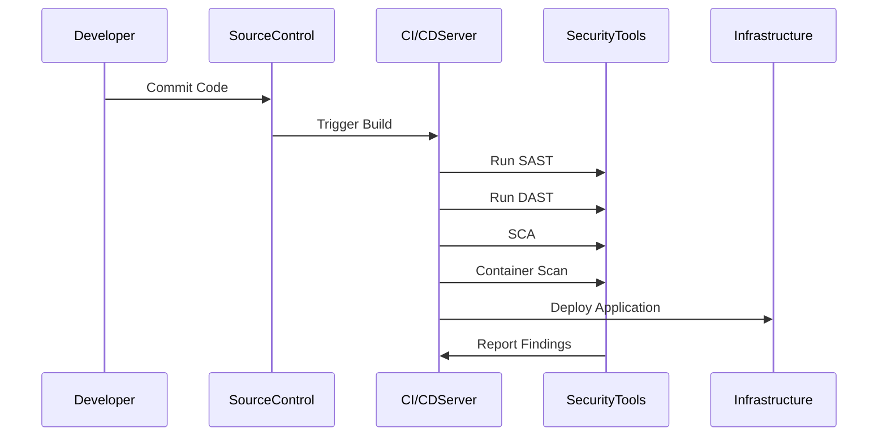

## Introduction

In the rapidly evolving world of cloud computing, Continuous Integration and Continuous Deployment (CI/CD) pipelines play a critical role in delivering software quickly and efficiently. However, this speed can sometimes come at the expense of security. Integrating security into these pipelines—often referred to as DevSecOps—is essential to detect and prevent security vulnerabilities without disrupting the workflow. This article explores design patterns, best practices, and tools necessary to ensure security in CI/CD pipelines.

## Design Pattern: Security in CI/CD Pipelines

### Overview

Security in CI/CD pipelines focuses on implementing security measures at each stage of the pipeline to identify vulnerabilities early in the software development lifecycle. This approach ensures that security is not a bottleneck but a seamless part of the development process.

### Key Components

1. **Static Application Security Testing (SAST):** Analyze source code for vulnerabilities without executing the code.
2. **Dynamic Application Security Testing (DAST):** Simulate attacks on a running application to find vulnerabilities.
3. **Software Composition Analysis (SCA):** Identify vulnerabilities in third-party components and libraries.
4. **Container Security:** Scan container images for vulnerabilities and misconfigurations before deployment.
5. **Infrastructure as Code (IaC) Security:** Analyze configuration files to ensure secure cloud environments.

### Architectural Approaches

- **Shift-Left Security:** Incorporates security early in the development process through automated testing and feedback.
- **Continuous Monitoring and Alerting:** Implement real-time monitoring tools to detect and alert on suspicious activities.
- **Automated Compliance Checks:** Enforce compliance requirements using automated checks against security policies.

### Best Practices

- **Automate Security Checks:** Leverage automation for consistent and repeatable security testing across the pipeline.
- **Integrate Security Tools:** Use security tools that integrate seamlessly with CI/CD tools like Jenkins, GitLab CI, or AWS CodePipeline.
- **Implement Role-Based Access Controls (RBAC):** Control access to CI/CD tools and environments based on roles.
- **Regular Security Audits and Penetration Testing:** Perform periodic reviews and testing to identify new vulnerabilities.

### Example Code

```yaml
pipeline {
    agent any
    stages {
        stage('Checkout') {
            steps {
                checkout scm
            }
        }
        stage('Build') {
            steps {
                sh 'mvn clean install'
            }
        }
        stage('Static Code Analysis') {
            steps {
                sh 'mvn sonar:sonar -Dsonar.host.url=http://localhost:9000'
            }
        }
        stage('Dependency Check') {
            steps {
                sh 'mvn org.owasp:dependency-check-maven:check'
            }
        }
        stage('Container Scan') {
            steps {
                sh 'docker scan my-image:latest'
            }
        }
        stage('Deploy') {
            steps {
                sh 'kubectl apply -f k8s-deployment.yaml'
            }
        }
    }
    post {
        always {
            archiveArtifacts artifacts: '**/target/*.jar', allowEmptyArchive: true
            junit '**/target/surefire-reports/*.xml'
        }
    }
}
```

### Diagrams

#### CI/CD Security Workflow



## Related Patterns

- **Immutable Infrastructure:** Enhance security by provisioning infrastructure in a consistent and controlled manner.
- **Zero Trust Networking:** Implement a security model that denies access by default and verifies each request.
- **Secrets Management:** Safeguard sensitive data such as passwords, API keys, and certificates.

## Additional Resources

- [OWASP Top 10](https://owasp.org/www-project-top-ten/): A list of the most critical security risks to web applications.
- [DevSecOps Hub](https://www.devsecopshub.com/): Resources and community for integrating security practices into DevOps workflows.
- [Google Cloud DevOps Security](https://cloud.google.com/security/): Best practices for securing CI/CD on Google Cloud.

## Summary

The integration of security into CI/CD pipelines is crucial for maintaining the integrity and security of software in a cloud environment. By adopting a proactive and automated approach to security testing, organizations can ensure vulnerabilities are addressed early in the development process. Embracing DevSecOps not only enhances security but also supports faster releases and more stable applications. Incorporate the outlined practices and tools to build a robust security framework within your CI/CD pipeline.
