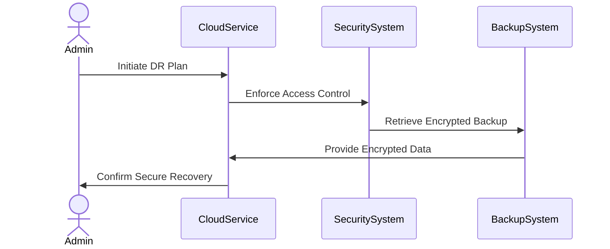

## Introduction

Disaster Recovery Planning for Security is a critical pattern in cloud computing that ensures secure recovery measures are established and maintained during disaster recovery (DR) scenarios. In the event of a disaster, such as a cyber-attack or natural calamity, this pattern helps preserve the integrity, confidentiality, and availability of data and systems. Secure disaster recovery includes strategies for identifying threats, mitigating risks, and ensuring continuity while maintaining compliance with regulatory requirements.

## Design Pattern Overview

Disaster Recovery Planning for Security integrates security practices into the disaster recovery process, focusing on:

- **Threat Identification**: Recognizing potential threats and vulnerabilities in recovery processes.
- **Risk Mitigation**: Implementing security controls to reduce risk impact.
- **Continuity Assurance**: Ensuring business operations can continue securely during and after a disaster.
- **Compliance**: Adhering to legal, regulatory, and organizational security standards.

### Architectural Approaches

1. **Redundant Systems**: Set up geographically dispersed redundant systems to ensure availability even if one region is compromised or fails.

2. **Encryption**: Use encryption for data at rest and in transit to protect sensitive information during recovery efforts.

3. **Access Control**: Implement strict access controls and multi-factor authentication to secure access to recovery systems and data.

4. **Regular Audits**: Conduct regular security audits and simulations to assess the effectiveness of DR security measures.

5. **Automated Incident Response**: Implement automated tools and scripts for quick incident detection and response to contain security threats during recovery.

### Best Practices

- **Regular Backups**: Schedule frequent, encrypted backups to secure locations, ensuring data can be reliably restored.
  
- **Test Recovery Plans**: Regularly test recovery plans, and update them based on changing threats and business needs.

- **Role-based Access**: Limit access permissions to those necessary for recovery operations; avoid giving elevated privileges broadly.

- **Logging and Monitoring**: Continuously monitor and log system and application activities, especially during recovery events, to promptly identify security breaches.

- **Training**: Conduct ongoing training sessions for staff to recognize phishing attempts and handle security-related incidents effectively.

## Example Code

Below is a simplified example of setting up an automated backup with encryption in AWS using Python and Boto3:

```python
import boto3
import datetime

def create_encrypted_snapshot(volume_id, description="Encrypted snapshot backup"):
    ec2 = boto3.client('ec2', region_name='us-west-2')
    
    # Create a snapshot with encryption
    snapshot = ec2.create_snapshot(
        VolumeId=volume_id,
        Description=description,
    )
    
    # Wait for the snapshot to complete
    waiter = ec2.get_waiter('snapshot_completed')
    waiter.wait(SnapshotIds=[snapshot['SnapshotId']])

    print(f"Created encrypted snapshot for volume {volume_id} with ID {snapshot['SnapshotId']}")

create_encrypted_snapshot('vol-0abcdef1234567890')
```

## Diagrams

### Sequence Diagram of Secure Disaster Recovery



## Related Patterns

- **Data Encryption**: Ensures data confidentiality and integrity across distributed systems.
- **Redundant Services**: Focuses on redundancy to increase system availability.
- **Automated Backup**: Regularly scheduled backups to support fast recovery.

## Additional Resources

- AWS Disaster Recovery Workflows: [AWS DR Documentation](https://docs.aws.amazon.com/disaster-recovery)
- NIST SP 800-53: Security and Privacy Controls for Information Systems and Organizations: [NIST](https://csrc.nist.gov/publications/detail/sp/800-53/rev-5/final)
- ISO/IEC 27031: Guidelines for information and communication technology readiness for business continuity: [ISO](https://www.iso.org/standard/44374.html)

## Summary

Disaster Recovery Planning for Security is essential in ensuring business continuity and protecting sensitive data during unforeseen incidents. By integrating robust security measures into your DR strategy—such as redundant systems, encryption, access controls, and regular audits—you safeguard your cloud infrastructure against diverse threats. Continuous testing and improvement of recovery plans, alongside effective staff training, ensure your organization remains resilient and compliant in the face of disasters.
