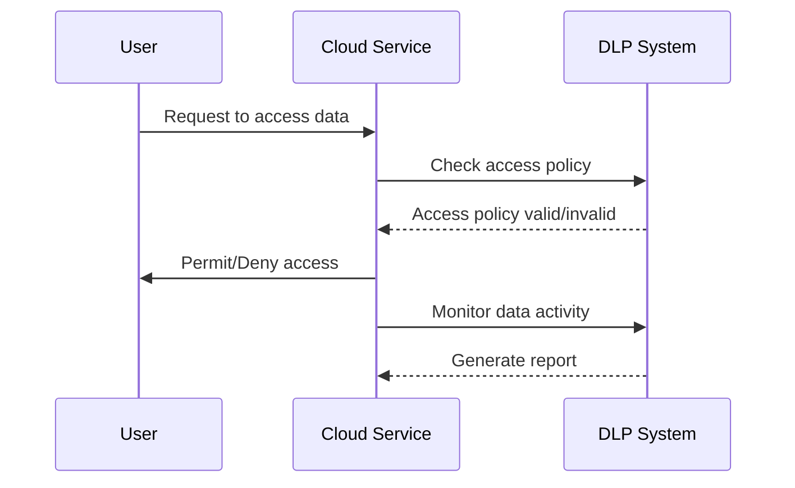

## Overview

Data Loss Prevention (DLP) is a significant security strategy primarily designed to secure sensitive data from unauthorized access or accidental disclosure in cloud environments. With the proliferation of cloud services and the increasing movement of critical data across borders, DLP helps organizations enforce data protection policies and comply with relevant regulations such as GDPR, HIPAA, and CCPA.

## Detailed Explanation

Implementing DLP in a cloud environment involves several key components and strategies:

1. **Data Classification**: Identifying and categorizing data based on its level of sensitivity. Cloud platforms provide automated tools for this purpose, allowing you to apply appropriate security measures to different classes of data, such as personal information, financial data, or intellectual property.

2. **Real-time Monitoring**: Leveraging cloud-native tools to monitor data movement and access in real-time. These tools help detect unauthorized attempts to access or transmit sensitive data, allowing for immediate action to prevent data breaches.

3. **Policy Enforcement**: Creating and enforcing policies that dictate how data can be accessed, shared, and moved within and outside the organization. This includes setting up encryption, tokenization, and user activity monitoring to ensure compliance with the defined policies.

4. **Data Masking and Encryption**: Securing data by converting it into a non-readable format for unauthorized users. Encryption and data masking are essential to protect data both at rest and in transit, ensuring that even if data is compromised, it remains inaccessible without the correct decryption keys.

5. **Anomaly Detection and Alerting**: Utilizing machine learning algorithms to detect unusual patterns of data access or transfer that may indicate a potential security threat. Alerts can be used to notify administrators for further investigation, or automated responses can be triggered to mitigate risks instantly.

6. **User Education and Awareness**: Regularly educating employees about data security best practices and the importance of protecting sensitive information. A well-informed workforce is essential to the success of any DLP strategy.

## Example Code

Incorporating DLP within a cloud service using AWS Macie to classify and protect data:

```python
import boto3

client = boto3.client('macie2')

response = client.enable_macie(
    findingPublishingFrequency='FIFTEEN_MINUTES',
    status='ENABLED'
)

response = client.put_classification_export_configuration(
    s3Destination={
        'bucketName': 'your-bucket-name',
        'kmsKeyArn': 'your-kms-key-arn'
    }
)
```

## Diagrams

### Data Loss Prevention Workflow



## Related Patterns

- **Access Control**: Establishing strict identity and access management to ensure only authorized users can access sensitive data.
- **Data Encryption**: Implementing robust encryption methodologies to secure data throughout its lifecycle.
- **Intrusion Detection System (IDS)**: Real-time analysis and monitoring for potential data breaches or unauthorized data access.

## Additional Resources

- [Google Cloud DLP Documentation](https://cloud.google.com/dlp/docs)
- [Azure Information Protection Overview](https://learn.microsoft.com/en-us/azure/information-protection/)
- [AWS Macie Overview](https://aws.amazon.com/macie/)
- [NIST Data Security Guidance](https://www.nist.gov/)

## Summary

Data Loss Prevention (DLP) in cloud environments is an essential practice to safeguard sensitive data from unauthorized access and exfiltration. By implementing comprehensive DLP strategies that encompass data classification, real-time monitoring, policy enforcement, and anomaly detection, organizations can enhance their data protection measures and comply with relevant regulatory requirements. Educating users and integrating DLP solutions with other security patterns further reinforce the integrity and confidentiality of data in the cloud.
