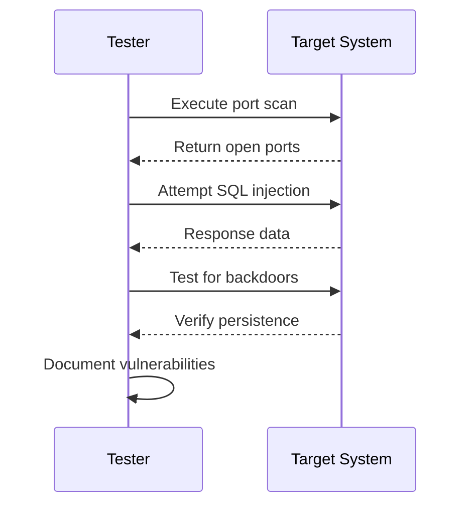

## Introduction

Penetration testing, often referred to as pen testing, is a critical practice in cloud security that involves simulating cyberattacks against a system to identify potential vulnerabilities. The goal is to discover security weaknesses before malicious attackers can exploit them, thereby strengthening overall security posture.

## Detailed Explanation

Penetration testing mimics the approaches and techniques used by attackers to compromise security. It involves the following key phases:

1. **Planning and Reconnaissance**: Define the scope and objectives, gather intelligence, and identify potential attack vectors.
2. **Scanning**: Understand how the target application will respond to various intrusion attempts. This involves scanning the network and vulnerabilities.
3. **Gaining Access**: Use web application attacks, such as cross-site scripting, SQL injection, and backdoors, to identify and exploit vulnerabilities.
4. **Maintaining Access**: Simulate advanced persistent threat scenarios to determine the extent of access that can be maintained.
5. **Analysis**: Document the test results, listing vulnerabilities discovered, data accessed, and amount of time the system remained compromised.

## Architectural Approaches

- **External Testing**: Simulates external attacks outside the organization's network perimeter. It's vital for assessing the security from an outside-in perspective.
- **Internal Testing**: Conducted from within the network to understand the risk of insider threats or what a malicious insider could achieve.
- **Blind Testing**: Testers are given limited information about the target, akin to a real-world scenario where an attacker knows little about the internal defenses.
- **Double-Blind Testing**: Neither the internal security team nor the testers have prior information about each other, simulating a real attack scenario to test the readiness of security measures and response teams.
- **Targeted Testing**: Conducted with the collaboration of an organization's IT personnel and security team, providing insight into real-time responses and processes.

## Best Practices

- **Engage Regularly and Strategically**: Schedule penetration testing regularly and after significant changes to the system to ensure continuous security.
- **Use Skilled Professionals**: Engage certified and experienced penetration testers to ensure comprehensive and effective testing.
- **Document Thoroughly**: Maintain detailed records of testing processes, results, and remediation actions for future reference and compliance.
- **Follow Up on Findings**: Act on the identified vulnerabilities promptly and conduct retests to ensure that vulnerabilities have been effectively mitigated.
- **Integrate with Security Policies**: Penetration testing should be integrated into the organization's overall security policy and compliance requirements.

## Example Code

While specific code examples for penetration testing can vary based on the tools and techniques used, here is a simple example using Python, showcasing a script to perform a network port scan:

```python
import socket

def scan_ports(target_ip):
    open_ports = []
    for port in range(1, 1025):
        sock = socket.socket(socket.AF_INET, socket.SOCK_STREAM)
        sock.settimeout(1)
        result = sock.connect_ex((target_ip, port))
        if result == 0:
            open_ports.append(port)
        sock.close()
    return open_ports

target = "192.168.1.1"  # Replace with your target IP
open_ports = scan_ports(target)
print(f"Open ports on {target}: {open_ports}")
```

## Diagrams

Below is sequence diagram to illustrate the typical process of penetration testing:



## Related Patterns

- **Incident Response**: A closely related pattern, focusing on how to handle and recover from security incidents.
- **Vulnerability Management**: Complements penetration testing by providing ongoing processes to manage and mitigate vulnerabilities.
- **Security Information and Event Management (SIEM)**: Works hand-in-hand with pen testing by collecting and analyzing log data from various sources to monitor for signs of security breaches.

## Additional Resources

- OWASP Penetration Testing Guide
- NIST Special Publication 800-115: Technical Guide to Information Security Testing and Assessment
- Offensive Security Certified Professional (OSCP) certification

## Summary

Penetration testing is an essential component of cloud security strategies, enabling organizations to proactively identify and rectify vulnerabilities before they are exploited. By following best practices and integrating pen testing into the broader security framework, organizations can enhance their defense mechanisms against evolving cyber threats.
