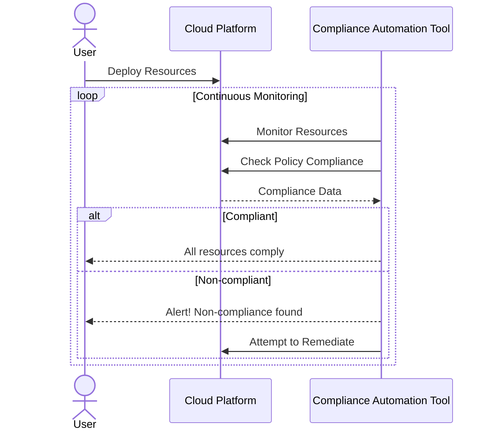

In today's dynamic and rapidly evolving cloud landscape, compliance with regulatory standards and organizational policies is crucial. Compliance Automation Tools offer a strategic approach to automatically enforce and validate these standards across cloud environments. This design pattern ensures that organizations maintain a continuous state of compliance, enhancing security posture and reducing the risk of breaches and fines associated with non-compliance.

## Design Pattern Explanation

### Key Concepts

1. **Automation**: Automatically implementing compliance checks and controls.
2. **Continuous Monitoring**: Real-time evaluation of cloud resources and configurations.
3. **Policy Enforcement**: Ensuring that cloud operations align with defined compliance policies.
4. **Audit Readiness**: Maintaining an up-to-date compliance status that simplifies auditing processes.

### Architectural Approach

Compliance Automation Tools integrate with cloud environments to continuously monitor and validate compliance standards. These tools often work alongside cloud management platforms to enforce security policies, identify deviations, and provide reporting capabilities.

### Implementation Steps

1. **Initial Setup**: Integrate Compliance Automation Tools with your cloud platforms (AWS, GCP, Azure).
2. **Define Compliance Policies**: Establish the compliance standards relevant to your industry and organizational goals.
3. **Configure Automation Rules**: Set up automated rules within the tool to continuously monitor and enforce compliance standards.
4. **Continuous Monitoring**: Use the tool to constantly scan cloud resources and configurations.
5. **Alerting and Reporting**: Implement alert mechanisms for non-compliance and generate compliance reports for audits.

## Example Code

Here's a simplified example of how a compliance automation rule might be configured using AWS Config:

```yaml
Resources:
  MyBucketComplianceRule:
    Type: "AWS::Config::ConfigRule"
    Properties:
      Source:
        Owner: "AWS"
        SourceIdentifier: "S3_BUCKET_PUBLIC_READ_PROHIBITED"
      Scope:
        ComplianceResourceTypes:
          - "AWS::S3::Bucket"
```

## UML Sequence Diagram



## Related Patterns

- **Policy Enforcement Point (PEP)**: Provides a framework for policy evaluation and enforcement.
- **Continuous Compliance**: Ensures ongoing compliance status with minimal disruption.
- **Security Monitoring and Alerting**: Offers real-time monitoring of security threats.

## Additional Resources

- [AWS Config](https://aws.amazon.com/config/)
- [Azure Policy](https://docs.microsoft.com/en-us/azure/governance/policy/)
- [Google Cloud Security Command Center](https://cloud.google.com/security-command-center)

## Summary

Compliance Automation Tools play a critical role in aligning cloud resources with regulatory and organizational compliance standards. By automating compliance checks, enforcing policies, and continuously monitoring cloud environments, organizations can enhance security, ensure audit readiness, and mitigate risks associated with non-compliance. This pattern is paramount for organizations operating in highly regulated industries or those seeking to uphold the integrity and security of their cloud infrastructures.
