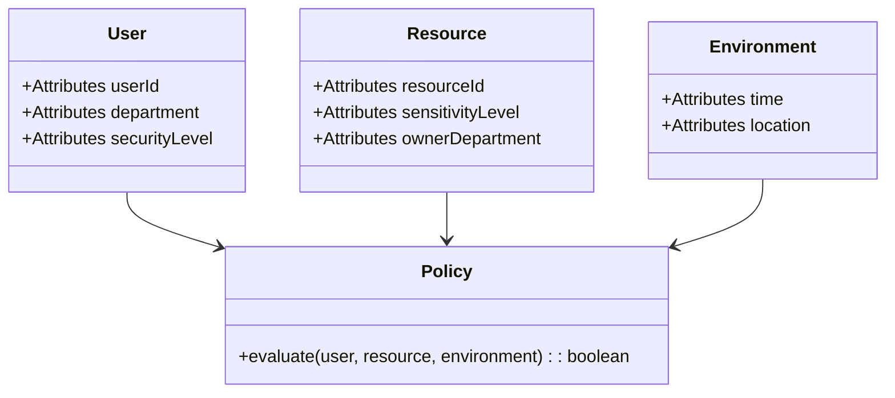

## Introduction to Attribute-Based Access Control (ABAC)

Attribute-Based Access Control (ABAC) is a dynamic and flexible access control method that determines access rights based on attributes associated with users, resources, and the environment. Unlike traditional Role-Based Access Control (RBAC) which relies on static roles, ABAC uses a more granular approach, allowing a wide range of access decisions that can adapt to varying contextual demands. This approach is particularly useful in cloud environments where resource access must be both secure and adaptable to dynamic conditions.

## Detailed Explanation

### Key Components of ABAC

1. **Attributes**: 
   - **User Attributes**: Characteristics of the user requesting access, like ID, role, department, security clearance, etc.
   - **Resource Attributes**: Characteristics of the resource being accessed, like resource type, sensitivity, owner, etc.
   - **Environmental Attributes**: Contextual information such as the time of day, location, and network security status.

2. **Policy**: ABAC policies define the rules that govern access decisions. They are expressed in terms of logical conditions on attributes.

3. **Decision Point**: The system component that evaluates policies and makes access control decisions.

4. **Enforcement Point**: The system component that enforces the access decision made by the decision point.

### How ABAC Works

ABAC works by evaluating a set of policy rules that combine attributes in various ways. When a user attempts to access a resource, the system:
- Collects the relevant attributes.
- Evaluates the access request against defined policies.
- Grants or denies access based on whether the conditions in the policies are met.

### Example Scenario

Consider a cloud-based document management system where documents have varying levels of sensitivity. A user requests access to a document. The ABAC system evaluates:
- If the user’s security clearance level meets or exceeds the document’s sensitivity level.
- If the access request is made during business hours (environmental attribute).
- If the user belongs to the department that owns the document.

Based on these conditions, access is granted or denied, showcasing the fine-grained control possible with ABAC.

## Example Code

Here is a simplified example of defining an ABAC policy using JSON syntax:

```json
{
  "policy" : {
    "effect" : "Allow",
    "action" : "read",
    "resource" : "document",
    "conditions" : {
      "user.department" : "equals document.ownerDepartment",
      "user.securityLevel" : "greaterOrEqual document.sensitivityLevel"
    }
  }
}
```

## Diagrams

### ABAC Architecture UML Diagram



## Related Patterns

- **Role-Based Access Control (RBAC)**: Uses fixed roles rather than dynamic attributes for access control.
- **Policy-Based Access Control (PBAC)**: A more generalized form that can encompass ABAC, focusing on policy evaluation as a central concept.

## Additional Resources

- [NIST Guide to Attribute Based Access Control (ABAC) Definition and Considerations](https://nvlpubs.nist.gov/nistpubs/SpecialPublications/NIST.SP.800-162.pdf)
- AWS IAM Policies and Permissions: [AWS Identity Management](https://aws.amazon.com/iam/)
- Azure Active Directory: [Azure AD Conditional Access](https://learn.microsoft.com/en-us/azure/active-directory/conditional-access/overview)

## Summary

Attribute-Based Access Control (ABAC) is a highly flexible and dynamic approach to managing access to resources in cloud environments. By leveraging a wide array of attributes, ABAC enables precise access control aligned with business needs and security requirements. This pattern equips organizations to handle complex access scenarios, supporting the secure and efficient operations necessary in today's rapidly changing IT landscapes.
