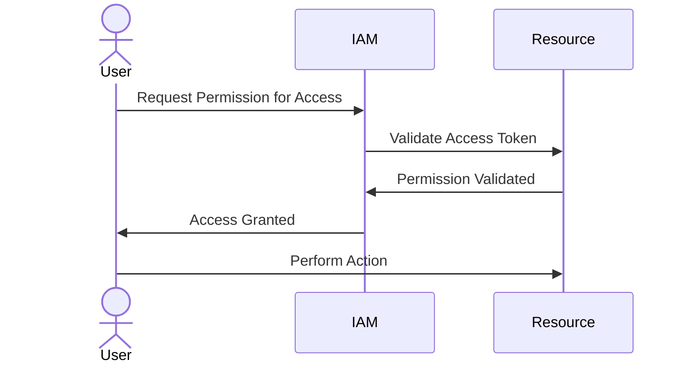
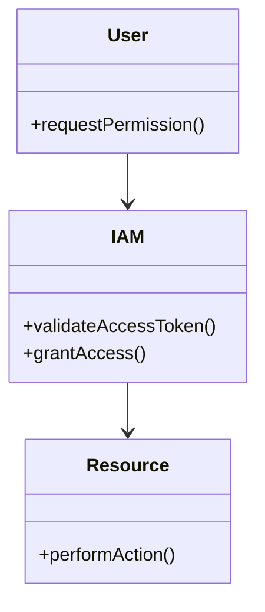

## Introduction

The **Least Privilege Principle** is a fundamental security design pattern that advocates for granting users, processes, or services the minimum levels of access—or permissions—needed to perform their functions. By adhering to this principle, organizations can minimize the attack surface and potential damage in the event of a security compromise.

## Detailed Explanation

### Key Concepts

- **Granular Access Control**: The practice involves defining precise access permissions aligned specifically with the user's or service's job requirements.
- **Role-Based Access Control (RBAC)**: Implementation technique where permissions are assigned to roles rather than individuals, and users are granted specific roles providing them required permissions.
- **Attribute-Based Access Control (ABAC)**: An advanced approach where access decisions are based on attributes of the user, resource, and environment.
- **Just-In-Time Access**: Provisioning temporary access permissions for a limited time or scope.

### Architectural Approaches

1. **Role Reduction**: Streamline roles to avoid excessive and redundant access.
2. **Auditing and Monitoring**: Regular checks and real-time monitoring of access logs to detect anomalies.
3. **Periodic Review**: Regular assessments of permissions to align with current job responsibilities and remove any unnecessary permissions.
4. **Policy Enforcement**: Continuous implementation of security policies ensuring compliance with least privilege norms.

### Best Practices

- **Start with Deny All**: Begin with no permissions granted and add necessary permissions incrementally.
- **Use IAM Tools**: Leverage cloud provider Identity and Access Management (IAM) tools to define policies and manage access.
- **Regular Updates**: Keep access policies updated in tandem with organizational changes.
- **Training and Awareness**: Educate employees about the importance and implementation of access control measures.

## Example Code

```yaml
{
    "Version": "2012-10-17",
    "Statement": [
        {
            "Effect": "Allow",
            "Action": [
                "s3:GetObject"
            ],
            "Resource": [
                "arn:aws:s3:::example-bucket/*"
            ]
        }
    ]
}
```

In the above code, a policy is defined that allows access only to the `GetObject` action in an S3 bucket, illustrating the least privilege principle.

## Diagrams

### Sequence Diagram



### Class Diagram



## Related Patterns

- **Defense in Depth**: An additional security layer approach complementing the least privilege by using multiple strategies to protect data and systems.
- **Separation of Duties**: Reduces risk by dividing responsibilities and permissions across different users or systems.
- **Identity Federation**: Ensures secure interaction across systems with a shared identification and authentication system.

## Additional Resources

- [NIST Special Publication on Access Control Models](https://nvlpubs.nist.gov/nistpubs/SpecialPublications/NIST.SP.800-162.pdf)
- [Cloud Security Best Practices by AWS](https://aws.amazon.com/security/security-best-practices/)
- [Google Cloud IAM and Roles Overview](https://cloud.google.com/iam/docs/understanding-roles)

## Summary

Embracing the **Least Privilege Principle** is vital for securing cloud environments by restricting access rights to the bare minimum required. This pattern, when properly integrated, can significantly reduce vulnerabilities and the impact of potential breaches within the cloud infrastructure. Implementing this principle requires continuous review and adaptation of access controls to evolve with organizational and technological changes.
