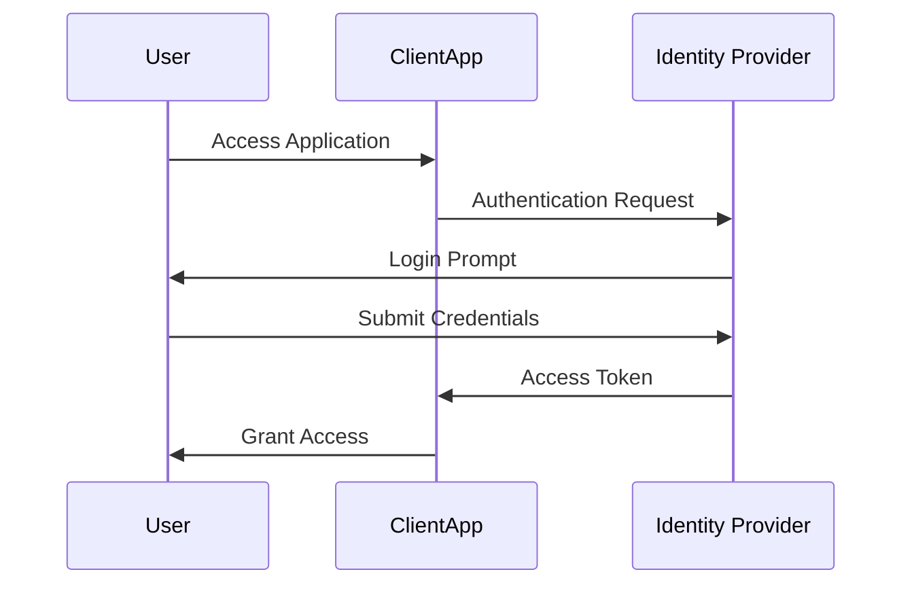

## Introduction

In the modern cloud environment, users expect seamless access to a multitude of applications without repeatedly authenticating. This is where Identity Federation and Single Sign-On (SSO) come into play. This pattern aims to provide users with a seamless authentication experience while maintaining robust security protocols.

## Design Pattern Overview

### Identity Federation

Identity Federation is the practice of allowing identities, managed in one domain, to be accepted in another. This often involves the integration of enterprise directories with cloud-based services. By federating identities, organizations can achieve:

- **Streamlined User Experience**: Reducing the need for multiple logins.
- **Centralized Control**: Better manage and control access to systems.
- **Enhanced Security**: Utilizing secure, federated protocols like SAML (Security Assertion Markup Language) and OAuth.

### Single Sign-On (SSO)

Single Sign-On allows users to authenticate once and gain access to all interconnected systems without further authentication steps. SSO implementations are built on federated identity protocols and provide:

- **User Convenience**: Only one set of credentials to remember.
- **Reduced Friction**: Streamlining the process of accessing multiple applications.
- **Efficient Access Management**: Simplified de-provisioning when users leave an organization.

## Architectural Approaches

### Centralized Identity Providers

To implement Identity Federation and SSO, many systems use centralized Identity Providers (IdP), which include:

- **Authentication as a Service**: Platforms such as Okta or Auth0.
- **Cloud Provider Solutions**: AWS IAM, Azure Active Directory, and Google Cloud Identity.
- **Enterprise Integration**: Connecting existing enterprise directories like LDAP or Active Directory to the choice of IdP.

### Federated Identity Protocols

- **SAML 2.0**: An XML-based protocol that allows secure web domains to exchange authentication and authorization data.
- **OAuth 2.0**: A token-based framework that allows third-party services to exchange resources in a secure environment.
- **OpenID Connect**: An identity layer on top of OAuth 2.0, allowing client applications to verify the identity of the end-user.

## Best Practices

- **Strong Cryptography**: Ensure transport and storage of credentials use strong encryption techniques.
- **Regular Audits & Compliance Checks**: Conduct regular security audits and ensure compliance with industry standards.
- **User Experience Testing**: Continuously optimize the login process to ensure usability and efficiency.
- **Risk-Based Conditional Access**: Implement access rules based on risk scores determined by user behavior and endpoints.

## Example Code

Here's a simplified example demonstrating the SSO flow using OAuth 2.0 in JavaScript.

```javascript
const client_id = '<Your-Client-ID>';
const redirect_uri = '<Your-Redirect-URI>';
const authEndpoint = '<OAuth-Authorization-Server>';

function authenticateUser() {
    window.location.href = `${authEndpoint}?response_type=token&client_id=${client_id}&redirect_uri=${encodeURIComponent(redirect_uri)}`;
}

function handleCallback() {
    const hash = window.location.hash.substr(1);
    const result = hash.split('&').reduce((res, item) => {
        const parts = item.split('=');
        res[parts[0]] = parts[1];
        return res;
    }, {});
    if (result.access_token) {
        // Store and use access token
        console.log('Access Token:', result.access_token);
    }
}
```

## Diagram



## Related Patterns

- **API Gateway**: Facilitates the communication of clients with backend services.
- **Access Control**: Implementing detailed access policies to further secure resources.

## Additional Resources

- [OAuth 2.0 Protocol](https://oauth.net/2/)
- [SAML Overview](https://www.oasis-open.org/standards#samlv2.0)
- **Books**: *Identity and Data Security for Web Development: Best Practices* by John Paul Mueller.

## Summary

Identity Federation and SSO are crucial in modern cloud architectures for ensuring secure, efficient, and user-friendly access to resources. By centralizing identity management, employing robust authentication protocols, and implementing best practices, organizations can significantly enhance their security posture and user experience. These patterns are foundational to cloud computing security and should be diligently designed and maintained.
