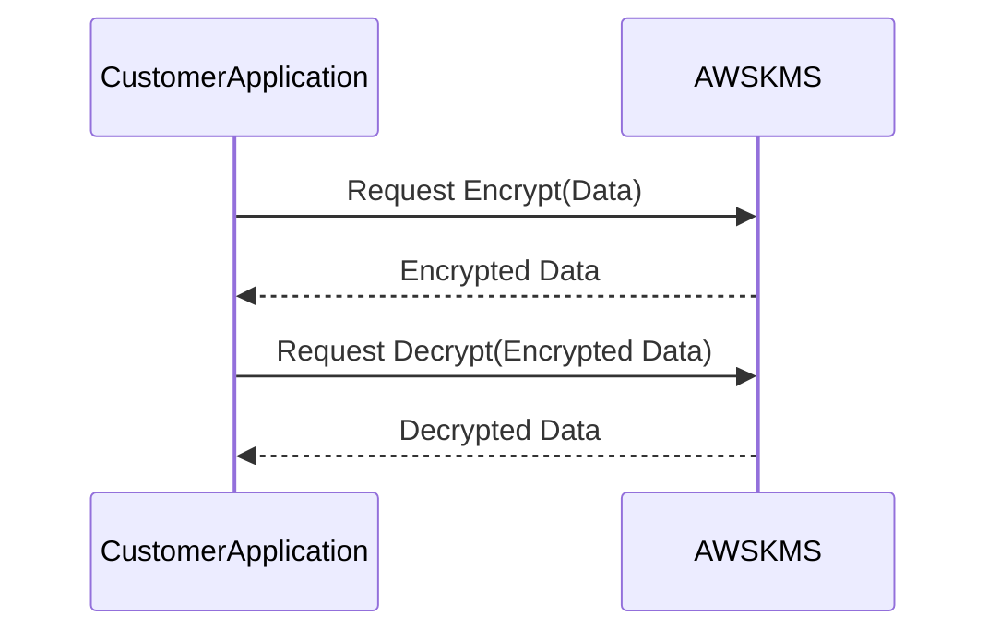

## Introduction

In cloud computing, ensuring the confidentiality and integrity of data is paramount. Key Management Services (KMS) provide a secure approach to managing cryptographic keys used for encryption and decryption processes, safeguarding data against unauthorized access. This pattern is vital for compliance with various regulatory standards and for maintaining the trust of users and stakeholders.

## Problem Statement

As organizations move their workloads to the cloud, they face the challenge of securely managing large volumes of cryptographic keys required for data protection. Traditional methods of key management become cumbersome, insecure, and difficult to scale in a distributed cloud environment.

## Solution

Key Management Services in the cloud offer a centralized platform for managing cryptographic keys efficiently. These services manage the lifecycle of keys, including key generation, distribution, rotation, revocation, and storage. KMS integrates seamlessly with other cloud services, providing automated encryption features and supporting varying compliance requirements.

### Architectural Approaches

1. **Centralized Key Management**: Cloud providers offer centralized KMS platforms that allow organizations to manage, access, and audit their cryptographic keys from a single platform. This reduces complexity and improves security posture.
   
2. **Automated Key Lifecycle Management**: KMS automates key lifecycle processes, ensuring regular key rotation and revocation to minimize risks of key leakage.

3. **Access Control and Auditing**: Implement strong access controls to ensure only authorized users and applications can access keys. Integrate auditing capabilities for tracking key usage and compliance verification.

## Example Code

Below is a simple example using AWS Key Management Service to encrypt and decrypt data:

```java
import com.amazonaws.services.kms.AWSKMS;
import com.amazonaws.services.kms.AWSKMSClientBuilder;
import com.amazonaws.services.kms.model.*;

public class KMSExample {

    private static final String KEY_ID = "your-key-id"; // Your KMS key ID

    public static void main(String[] args) {
        AWSKMS kmsClient = AWSKMSClientBuilder.defaultClient();

        // Encrypt data
        String textToEncrypt = "Hello, World!";
        ByteBuffer plaintext = ByteBuffer.wrap(textToEncrypt.getBytes());
        EncryptRequest encryptRequest = new EncryptRequest().withKeyId(KEY_ID).withPlaintext(plaintext);
        ByteBuffer ciphertext = kmsClient.encrypt(encryptRequest).getCiphertextBlob();

        // Decrypt data
        DecryptRequest decryptRequest = new DecryptRequest().withCiphertextBlob(ciphertext);
        ByteBuffer decryptedText = kmsClient.decrypt(decryptRequest).getPlaintext();
        System.out.println("Decrypted text: " + new String(decryptedText.array()));
    }
}
```

## Diagrams

### Key Management Service Interaction



## Related Patterns

- **Identity and Access Management (IAM)**: Ensures that only authorized users have access to KMS.
- **Infrastructure as Code (IaC)**: Use IaC tools to provision and manage KMS along with application deployments.

## Best Practices

- Use strong, frequently rotating encryption keys.
- Leverage automated key management features offered by cloud providers.
- Enforce strict access policies using Role-Based Access Control (RBAC).
- Regularly audit key management processes and configurations.

## Additional Resources

- [AWS Key Management Service](https://aws.amazon.com/kms/)
- [Azure Key Vault](https://azure.microsoft.com/en-us/services/key-vault/)
- [Google Cloud KMS](https://cloud.google.com/kms)

## Summary

Key Management Services are indispensable in the cloud computing landscape, ensuring that sensitive data is securely encrypted and decrypted using managed cryptographic keys. By centralizing key management and automating processes such as key rotation and access control, KMS significantly enhances the security and compliance posture of cloud applications.
