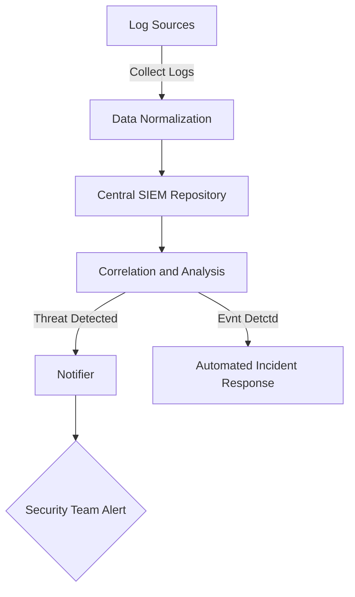

## Introduction

Security Information and Event Management (SIEM) systems are crucial in the modern security landscape, especially for cloud-based architectures. They provide a centralized solution for collecting, storing, and analyzing security data across the organization. This ensures real-time event management and enhances the efficiency of security operations by alerting security teams to potential threats, helping identify malicious activity, and facilitating compliance reporting.

## Design Pattern Overview

### Intent

The primary intent of a SIEM system is to collect security-related data from across the entire organizational infrastructure—servers, network devices, applications, and other security systems—and store it in a centralized location for analysis and management. By doing so, SIEM solutions provide visibility into security incidents and enable faster, more effective responses.

### Key Components and Workflow

1. **Data Collection**: SIEM systems aggregate data from various sources, including logs from firewalls, antivirus software, intrusion detection systems (IDS), applications, and cloud services.

2. **Data Normalization**: The collected data from diverse sources is normalized to a common format to simplify analysis.

3. **Correlation and Analysis**: Advanced analytics correlate normalized data to detect patterns indicative of potential threats or required actions.

4. **Reporting and Notification**: The system generates reports and alerts for security administrators about possible security events or breaches.

5. **Incident Response**: Supports automated incident response functions to quickly address detected security threats.

## Architectural Approaches

- **Agent-Based Data Collection**: SIEMs can use software agents installed on endpoints and network devices to collect logs and data.

- **Agentless Data Collection**: Some SIEM solutions also support agentless ingestion of data via protocols such as Syslog, extracting it directly into the central repository.

- **Cloud-Native SIEM**: As organizations migrate to the cloud, many opt for cloud-native SIEM solutions which offer scalability and integration with cloud services.

## Best Practices

- **Continuous Monitoring**: Implement continuous monitoring to ensure that data is consistently collected and analyzed for real-time threat detection.

- **Integration with Incident Response**: A SIEM should seamlessly integrate with your incident response protocols to aid in swift responses.

- **Regular Updates and Tuning**: Regularly update the SIEM to tackle new threats and maintain accuracy in threat detection through frequent tuning.

- **Scalability and Flexibility**: Choose a SIEM solution that scales with your organization's growth and adjusts to changing compliance requirements.

## Example Code (Pseudocode)

```scala
// Example pseudocode for real-time log collection and analysis using a SIEM platform

class SIEMService {
  def collectLogs(source: LogSource): Unit = {
    // Collect logs from the source (e.g., server or network device)
    val logs = source.getLogs()
    // Send logs to the central SIEM repository
    centralRepository.storeLogs(logs)
  }

  def analyzeLogs(): Unit = {
    val logs = centralRepository.retrieveLogs()
    // Perform analysis using correlation techniques
    val detectedThreats = ThreatAnalyzer.analyze(logs)
    // In case of threats, notify the security team
    if (detectedThreats.nonEmpty) {
      Notifier.sendAlerts(detectedThreats)
    }
  }
}
```

## Diagrams

### SIEM Architectural Diagram



## Related Patterns and Concepts

- **Intrusion Detection Systems (IDS)**: Systems that monitor network traffic for suspicious activity and alert the system or network administrator.

- **Log Management Systems**: These systems focus on collecting and storing logs without the deep analysis provided by SIEMs.

- **Threat Intelligence Platforms**: Enhance the capabilities of SIEMs by providing additional context for detected threats.

## Additional Resources

- [The Importance of SIEM in Modern Security](https://example.org/importance-of-siem)
- [Choosing the Right SIEM Solution](https://example.org/choosing-siem)
- [Implementing a SIEM System in Cloud Environments](https://example.org/cloud-siem-implementation)

## Summary

Security Information and Event Management (SIEM) systems are indispensable for maintaining robust security postures within organizations, especially in increasingly complex and cloud-integrated environments. By offering centralized visibility and real-time analysis of security events, SIEM solutions enable dynamic responses to potential threats and help businesses stay compliant with evolving legislative requirements.
