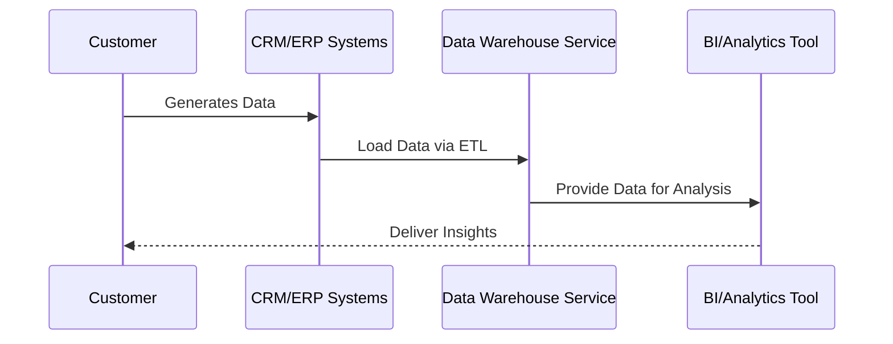

## Introduction

Data Warehousing Services are specialized cloud-based solutions designed to consolidate structured data from disparate sources into a unified repository. They enable enterprises to efficiently store, retrieve, and analyze large volumes of data, thereby facilitating informed decision-making and strategic planning. This design pattern highlights the use of scalable, secure, and highly available data warehouses in the cloud.

## Design Pattern Explanation

Data Warehousing Services involve utilizing a centralized cloud-based system that aggregates data from various sources like OLTP systems, logs, and external data sources. These services ensure data consistency, minimize redundancy, and provide comprehensive analytics capabilities through the use of cloud resources such as computing power, storage, and managed services.

### Architectural Approaches

1. **Star Schema and Snowflake Schema**: These are traditional methods of organizing data within a warehouse. They facilitate efficient querying and data retrieval.

2. **Hybrid/Data Lake Patterns**: Combining data lakes with warehousing services for managing both structured and unstructured data.

3. **Batch and Real-Time Processing**: Integration of services that support both batch processing of historical data and real-time insights for timely decision-making.

4. **ETL/ELT Processes**: Using Extract, Transform, Load (ETL) or Extract, Load, Transform (ELT) processes for moving and transforming data into the warehouse.

### Best Practices

- **Scalability**: Leverage the elastic nature of cloud infrastructure to scale resources up or down based on data loads and analytics demand.
  
- **Security and Compliance**: Implement robust security measures such as encryption, access control, and compliance with regulations like GDPR or HIPAA.

- **Cost Management**: Utilize cost optimization strategies by choosing the right storage tiers and compute instances based on usage and performance needs.

- **Data Governance and Quality**: Establish data governance frameworks ensuring data accuracy, consistency, and availability across the organization.

## Example Code

Utilizing AWS Redshift, a managed cloud warehouse service:

```sql
-- Create a New Table in Amazon Redshift
CREATE TABLE sales (
    sale_id INT IDENTITY(1,1),
    product_id INT,
    customer_id INT,
    sale_date DATE,
    amount DECIMAL(10,2)
);

-- Load Data into Redshift
COPY sales
FROM 's3://mybucket/salesdata/'
IAM_ROLE 'arn:aws:iam::123456789012:role/MyRedshiftRole'
FORMAT AS CSV;
```

## Diagrams

### Data Flow Diagram



## Related Patterns

- **Data Lake Pattern**: Explains handling unstructured and semi-structured data, often used alongside warehousing.
- **Streaming Data Processing**: Covers real-time data ingestion and processing which is crucial for certain analytics scenarios.

## Additional Resources

- [AWS Redshift Documentation](https://docs.aws.amazon.com/redshift/)
- [Google BigQuery Documentation](https://cloud.google.com/bigquery/docs)
- [Azure Synapse Analytics Documentation](https://docs.microsoft.com/en-us/azure/synapse-analytics/)

## Summary

Data Warehousing Services in the cloud offer a powerful approach for organizations aiming to achieve scalable, efficient, and cost-effective data consolidation and analysis. By leveraging these cloud-native solutions, enterprises can address the ever-growing data volumes and the demand for real-time insights, leading to more informed business decisions and strategic advancements.
