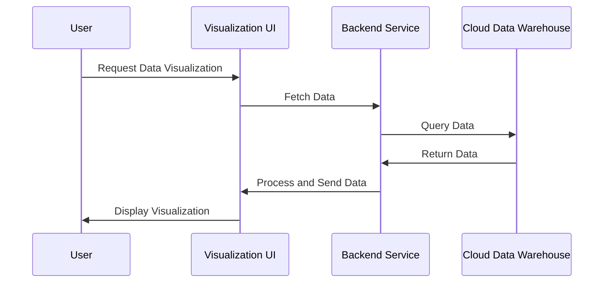

## Introduction

In the era of big data, transforming vast and complex datasets into insightful visual representations can empower businesses and organizations to make data-driven decisions. Data visualization tools have emerged as indispensable assets in cloud computing environments, enabling users to create compelling narratives through graphical depictions of data.

## Understanding Data Visualization Tools in Cloud

Data visualization tools in the cloud refer to the frameworks and software that enable the visualization and analysis of data stored in cloud environments. These tools integrate seamlessly with large datasets, offering scalability and flexibility. They are used for data exploration, business intelligence, performance tracking, and strategic decision-making.

### Key Features of Data Visualization Tools

- **Scalability**: Handle large volumes of data efficiently.
- **Interactivity**: Offer real-time updates and interactions.
- **Integration**: Seamlessly connect with various data sources and cloud services.
- **Customization**: Provide options to create tailored dashboards and reports.
- **Accessibility**: Enable sharing and collaboration across platforms and devices.

## Design Patterns and Architectural Approaches

### 1. **Serverless Visualization Pattern**

This pattern leverages serverless compute resources to dynamically generate visualizations based on user interactions. The serverless approach reduces operational overhead and scales automatically with user demand.

### 2. **Data Lake Integration Pattern**

Here, visualization tools connect directly to data lakes, pulling in vast datasets for analysis and representation. This pattern is efficient for organizations that use a centralized repository for all their data.

### 3. **Microservices Orchestration Pattern**

Microservices manage specific functionalities such as data ingestion, transformation, and presentation. This allows for independent scaling and improvements in different sections of the visualization pipeline.

## Best Practices

- **Ensure Data Quality**: Clean and preprocess data before visualization to ensure accuracy.
- **Focus on User Experience**: Prioritize ease of use and intuitive design for end-users.
- **Leverage Cloud Capabilities**: Utilize cloud-native features for scalability and performance.
- **Security Considerations**: Implement robust access controls and data protection mechanisms.
- **Iterative Development**: Continuously gather user feedback and refine visualizations.

## Example Code

Here is a simple example using JavaScript with D3.js, a popular library for creating web-based visualizations:

```javascript
// Function to create a simple bar chart with D3.js
const data = [10, 20, 30, 40, 50];

const svg = d3.select("svg");
const width = +svg.attr("width");
const height = +svg.attr("height");

const x = d3.scaleBand()
  .domain(data.map((d, i) => i))
  .range([0, width])
  .padding(0.1);

const y = d3.scaleLinear()
  .domain([0, d3.max(data)])
  .range([height, 0]);

svg.selectAll(".bar")
  .data(data)
  .enter().append("rect")
  .attr("class", "bar")
  .attr("x", (d, i) => x(i))
  .attr("y", d => y(d))
  .attr("width", x.bandwidth())
  .attr("height", d => height - y(d));
```

## Diagrams

### Sequence Diagram for Data Visualization Workflow



## Related Patterns

- **Data Lake Pattern**: Central repository that allows you to store and analyze vast amounts of data inexpensively.
- **ETL (Extract, Transform, Load) Pattern**: A process to extract data from various sources, transform it into a suitable format, and load it into a database.
- **Real-Time Analytics Pattern**: Provides the capability to analyze data immediately as it is ingested.

## Additional Resources

- [D3.js: Data-Driven Documents](https://d3js.org/)
- [Tableau](https://www.tableau.com/)
- [Power BI](https://powerbi.microsoft.com/)
- [Google Charts](https://developers.google.com/chart)

## Summary

Data visualization tools are pivotal in harnessing the power of cloud computing for data analysis. They enable users to understand complex datasets through graphical representations, which facilitate informed decision-making. By employing the best practices and design patterns discussed, organizations can effectively deploy these tools to unlock new insights and opportunities within their data.
