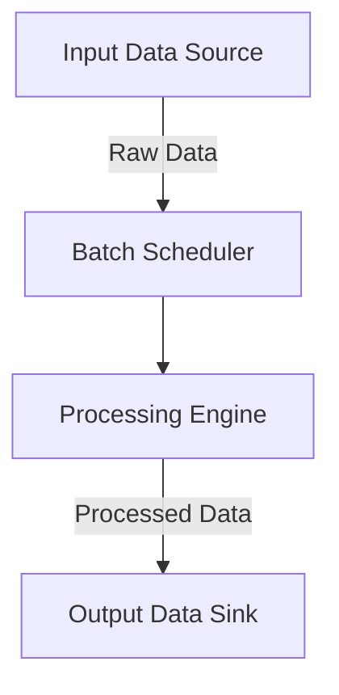
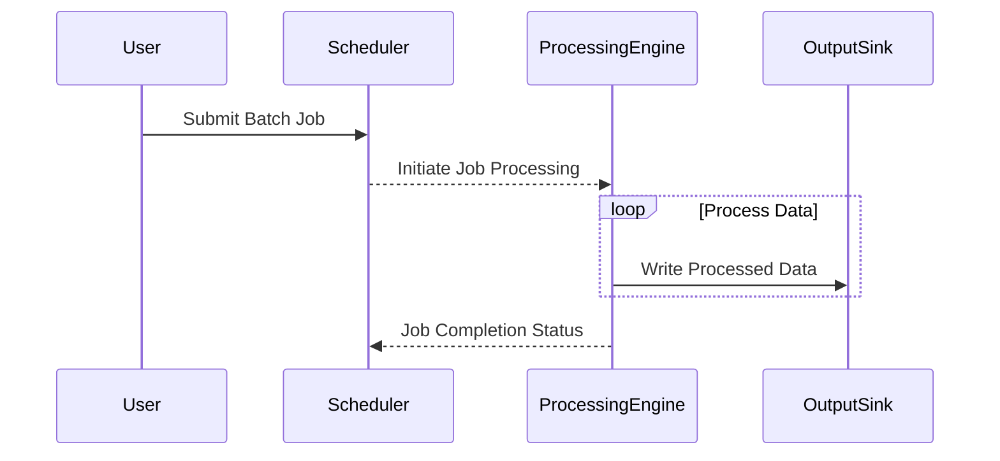

## Introduction to Batch Processing

Batch processing is a fundamental design pattern used in cloud computing for executing a series of non-interactive transactions as a single batch. This approach optimally manages large volumes of data through efficient resource utilization, especially within distributed environments. It is particularly effective for workloads that are too large, complex, or time-consuming for real-time processing.

## Architectural Approaches

The primary goal of batch processing is to handle high-volume data workloads efficiently. Commonly used approaches include:

1. **Parallel Batch Execution**: Distributing workload across multiple nodes to process batches simultaneously, reducing overall processing time.
2. **Serial Processing**: Executing tasks sequentially, useful for jobs that rely on the output of previous tasks.
3. **Hybrid Method**: A combination of both parallel and serial techniques, depending on task dependencies and resource availability.

### Key Components

- **Input Data Source**: Data collected from databases, files, or streaming sources which serve as input for batch processing.
- **Batch Scheduler**: A tool or service that determines the schedule and execution order of batch jobs.
- **Processing Engine**: The core component that executes the pre-defined operations on the input data.
- **Output Data Sink**: Location where the processed data is stored, which could be a database, data warehouse, or cloud storage solution.

## Example Code

Here's an example of implementing a simple batch processing system using Java with Apache Hadoop:

```java
import org.apache.hadoop.conf.Configuration;
import org.apache.hadoop.fs.Path;
import org.apache.hadoop.io.IntWritable;
import org.apache.hadoop.io.Text;
import org.apache.hadoop.mapreduce.Job;
import org.apache.hadoop.mapreduce.Mapper;
import org.apache.hadoop.mapreduce.Reducer;
import org.apache.hadoop.mapreduce.lib.input.FileInputFormat;
import org.apache.hadoop.mapreduce.lib.output.FileOutputFormat;

import java.io.IOException;

public class BatchProcessingExample {

  public static class TokenizerMapper
       extends Mapper<Object, Text, Text, IntWritable>{

    private final static IntWritable one = new IntWritable(1);
    private Text word = new Text();

    public void map(Object key, Text value, Context context) throws IOException, InterruptedException {
      String[] tokens = value.toString().split("\\s+");
      for (String token : tokens) {
        word.set(token);
        context.write(word, one);
      }
    }
  }

  public static class IntSumReducer
       extends Reducer<Text, IntWritable, Text, IntWritable> {
    private IntWritable result = new IntWritable();

    public void reduce(Text key, Iterable<IntWritable> values, Context context) throws IOException, InterruptedException {
      int sum = 0;
      for (IntWritable val : values) {
        sum += val.get();
      }
      result.set(sum);
      context.write(key, result);
    }
  }

  public static void main(String[] args) throws Exception {
    Configuration conf = new Configuration();
    Job job = Job.getInstance(conf, "batch processing example");
    job.setJarByClass(BatchProcessingExample.class);
    job.setMapperClass(TokenizerMapper.class);
    job.setCombinerClass(IntSumReducer.class);
    job.setReducerClass(IntSumReducer.class);
    job.setOutputKeyClass(Text.class);
    job.setOutputValueClass(IntWritable.class);
    FileInputFormat.addInputPath(job, new Path(args[0]));
    FileOutputFormat.setOutputPath(job, new Path(args[1]));
    System.exit(job.waitForCompletion(true) ? 0 : 1);
  }
}
```

## Diagrams

### Batch Processing System Architecture



### Sequence Diagram



## Best Practices

- **Resource Optimization**: Schedule batch jobs during off-peak hours to take advantage of lower resource usage and cost efficiency.
- **Data Validation**: Ensure data integrity and quality checks before and after processing.
- **Fine-tune Tasks**: Break down large tasks into smaller, manageable batches for better parallelism and fault tolerance.
- **Monitoring and Logging**: Implement robust logging and monitoring to track job execution and performance metrics.

## Related Patterns

- **Event-Driven Architecture**: Ideal for scenarios needing immediate processing of events rather than bulk data.
- **Stream Processing**: For real-time processing demands, directly contrasting with batch processing.
- **Lambda Architecture**: Combines batch processing and stream processing to offer balanced, real-time, and accessible historical data.

## Additional Resources

- [Apache Hadoop](https://hadoop.apache.org/)
- [AWS Batch](https://aws.amazon.com/batch/)
- [Google Cloud Dataflow](https://cloud.google.com/dataflow/)
- [Azure Batch](https://azure.microsoft.com/en-us/services/batch/)

## Summary

Batch processing remains a vital pattern in cloud computing for the efficient handling of large datasets over specified intervals. It contrasts with real-time processing by emphasizing time-independent operations, resource optimization, and cost-effectiveness. By leveraging cloud platforms’ scalability and parallel processing capabilities, batch processing enables organizations to provide timely insights and maintain control over extensive data management tasks.
