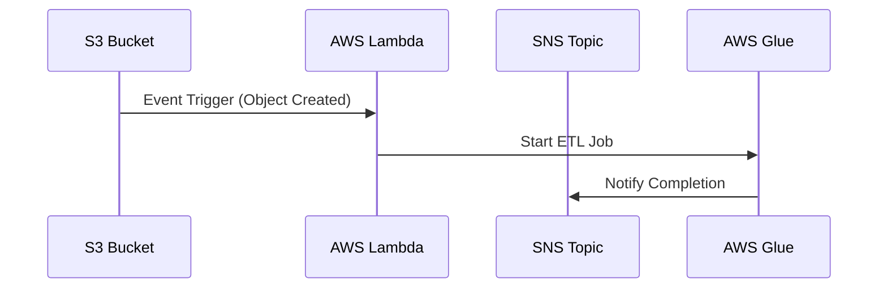

## Introduction

Serverless data processing is an architectural pattern that leverages cloud-based services to execute data processing tasks without the need to manage underlying infrastructure. This paradigm enables developers to focus on writing code while the cloud provider handles the provisioning and scaling of resources, which optimizes operational efficiency and cost-effectiveness.

## Architectural Approaches

### Event-Driven Architecture

Serverless data processing often utilizes an event-driven architecture where data changes or system events trigger specific processing functions. This model is highly scalable and responsive to varying data workloads.

### Function-as-a-Service (FaaS)

This approach uses FaaS platforms, like AWS Lambda, Azure Functions, or Google Cloud Functions, to execute stateless processing functions. Functions are invoked in response to events and can scale automatically to match the incoming workload.

### Data Pipeline Orchestration

Cloud providers offer orchestration services like AWS Step Functions, Apache Airflow on Google Cloud, or Azure Data Factory, enabling complex workflows that span multiple serverless functions and data processing services.

## Best Practices

- **Efficient Function Design**: Optimize functions for fast execution and minimal resource consumption to leverage cost efficiencies inherent in the serverless model.
- **Function State Management**: Use services like AWS Step Functions or Google Cloud Composer to manage state across multiple function executions.
- **Security Best Practices**: Implement stringent security measures such as encryption, IAM roles, and environment variable management to safeguard data.

## Example Code

Below is a basic example using AWS Lambda to process data from an S3 bucket:

```javascript
const AWS = require('aws-sdk');
const s3 = new AWS.S3();

exports.handler = async (event) => {
  for (const record of event.Records) {
    const bucket = record.s3.bucket.name;
    const key = record.s3.object.key;
    const params = {
      Bucket: bucket,
      Key: key,
    };

    try {
      const data = await s3.getObject(params).promise();
      const processedData = processData(data.Body.toString('utf-8'));
      console.log('Processed data:', processedData);
    } catch (error) {
      console.error('Error processing file:', error);
      throw new Error('Data processing failed');
    }
  }
};

function processData(data) {
  // Implement your data processing logic here
  return data.toUpperCase();
}
```

## Diagrams

### Serverless Data Processing Workflow



## Related Patterns

- **Microservices Architecture**: Offers the ability to decompose applications into loosely coupled services, many of which can be serverless.
- **Event Sourcing**: Often used in conjunction with serverless architectures for real-time processing and auditing.
- **CQRS (Command Query Responsibility Segregation)**: Separates the data modification logic from the query logic, often employed to enhance the performance of serverless applications.

## Additional Resources

- [AWS Lambda Documentation](https://docs.aws.amazon.com/lambda/latest/dg/welcome.html)
- [Google Cloud Functions Documentation](https://cloud.google.com/functions/docs)
- [Azure Functions Documentation](https://docs.microsoft.com/en-us/azure/azure-functions/)

## Summary

Serverless data processing enables the efficient and cost-effective execution of data processing tasks in the cloud by abstracting infrastructure management and using event-driven, scalable function executions. By adopting serverless patterns, organizations can optimize their data processing capabilities, enhance scalability, and reduce overhead costs.
