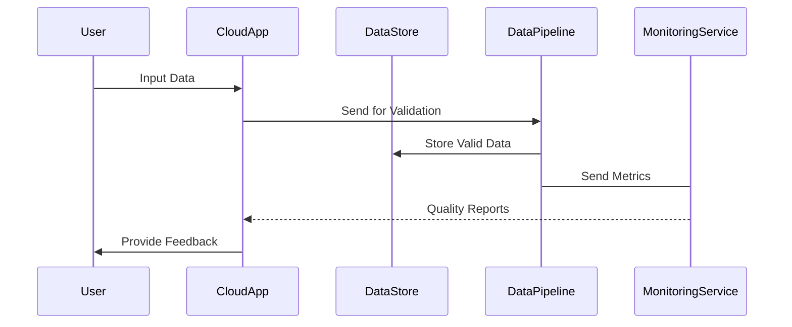

## Overview

In cloud-based systems, data quality assurance (DQA) is essential to support strategic decision-making and operational processes. Data Quality Assurance encompasses a set of practices aimed at ensuring data integrity, accuracy, consistency, and reliability across various stages of data processing in distributed cloud environments. This pattern is critical for organizations leveraging big data and analytics on cloud platforms to derive actionable insights.

## Key Concepts

- **Data Integrity**: Ensures data remains accurate and reliable over its lifecycle. This includes preventing unauthorized access or alterations.
- **Data Accuracy**: Involves ensuring data is clear, precise, and without errors, and reflects the intended state of entities.
- **Data Consistency**: Preserves uniformity across various data sets and databases, particularly crucial in distributed systems.
- **Data Reliability**: Consistency in data presentation and availability, ensuring that the data can be counted on for various processes.

## Architectural Approaches

1. **Data Profiling and Assessment**:
   - Perform regular profiling to understand data characteristics and identify potential quality issues.
   - Use tools like Apache Griffin or Talend for profiling data within cloud systems.

2. **Data Cleansing**:
   - Implement automated and manual processes to fix inaccuracies, remove duplicates, and standardize data formats.
   - Leverage SQL and ETL (Extract, Transform, Load) processes for cleansing.

3. **Data Validation**:
   - Set up validation rules at data entry points using services like AWS Glue or GCP Dataflow to ensure only valid data enters the system.
   - Incorporate machine learning-based anomaly detection to flag inconsistent data inputs.

4. **Data Lineage and Metadata Management**:
   - Track data movement through various components of the cloud system using tools like Apache Atlas.
   - Maintain comprehensive metadata to ensure any modification in data can be traced back to its origin.

5. **Quality Monitoring and Reporting**:
   - Implement dashboards and KPI tracking using platforms like Power BI or Tableau to monitor ongoing data quality.
   - Schedule frequent audits and generate reports to proactively address potential data quality issues.

## Best Practices

- **Automate Quality Checks**: Use automation to consistently perform data quality checks as part of your data pipeline.
- **Integrate AI/ML Techniques**: Apply AI and machine learning to predict and flag data anomalies proactively.
- **Continuous Quality Improvement**: Establish a feedback loop from quality assessments to improve processes and data quality standards iteratively.
- **Collaborate and Train**: Promote inter-departmental collaboration and provide training to ensure everyone understands the importance of data quality.
- **Adopt Robust Tools**: Use reliable tools and platforms tailored to your cloud system's requirements to handle data quality tasks effectively.

## Example Code

```scala
// Sample code for data validation using Spark in Scala
import org.apache.spark.sql.SparkSession
import org.apache.spark.sql.functions._
import org.apache.spark.sql.types._

val spark = SparkSession.builder()
  .appName("Data Quality Assurance")
  .getOrCreate()

val schema = new StructType()
  .add("id", IntegerType)
  .add("name", StringType)
  .add("age", IntegerType)

// Load data
val df = spark.read
  .option("header", "true")
  .schema(schema)
  .csv("s3://your-bucket/data.csv")

// Validate data - Example: Remove rows with null values in crucial columns
val cleanDf = df.filter(col("age").isNotNull)

cleanDf.show()
```

## Diagrams

### Data Quality Assurance Workflow



## Related Patterns

- **Data Lakes**: Provides raw data storage and processing capabilities that can be integrated with DQA to refine data.
- **ETL Pipelines**: Essential for data transformation and migration, encompassing pivotal data cleansing stages.
- **Real-Time Processing Architectures**: Combine with DQA to ensure quality in data streams and event-driven architectures.

## Additional Resources

- [The Data Management Solutions Using Data Quality](https://cloud.google.com/solutions/data-quality)
- [AWS Data Quality Best Practices](https://aws.amazon.com/big-data/datalakes-and-analytics/data-quality/)
- [Apache DataFu User Guide](https://orange.github.io/datafu/docs/userguide/data-quality.html)

## Summary

Data Quality Assurance is an indispensable pattern in the cloud computing realm, underpinning the efficacy and trustworthiness of data-driven decision-making. By implementing DQA practices, organizations can ensure their cloud-based data remains a valuable asset, supporting various analytics and operational activities with clear, precise, and reliable data. As cloud environments grow, incorporating sophisticated DQA strategies becomes paramount to maintaining a competitive edge.
