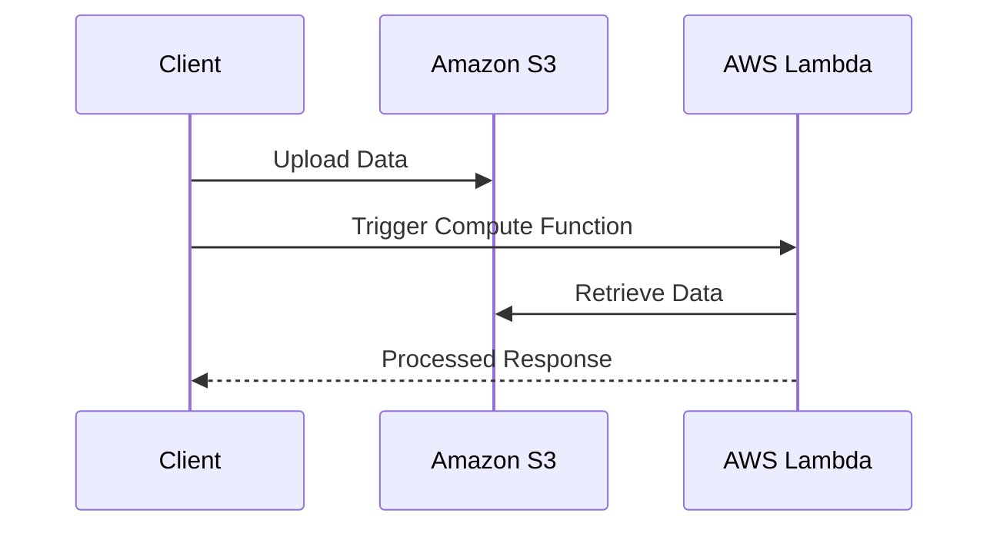

---

linkTitle: "Decoupled Storage and Compute"
title: "Decoupled Storage and Compute: Enhancing Flexibility in Cloud Architectures"
category: "Data Management and Analytics in Cloud"
series: "Cloud Computing: Essential Patterns & Practices"
description: "Decoupled storage and compute is a cloud architecture design pattern that separates data storage from the computational resources that process the data, allowing for independent scaling and enhanced flexibility in cost optimization."
categories:
- Cloud Architecture
- Data Management
- Cloud Analytics
tags:
- Decoupled Storage
- Compute Resources
- Cloud Scalability
- Cost Optimization
- Cloud Patterns
date: 2023-10-10
type: docs

canonical: "https://softwarepatternslexicon.com/18/6/15"
license: "© 2024 Tokenizer Inc. CC BY-NC-SA 4.0"
---

## Overview

The **Decoupled Storage and Compute** pattern is a foundational architectural approach within cloud computing aimed at optimizing flexibility, scalability, and cost efficiency. Unlike traditional monolithic designs, where storage and compute resources are tightly coupled, this pattern advocates for a separation that enables independent scaling based on differing application demands.

## Design Pattern Details

Traditionally, compute resources like CPU and RAM are closely linked with the storage resources, both being scaled together. However, in cloud architectures, workloads can vary greatly, where the requirements for storage capacity and compute power differ significantly. Decoupled Storage and Compute addresses these disparities by allowing each component to scale independently, thus optimizing resource utilization and cost.

### Key Benefits

- **Scalability**: Resources can be independently scaled to meet demand. For example, if a compute task requires more processing but not additional storage, only the compute instances need to be scaled up.
- **Cost Optimization**: Organizations can achieve cost savings by only scaling the necessary resources, reducing over-provisioning.
- **Flexibility**: Supports diverse workloads by allocating the right amount of resources where needed, whether it is storage or computing power.

### Common Use Cases

- **Data Analytics**: Handling large data sets where analysis processing might vary in demand independently of storage.
- **Machine Learning**: With varying compute needs depending on model training intensity without increasing storage unnecessarily.
- **Web Applications**: Serving dynamic content that requires fluctuating computing resources.

## Architectural Approaches

1. **Cloud Storage Services**: Utilize services like Amazon S3, Google Cloud Storage, or Azure Blob Storage for scalable and durable storage solutions.
2. **Independent Compute Services**: Employ compute services such as AWS Lambda, Google Cloud Functions, or Azure Functions for scaling processing power independently.
3. **Containerization**: Use container orchestration platforms like Kubernetes to separate compute workloads from data persistence.

## Best Practices

- **Cost Analysis**: Regularly assess use patterns to optimize cost savings by aligning provisioning strategies with resource demands.
- **Automated Scaling**: Implement autoscaling policies to dynamically adjust compute resources in response to real-time demand changes.
- **Data Governance**: Ensure data integrity and compliance through effective data management practices when decoupling storage.

## Example Code

Here's an example of setting up decoupled storage and compute using AWS:

```bash
aws s3 mb s3://my-decoupled-storage-bucket

aws lambda create-function \
    --function-name MyComputeFunction \
    --runtime python3.8 \
    --role arn:aws:iam::account-id:role/execution_role \
    --handler lambda_function.lambda_handler \
    --code S3Bucket=my-decoupled-storage-bucket,S3Key=lambda-code.zip
```

This setup demonstrates how to set up an S3 bucket for storage while using AWS Lambda for independent compute tasks.

## Diagrams

Below is Sequence diagram illustrating the interaction between decoupled storage and compute:



## Related Patterns

- **Event-Driven Architecture**: Supports reactive and real-time data streams in decoupled architectures.
- **Microservices**: Design services that are independently deployable and scale to optimize across storage and compute.
- **Serverless Architecture**: Enables fine-grained scaling of compute resources without managing server infrastructure.

## Additional Resources

- [AWS Documentation on Decoupled Architectures](https://aws.amazon.com/architecture/)
- [Google Cloud's Guide on Storage and Compute](https://cloud.google.com/architetcure/decoupled-compute-storage)
- [Microsoft Azure Patterns & Practices](https://docs.microsoft.com/en-us/azure/architecture/)

## Summary

The **Decoupled Storage and Compute** pattern offers significant advancements in building flexible, scalable, and cost-effective cloud solutions by separating storage resources from compute resources. It particularly benefits applications with varied requirements for data storage and processing power and aligns well with modern cloud-native strategies.

