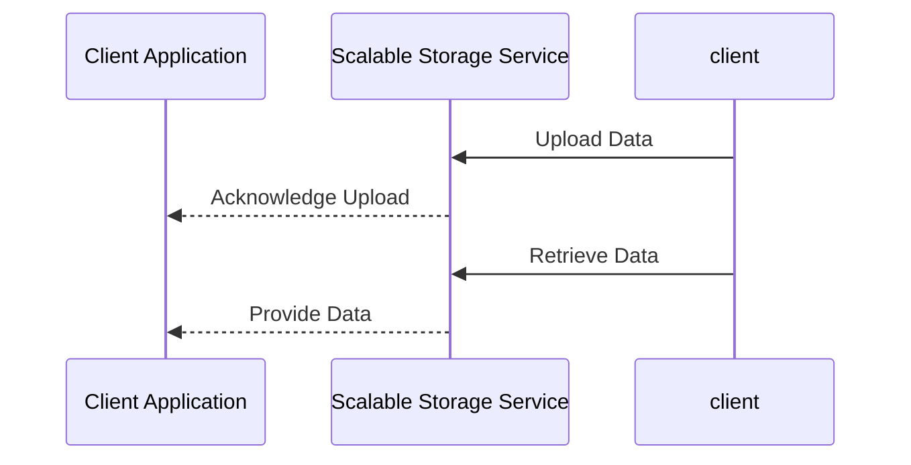

## Introduction

The need for scalable storage solutions has become critical in modern cloud environments. As data volume, velocity, and variety continuously grow, organizations must adopt architectures and patterns that can handle this increased load seamlessly. Scalable storage solutions enable efficient and flexible data management, providing the foundation for analytics and other data-driven applications. This article provides insight into various design patterns and best practices for implementing scalable storage solutions in the cloud.

## Design Patterns and Architectural Approaches

### 1. Distributed File Systems

Distributed File Systems (DFS) like Hadoop Distributed File System (HDFS) or Amazon S3 provide scalable, fault-tolerant storage necessary for big data analytics and processing.

- **Advantages**: High availability, cost efficiency, massive scalability.
- **Best Practices**:
  - Employ data replication to ensure reliability.
  - Use lifecycle policies to manage data durability and cost.

### 2. NoSQL Databases

NoSQL databases like MongoDB, Cassandra, and Amazon DynamoDB are designed for flexible schema requirements and horizontal scalability.

- **Advantages**: Schema flexibility, high throughput, seamless scalability.
- **Best Practices**:
  - Choose the right NoSQL model (document, key-value, column-family, graph) based on data access patterns.
  - Use partitioning and sharding effectively to distribute load.

### 3. Object Storage

Object storage systems like Amazon S3 and Azure Blob Storage allow for scalable storage of unstructured data.

- **Advantages**: Unlimited storage capacity, durability, easy data retrieval.
- **Best Practices**:
  - Leverage versioning for data protection.
  - Optimize storage usage with intelligent tiering based on data access frequency.

### 4. Data Lakes

Data Lakes provide a centralized repository for storing unprocessed data. They support both structured and unstructured data storage, enabling diverse analytics workloads.

- **Advantages**: Centralization of data, supports multiple analytics paradigms.
- **Best Practices**:
  - Implement governance for data quality and security.
  - Use metadata tagging for efficient data organization and retrieval.

### 5. Data Warehouses

Cloud data warehouses like Amazon Redshift and Google BigQuery offer robust solutions for structured data storage and querying.

- **Advantages**: Efficient analytics, real-time insights, integrated with BI tools.
- **Best Practices**:
  - Utilize clustering and partitioning for query optimization.
  - Employ caching mechanisms to improve query performance.

## Example Code

Here's a basic example of using Amazon S3 with AWS SDK in Java to store an object:

```java
import software.amazon.awssdk.services.s3.S3Client;
import software.amazon.awssdk.services.s3.model.PutObjectRequest;
import software.amazon.awssdk.core.sync.RequestBody;

public class S3Example {
    public static void main(String[] args) {
        S3Client s3 = S3Client.builder().build();
        PutObjectRequest request = PutObjectRequest.builder()
                .bucket("my-bucket")
                .key("my-object.txt")
                .build();
        s3.putObject(request, RequestBody.fromString("Hello, S3!"));
        System.out.println("Object stored successfully.");
    }
}
```

## Diagrams

Below is UML sequence diagram illustrating the interaction between a cloud application and scalable storage services:



## Related Patterns

- **Cache-Aside Pattern**: Enhance data retrieval performance by caching frequently accessed data.
- **Command Query Responsibility Segregation (CQRS)**: Separate read and write operations for optimized data handling.

## Additional Resources

- [AWS Documentation on Scalable Storage Services](https://aws.amazon.com/documentation/storage/)
- [GCP Storage Options Overview](https://cloud.google.com/storage-options)

## Summary

Scalable storage solutions form an essential component of modern cloud architectures, enabling organizations to effectively manage massive datasets and perform advanced analytics. By leveraging distributed file systems, NoSQL databases, object storage, data lakes, and data warehouses, businesses can address the challenges of data growth, variability, and speed, ensuring their systems remain robust and performant. Adopting the outlined best practices can further help optimize these solutions for cost, efficiency, and reliability.
