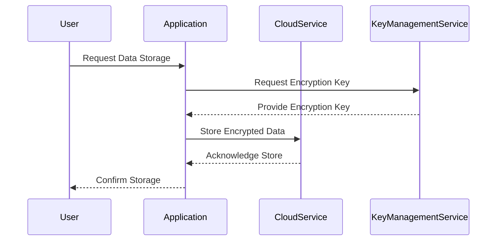

In the realm of cloud computing, ensuring the security of data is paramount. This pattern focuses on employing encryption methodologies to safeguard data both at rest and during transmission across networks. Encryption acts as a fortification, ensuring data confidentiality and integrity, making it incomprehensible to unauthorized users.

## Detailed Explanation

### Design Patterns

1. **Encryption at Rest**:
   - **Description**: Encrypts stored data to prevent unauthorized access.
   - **Purpose**: Protects data stored on physical storage devices by enciphering datasets.
   - **Implementation**: Utilize services like AWS KMS (Key Management Service), Azure Key Vault, or GCP Cloud KMS to manage keys and encrypt data in cloud storage.

2. **Encryption in Transit**:
   - **Description**: Ensures data traveling between client and server is secure.
   - **Purpose**: Protects data from eavesdroppers and man-in-the-middle attacks.
   - **Implementation**: Use HTTPS/TLS protocols for secure data transmission over the Internet.

3. **End-to-End Encryption**:
   - **Description**: Encrypts data throughout its journey from sender to receiver.
   - **Purpose**: Provides a complete encryption mechanism ensuring only the communicating users can read the messages.
   - **Implementation**: Implement encryption libraries that support end-to-end encryption such as OpenSSL for secure channels.

### Architectural Approaches

- **Key Management**: Proper management and rotation of cryptographic keys are critical. Utilize cloud-based key management services or on-premises HSMs (Hardware Security Modules) to ensure security and compliance.
  
- **Access Controls**: Implement strict access control policies to ensure encryption keys are accessed only by authorized entities.

- **Auditing and Logging**: Maintain comprehensive audit logs for monitoring access to cryptographic keys and encrypted data to support compliance and security investigations.

## Best Practices

- **Regularly Update Encryption Algorithms**: Stay updated with the latest encryption standards and update systems accordingly to safeguard against new vulnerabilities.
  
- **Perform Security Audits**: Regular security assessments can help identify gaps in encryption implementations.
  
- **Compliance and Regulations**: Adhere to industry regulations like GDPR, HIPAA, and PCI DSS that mandate specific encryption requirements.

## Example Code

Here's a simple example using AWS SDK for encrypting data at rest using AWS KMS:

```java
import com.amazonaws.services.kms.AWSKMS;
import com.amazonaws.services.kms.AWSKMSClientBuilder;
import com.amazonaws.services.kms.model.EncryptRequest;

import java.nio.ByteBuffer;

public class EncryptData {
    public static void main(String[] args) {
        AWSKMS kmsClient = AWSKMSClientBuilder.standard().build();

        ByteBuffer plaintext = ByteBuffer.wrap("Sensitive data to encrypt".getBytes());
        EncryptRequest req = new EncryptRequest().withKeyId("alias/my-key")
                                                 .withPlaintext(plaintext);

        ByteBuffer ciphertext = kmsClient.encrypt(req).getCiphertextBlob();
        System.out.println("Encrypted data: " + new String(ciphertext.array()));
    }
}
```

## Diagrams

### Data Encryption Workflow



## Related Patterns

- **Identity and Access Management**: Ensuring only authorized users can access data.
- **Intrusion Detection and Prevention Systems**: To detect and mitigate unauthorized access attempts.

## Additional Resources

- [AWS Security Best Practices](https://aws.amazon.com/whitepapers/aws-security-best-practices/)
- [Google Cloud Encryption Overview](https://cloud.google.com/encryption/)
- [Microsoft Azure Encryption](https://docs.microsoft.com/en-us/azure/security/fundamentals/encryption-overview)

## Summary

Encrypting data both at rest and in transit is crucial for maintaining data confidentiality and integrity in cloud environments. By leveraging proven encryption patterns and best practices, organizations can mitigate risks associated with unauthorized access, ensuring their cloud-hosted data remains secure and compliant with international standards and regulations.
