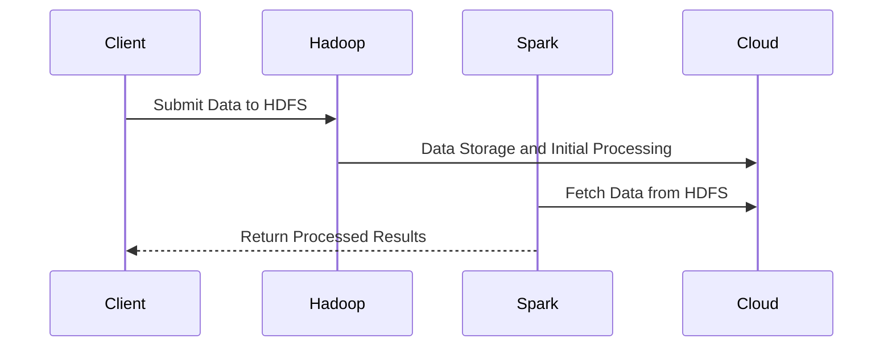

---

linkTitle: "Big Data Processing with Hadoop/Spark"
title: "Big Data Processing with Hadoop/Spark: Efficient Data Computation and Analytics"
category: "Data Management and Analytics in Cloud"
series: "Cloud Computing: Essential Patterns & Practices"
description: "Explore the architectural pattern for efficient big data processing using Hadoop and Spark on cloud infrastructures, focusing on scalability, fault tolerance, and real-time analytics."
categories:
- Cloud Computing
- Big Data
- Data Analytics
tags:
- Hadoop
- Spark
- Data Processing
- Cloud Infrastructure
- Real-time Analytics
date: 2024-07-07
type: docs

canonical: "https://softwarepatternslexicon.com/18/6/2"
license: "© 2024 Tokenizer Inc. CC BY-NC-SA 4.0"
---

## Introduction

In today's data-driven world, massive volumes of data are generated, requiring robust processing frameworks. This document explores the Big Data Processing pattern using Hadoop and Spark, focusing on efficient data computation and analytics within cloud environments. This architectural approach leverages the strengths of these two frameworks to achieve scalability, fault tolerance, and real-time insights.

## Architectural Approach

### Hadoop

Hadoop is designed to handle vast amounts of data distributed across clusters of machines. It uses the Hadoop Distributed File System (HDFS) for storage and the MapReduce programming model for data processing.

**Components:**

- **HDFS**: Provides high-throughput data access.
- **MapReduce**: Enables parallel processing of large datasets.
- **YARN**: Manages cluster resources.

### Spark

Apache Spark complements Hadoop with in-memory data processing, improving speed and efficiency. It is well-suited for iterative algorithms and interactive data analysis.

**Components:**

- **Spark Core**: Provides basic functionalities for job scheduling and task dispatching.
- **Spark SQL**: Offers querying capabilities using SQL-like syntax.
- **MLlib**: Machine learning library.
- **GraphX**: For graph computation.
- **Structured Streaming**: Real-time data processing.

### Integration in Cloud

Leverage cloud services such as AWS EMR, Azure HDInsight, or GCP Dataproc for managed Hadoop and Spark deployments. This integration provides:

- **Elastic scalability**: Scale clusters up or down based on demand.
- **Cost-efficiency**: Pay for usage with cloud-native billing models.
- **Resource Management**: Cloud platforms handle resource provision and management.

## Pattern Implementation

### Best Practices

- **Data Partitioning**: Optimally partition data to enhance parallel processing.
- **Resource Configuration**: Tailor resource allocation to match workload requirements.
- **Data Locality**: Place data near computation resources to minimize latency.
- **Fault Tolerance**: Use HDFS and Spark's lineage graph for automated recovery from failures.

### Example Code

Below is an example of a simple Spark application in Scala that processes data stored on HDFS:

```scala
import org.apache.spark.sql.SparkSession

object SparkHadoopExample {
  def main(args: Array[String]): Unit = {
    val spark = SparkSession.builder
      .appName("HadoopSparkExample")
      .getOrCreate()

    val hadoopData = spark.read.textFile("hdfs://path/to/data")
    val wordCount = hadoopData.flatMap(line => line.split(" "))
      .groupByKey(identity).count()

    wordCount.show()

    spark.stop()
  }
}
```

## Diagrams

### Data Flow Diagram



## Related Patterns

- **Lambda Architecture**: Combines batch processing and real-time streaming.
- **ETL Offload**: Data extraction, transformation, and loading using cloud resources.
- **Data Lake**: Centralized repository for storing structured and unstructured data at scale.

## Additional Resources

- [Apache Hadoop Documentation](https://hadoop.apache.org/docs/)
- [Apache Spark Documentation](https://spark.apache.org/docs/latest/)
- [AWS Elastic MapReduce](https://aws.amazon.com/emr/)
- [GCP Dataproc](https://cloud.google.com/dataproc)
- [Azure HDInsight](https://azure.microsoft.com/en-us/services/hdinsight/)

## Summary

The Big Data Processing pattern with Hadoop and Spark on cloud infrastructures allows organizations to efficiently handle, process, and analyze vast datasets. By leveraging the cloud's elastic capabilities and the powerful processing engines of Hadoop and Spark, enterprises can gain real-time insights, ensure fault tolerance, and optimize resource usage. This pattern is vital for meeting the demands of modern applications in various industrial sectors, from finance to healthcare.
