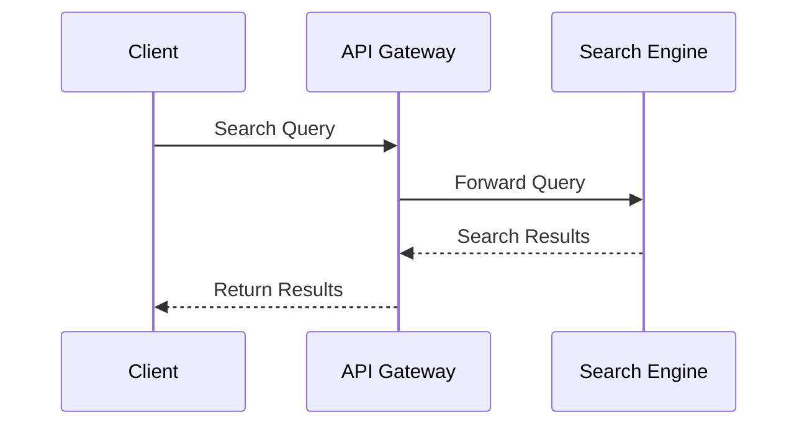

## Search Services Implementation: Harnessing Cloud Power for Efficient Data Retrieval

In the realm of cloud computing, implementing efficient search services is pivotal for applications dealing with extensive datasets. Cloud-based search services offer scalable, distributed search capabilities enabling quick and precise data retrieval. This article delves into the design pattern of Search Services Implementation, encompassing architectural approaches, relevant paradigms, best practices, and integration with open-source technologies.

### Design Pattern Overview

The **Search Services Implementation** pattern focuses on leveraging cloud infrastructure for search operations that handle large amounts of data across multiple nodes. This facilitates not only improved performance via distributed architectures but also enhances scalability and availability.

### Architectural Approach

1. **Distributed Search Architecture**:
   - Utilize cloud-native services such as Azure Search, Amazon CloudSearch, or open-source tools like Elasticsearch to distribute search operations over multiple nodes.
   - Employ techniques such as sharding for data distribution across nodes and replication for data availability.

2. **Indexing Strategies**:
   - Implement efficient indexing mechanisms to manage how documents are indexed and retrieved, improving search response times and accuracy.
   - Full-text search, auto-suggestions, and faceted search are common approaches that enhance user experience.

3. **API Integration**:
   - Expose search functionalities through RESTful APIs, enabling seamless integration with web applications and services.

### Best Practices

- **Data Management**: Use data pipelines to preprocess data for indexing, ensuring only cleansed data is stored.
- **Scalability**: Design for horizontal scalability, allowing the addition of nodes as data volumes grow.
- **Monitoring and Logging**: Implement real-time monitoring of search operations and maintain logs for performance analysis and troubleshooting.
- **Security**: Ensure data at rest and in transit is encrypted, and implement proper authentication and authorization mechanisms.

### Example Code

Here's an example of configuring an Elasticsearch client in Java:

```java
import org.elasticsearch.client.RestClient;
import org.elasticsearch.client.RestHighLevelClient;

public class ElasticsearchConfig {
    
    public RestHighLevelClient createClient() {
        return new RestHighLevelClient(
            RestClient.builder(new HttpHost("localhost", 9200, "http"))
        );
    }
}
```

### Diagram

Below is sequence diagram illustrating a typical search service interaction involving a client and a cloud-based search engine:



### Related Patterns

- **CQRS (Command Query Responsibility Segregation)**: Allows separation of read and write operations, optimizing the search workload.
- **Event Sourcing**: Keeps a log of all changes as a sequence of events, which can be indexed for search purposes.

### Additional Resources

- [Elasticsearch Documentation](https://www.elastic.co/guide/index.html)
- [Azure Cognitive Search](https://learn.microsoft.com/en-us/azure/search/search-what-is-azure-search)
- [Amazon CloudSearch](https://aws.amazon.com/cloudsearch/)

### Summary

Integrating search services in a cloud environment provides significant advantages in data management and retrieval. By following this design pattern, you can achieve scalable, robust, and high-performance search functionalities, empowering applications to handle vast datasets efficiently. This not only enhances user experience but also future-proofs your systems to accommodate growing data needs.
