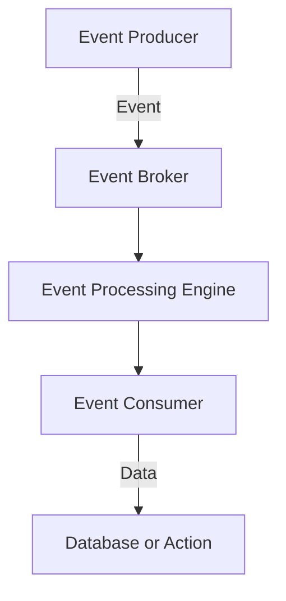
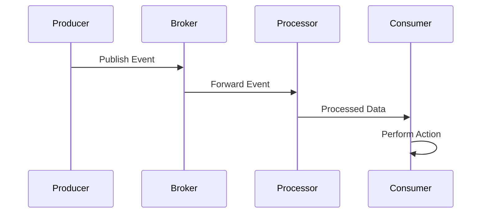

## Introduction

Event-Driven Data Processing is a design pattern that focuses on the efficient handling of real-time data events within cloud environments. This pattern is essential for creating systems that need to respond promptly to a continuous flow of data changes, enabling responsive and scalable applications.

### Core Concepts

- **Event**: A signal indicating a change of state in the application. Events trigger processing flows within the system.
- **Event Source**: The origin of events, which could be user interactions, IoT devices, or system-generated events.
- **Event Stream**: A continuous flow of events communicated from sources to processing systems.
- **Event Processing Model**: The architectural approach to consume, transform, and respond to events, which can be implemented using stream processing or batch processing.

## Architectural Approach

The typical architecture for Event-Driven Data Processing involves multiple components interconnected to efficiently process events as they occur:

### 1. Event Producers
Sources that generate events in response to state changes, user actions, or device outputs.

### 2. Event Broker
A middleware that handles event distribution, ensuring decoupled communication between event producers and consumers. Technologies like Apache Kafka, AWS Kinesis, and Google Pub/Sub are commonly used.

### 3. Event Processing Engine
Components that process incoming events using rules, analytics, or transformations. This can be implemented using frameworks like Apache Flink, Apache Storm, or Spark Streaming.

### 4. Event Consumers
Applications or services that subscribe to event streams and act on events, such as updating a database or triggering other processes.

## Best Practices

- **Decoupling**: Use event brokers to decouple event producers and consumers, allowing independent scaling and development.
- **Scalability**: Implement scalable broker and processing solutions to manage varying event loads.
- **Fault Tolerance**: Ensure system resilience with mechanisms such as event replay, commit logs, and distributed processing.
- **Real-Time Analytics**: Utilize stream processing engines for instant insights and actions on incoming data.
- **Monitoring and Logging**: Integrate comprehensive monitoring to trace event flow and diagnose issues.

## Example Code

Below is a simplistic example using Apache Kafka and Kafka Streams in Java to illustrate event-driven processing:

```java
import org.apache.kafka.streams.KafkaStreams;
import org.apache.kafka.streams.StreamsBuilder;
import org.apache.kafka.streams.kstream.KStream;
import org.apache.kafka.streams.kstream.KTable;

public class EventDrivenProcessingExample {
    public static void main(String[] args) {
        StreamsBuilder builder = new StreamsBuilder();
        KStream<String, String> events = builder.stream("input-topic");

        KTable<String, Long> eventCounts = events
            .groupBy((key, value) -> value)
            .count();

        eventCounts.toStream().to("output-topic");

        KafkaStreams streams = new KafkaStreams(builder.build(), new Properties());
        streams.start();
    }
}
```

## Diagrams

### Architectural Diagram



### Sequence Diagram



## Related Patterns

- **Event Sourcing**: Captures all changes to an application state as a sequence of events.
- **CQRS**: Separates read and write operations for improved management and performance.
- **Pub/Sub Messaging**: Uses messaging patterns to distribute events across systems.

## Additional Resources

- [Apache Kafka Documentation](https://kafka.apache.org/documentation/)
- [AWS Kinesis Data Streams](https://aws.amazon.com/kinesis/data-streams/)
- [Google Cloud Pub/Sub](https://cloud.google.com/pubsub/docs)

## Summary

Event-Driven Data Processing is crucial for building responsive and scalable cloud applications that respond to real-time data events. By leveraging appropriate architectural components and practices, you can create efficient systems that handle a large volume of events, ensuring timely processing and action.

This pattern facilitates decoupled communication, real-time analytics, and seamless scalability, making it a powerful tool in modern cloud architecture.
