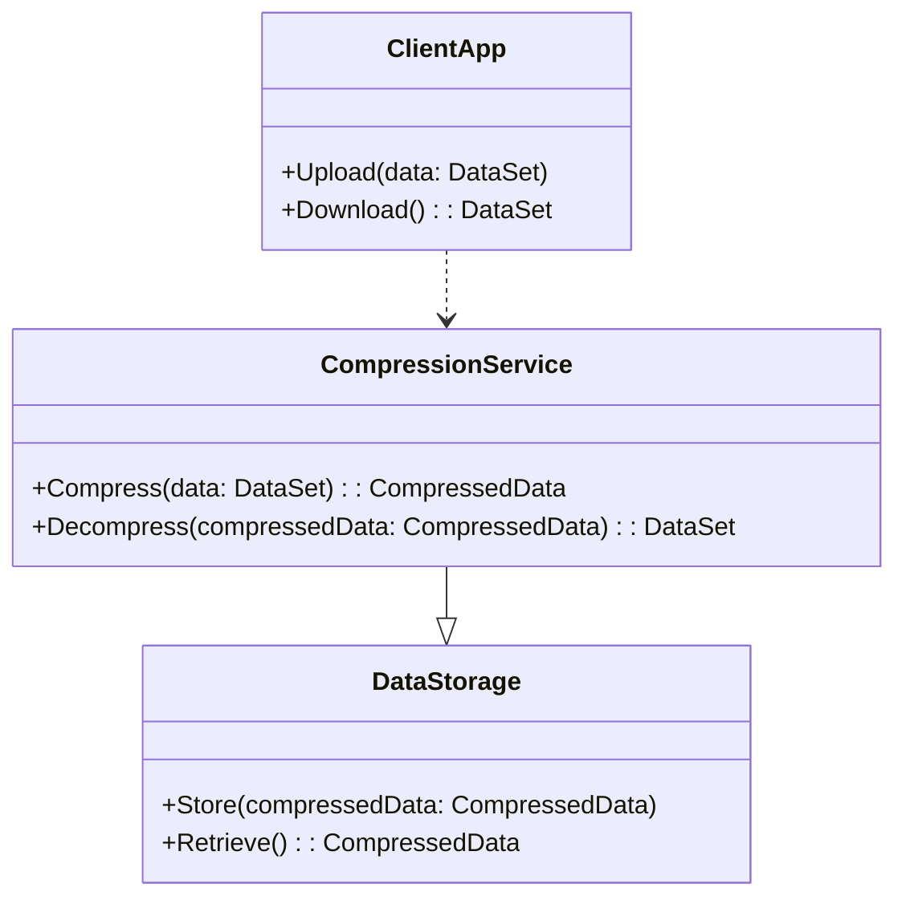

## Introduction

Data compression is a fundamental technique used to reduce the size of data, making it efficient for storage and transmission, particularly in cloud computing environments where data volumes are substantial. This reference explores various data compression techniques, their applications, and how they contribute to optimal data management in the cloud.

## Design Patterns and Techniques

### 1. Lossless vs. Lossy Compression

- **Lossless Compression**: Allows the original data to be perfectly reconstructed from the compressed data. Common algorithms include ZIP, GZIP, and LZW.
- **Lossy Compression**: Permanently removes some data, allowing for higher compression rates at the cost of potential quality degradation. Examples include JPEG for images and MP3 for audio.

### 2. Entropy Coding

Entropy coding is used in lossless compression algorithms to represent frequently encountered elements with shorter codes:
- **Huffman Coding**: Assigns variable-length codes to input characters, with shorter codes for more frequent characters.
- **Arithmetic Coding**: Represents the entire message as a single number, offering better compression rates than Huffman coding in some situations.

### 3. Dictionary-Based Compression

Utilizes dictionaries to replace repeated data patterns with shorter representations:
- **Lempel-Ziv-Welch (LZW)**: Builds a dictionary of input data patterns for compression.
- **DEFLATE**: Combines LZ77 compression with Huffman coding; used in formats like ZIP and PNG.

### 4. Run-Length Encoding (RLE)

Simple form of data compression where consecutive identical data values are replaced with a single value and a count. It is effective for data with many repeating elements.

### 5. Delta Encoding

Records differences between sequential data points rather than entire values, commonly used in time series data and version control systems.

### 6. Transformation Coding

Transforms data into another domain for more efficient compression:
- **Fourier Transform**: Used in signal processing and multimedia compression.
- **Discrete Cosine Transform (DCT)**: Basis for JPEG image compression, where image data is transformed and adaptively quantized.

## Architectural Approaches

- **Hybrid Compression Schemes**: Combine both lossless and lossy methods to leverage the benefits of each technique.
- **Compression as a Service (CaaS)**: Cloud-based services for applying compression, suitable for multi-tenant architectures.

## Best Practices

- Choose the right compression technique based on data type and use case.
- Test compression impacts on both storage and retrieval performance.
- Consider data sensitivity and compliance when using lossy methods.
- Implement transparent compression mechanisms in file storage for cloud systems.

## Example Code

Here's a basic example of using GZIP for data compression in Java:

```java
import java.io.ByteArrayOutputStream;
import java.util.zip.GZIPOutputStream;

public class GzipExample {
    public static byte[] compress(String data) throws Exception {
        ByteArrayOutputStream byteArrayOutputStream = new ByteArrayOutputStream();
        try (GZIPOutputStream gzipOutputStream = new GZIPOutputStream(byteArrayOutputStream)) {
            gzipOutputStream.write(data.getBytes());
        }
        return byteArrayOutputStream.toByteArray();
    }

    public static void main(String[] args) throws Exception {
        String originalData = "This is the data to be compressed.";
        byte[] compressedData = compress(originalData);
        System.out.println("Compressed data size: " + compressedData.length);
    }
}
```

## Diagrams

### Example of a Hybrid Compression Architecture

Here is a basic diagram showcasing the components involved in a hybrid compression system:



## Related Patterns with Descriptions

- **ETL (Extract, Transform, Load)**: Data compression can optimize ETL processes by reducing data size during transfer between systems.
- **Data Lake Pattern**: Efficient data storage management in data lakes through effective use of compression techniques.
  
## Additional Resources

- [Wikipedia: Data Compression](https://en.wikipedia.org/wiki/Data_compression)
- [Understanding Compressed Data Formats](https://linktoarticle.com)
- [Building Efficient File Storage Systems with Compression](https://linktoresource.com)

## Summary

Data compression techniques significantly enhance data management through reduced storage requirements and optimized transmission efficiency—vital for cloud computing environments. By choosing appropriate compression strategies, organizations can balance performance, resource utilization, and data integrity, aiding in seamless cloud operations.


