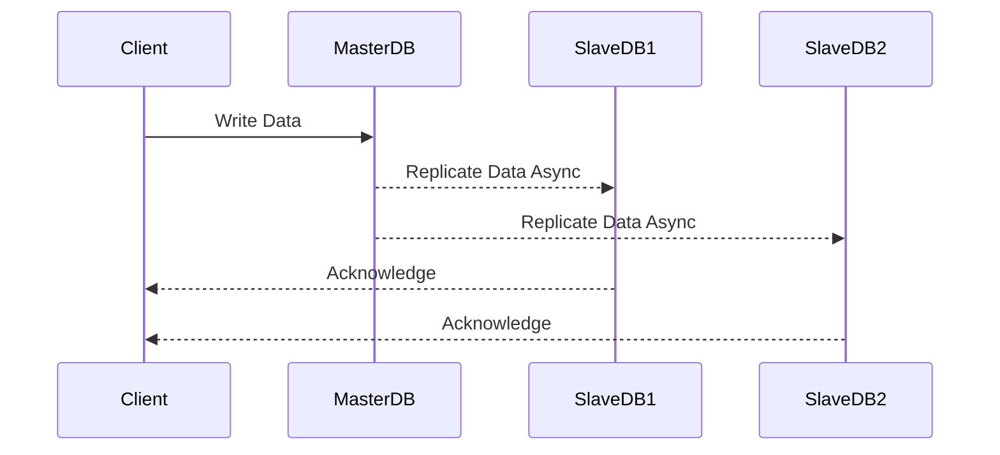

---

linkTitle: "Replication and Synchronization"
title: "Replication and Synchronization: Data Consistency and Availability"
category: "Data Management and Analytics in Cloud"
series: "Cloud Computing: Essential Patterns & Practices"
description: "Detailed exploration of Replication and Synchronization in cloud systems to ensure data consistency, availability, and fault tolerance."
categories:
- Cloud Computing
- Data Consistency
- Data Management
tags:
- Replication
- Synchronization
- Distributed Systems
- Cloud Patterns
- Data Consistency
date: 2024-07-07
type: docs

canonical: "https://softwarepatternslexicon.com/18/6/23"
license: "© 2024 Tokenizer Inc. CC BY-NC-SA 4.0"
---

## Introduction

Replication and Synchronization are fundamental design patterns in cloud computing that play a pivotal role in managing data consistency and availability across distributed systems. These patterns help in ensuring that data is reliably available even in the presence of failures and can minimize downtime, making them crucial for high-availability systems.

## Description

### Replication

Replication involves creating and maintaining copies of data across different nodes in a distributed system. This pattern is instrumental in improving data availability and reliability. There are three major types of replication strategies:

1. **Master-Slave Replication** - One master node handles data writes, whereas other slave nodes replicate data for reading.
2. **Multi-Master Replication** - Multiple nodes handle data writes and sync with each other to ensure data consistency.
3. **Client-side Replication** - The client manages data sync between nodes, suitable for edge devices or disconnected operations.

### Synchronization

Synchronization ensures that replicated data remains consistent across all nodes that hold the data copies. This can be achieved using:

- **Synchronous Synchronization** - All replicas are updated in real-time as changes occur, which provides strong consistency but may impact system performance due to latency.
- **Asynchronous Synchronization** - Updates are propagated at periodic intervals, offering better performance but weaker consistency.

## Architectural Approaches

- **Eventual Consistency**: A model where systems guarantee that, given enough time without new updates, all replicas will eventually converge to the same value. It is commonly used in NoSQL databases like Amazon DynamoDB and Apache Cassandra.
  
- **Strong Consistency**: Ensures that any read operation reflects the most recent write operation, often implemented in systems requiring transactional accuracy such as financial services.
  
- **CAP Theorem**: Balances Consistency, Availability, and Partition Tolerance. It's crucial to choose the right trade-offs based on application requirements.

## Best Practices

- Implement **Conflict Resolution Mechanisms** to handle data inconsistencies, especially in multi-master replication scenarios.
  
- Use **Tunable Consistency Levels** in databases like Cassandra to adjust the balance between consistency and performance.
  
- **Monitor and Alert** for synchronization delays and replication lag to preemptively address data consistency issues.

## Example Code

Here's a simple example using Apache Kafka to illustrate asynchronous event replication:

```java
Properties props = new Properties();
props.put("bootstrap.servers", "localhost:9092");
props.put("acks", "all"); // Ensures all replicas acknowledge messages
props.put("key.serializer", "org.apache.kafka.common.serialization.StringSerializer");
props.put("value.serializer", "org.apache.kafka.common.serialization.StringSerializer");

Producer<String, String> producer = new KafkaProducer<>(props);
for (int i = 0; i < 100; i++) {
    producer.send(new ProducerRecord<>("my-topic", Integer.toString(i), Integer.toString(i)));
}
producer.close();
```

## Diagrams

### UML Sequence Diagram for Replication and Synchronization



## Related Patterns

- **Leader and Follower**: A pattern for electing a single leader amongst a group of nodes to maintain a single source of truth.
  
- **Snapshot Isolation**: Provides a consistent snapshot view of data for read operations, helping in synchronization.

## Additional Resources

- [Google's Spanner](https://cloud.google.com/spanner): A globally distributed database with strong consistency.
- [Amazon DynamoDB](https://aws.amazon.com/dynamodb/): Offers eventual consistency with options for strong consistent reads.

## Summary

Replication and Synchronization are essential patterns for ensuring data consistency and availability in distributed systems. By employing these patterns, cloud systems can achieve high fault tolerance and meet various consistency requirements. By understanding and applying the right strategy and architecture based on specific needs, organizations can effectively manage their data in cloud environments, thereby ensuring smooth, reliable operations.

---
