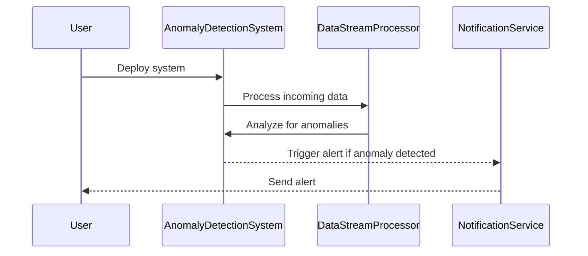

## Anomaly Detection Systems

### Overview

Anomaly detection is a critical component in various cloud-based systems for identifying irregular or unexpected behaviors within datasets. These systems are vital for monitoring applications, enhancing security, ensuring consistency in data integrity, and maintaining service levels in complex cloud infrastructures. This pattern provides a detailed framework for designing and implementing effective anomaly detection systems using cloud technologies and modern data processing paradigms.

### Architectural Approaches

1. **Stream Processing:** Leveraging platforms such as Apache Kafka, AWS Kinesis, or Google Cloud Dataflow to process real-time data streams and apply anomaly detection algorithms as data flows through the pipeline.

2. **Batch Processing:** Utilizing data batches processed at specific intervals through systems like Apache Spark or Hadoop. This approach is effective for analyzing historical data to identify trends and sporadic anomalies.

3. **Hybrid Solutions:** Combining both stream and batch processing to optimize anomaly detection. This ensures real-time monitoring and comprehensive historical analysis for better accuracy and context.

### Techniques and Algorithms

- **Statistical Methods:** Use techniques like z-score, Holt-Winters seasonal adjustment, or ARIMA models to detect anomalies based on statistical deviations.

- **Machine Learning Models:** Implement supervised or unsupervised learning techniques, such as isolation forests, DBSCAN, or autoencoders, to identify patterns that deviate from the norm.

- **Deep Learning Approaches:** Utilize recurrent neural networks (RNNs) or long short-term memory (LSTM) networks for complex sequence prediction and anomaly detection in time-series data.

### Best Practices

1. **Data Normalization:** Ensure consistent data formats and scales for better model performance and accuracy.

2. **Continuous Monitoring:** Implement real-time anomaly alerting systems using cloud services like AWS CloudWatch Alarms or Azure Monitor.

3. **Scalability and Flexibility:** Design systems that can automatically scale in response to variable data volumes and apply flexible algorithms suitable for different anomaly types.

4. **Explainability:** Equip models with interpretable outputs to facilitate understanding and decision-making by end-users.

### Example Code

```scala
import org.apache.spark.ml.clustering.{KMeans, KMeansModel}
import org.apache.spark.sql.SparkSession

val spark = SparkSession.builder.appName("AnomalyDetectionExample").getOrCreate()

// Load sample data
val dataset = spark.read.format("libsvm").load("data/sample_kmeans_data.txt")

// Train a KMeans model
val kmeans = new KMeans().setK(2).setSeed(1L)
val model = kmeans.fit(dataset)

// Show the result
println("Cluster Centers: ")
model.clusterCenters.foreach(println)
```

### Diagrams



### Related Patterns

- **Event Sourcing:** Captures all changes to an application state as a sequence of events, useful for tracking anomalies over time.
- **CQRS (Command Query Responsibility Segregation):** Separating read and write models for efficient data retrieval and update, aiding in anomaly analysis.
- **Circuit Breaker:** Prevents system failures by managing invalid states and can work effectively with anomaly detection to provide resilience.

### Additional Resources

- [Anomaly Detection in Cloud Computing](https://example-resource.com)
- [Machine Learning for Anomaly Detection](https://another-resource.com)
- [Cloud-Native Data Analytics](https://resource-for-analytics.com)

### Summary

Anomaly Detection Systems are indispensable for ensuring the reliability and security of cloud-based applications. By utilizing a blend of real-time and historical data processing along with advanced machine learning techniques, organizations can effectively monitor and respond to irregularities. By following best practices and leveraging cloud-native services, these systems can provide scalable, accurate, and timely insights for proactive management of cloud infrastructures.
