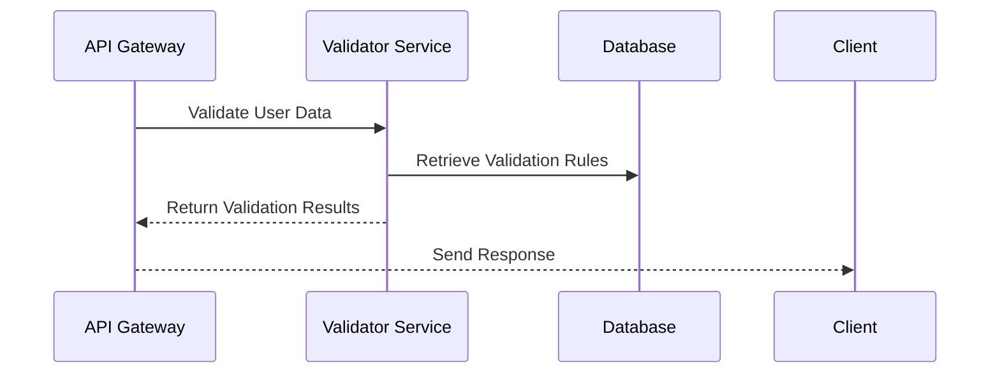

## Introduction

Data validation frameworks play a crucial role in maintaining the integrity and accuracy of data as it moves through various systems in a cloud environment. As organizations increasingly rely on cloud-based solutions to manage their data, ensuring that this data is valid and consistent becomes paramount. This article explores the design patterns, architectural approaches, and best practices for implementing data validation frameworks in cloud-native applications.

## Design Patterns for Data Validation

### 1. Schema Validation Pattern

Schema validation involves defining a schema that describes the structure, types, and constraints of the data. This pattern ensures that any data ingested or processed adheres to the specified schema.

- **Usage**: Commonly used in data lakes, data warehouses, and ETL processes.
- **Example Tools**: Apache Avro, JSON Schema, XML Schema.

### 2. Rule-based Validation Pattern

Rule-based validation applies specific business rules to data to ensure it meets certain conditions or formats.

- **Usage**: Often used in applications where business logic defines the validity of data.
- **Example Tools**: JSR 380 (Java Bean Validation), Google's RE2 for regex validation.

### 3. Machine Learning-based Validation Pattern

Utilizes machine learning models to predict anomalies or inconsistencies in data.

- **Usage**: Suitable for complex datasets where rules are not easily defined.
- **Example Tools**: TensorFlow, PyTorch for anomaly detection models.

## Architectural Approaches

### Cloud-Native Architecture

Design a cloud-native data validation framework that leverages microservices to validate data at each stage of its lifecycle. Utilize serverless technologies for automatic scaling.

#### Components
- **API Gateways**: Act as entry points for data validation services.
- **Microservices**: Each responsible for specific validation tasks, such as schema validation or rule-based validation.
- **Message Brokers**: For asynchronous validation requests, Kafka or RabbitMQ.
- **Storage Solutions**: Use NoSQL databases like DynamoDB or SQL databases like PostgreSQL to store validation rules and schemas.

### Event-Driven Architecture

Adopt an event-driven approach where every data ingress or modification triggers validation events.

#### Components
- **Event Sources**: Data ingestion points.
- **Event Processors**: Services that apply validation rules.
- **Event Stores**: Systems like Amazon Kinesis or Azure Event Hubs for event logging.

## Best Practices

- **Decouple Validation Logic**: Keep validation logic separate from business logic to enhance reusability and scalability.
- **Automated Testing**: Implement automated testing strategies to verify validation rules.
- **Version Control for Schemas**: Manage versions of validation schemas to support backward compatibility.
- **Continuous Monitoring**: Deploy monitoring solutions like Prometheus or CloudWatch for real-time metrics.

## Example Code

```java
import javax.validation.constraints.NotNull;
import javax.validation.constraints.Size;

public class UserData {

    @NotNull(message = "Name cannot be null")
    @Size(min = 2, max = 30, message = "Name must be between 2 and 30 characters")
    private String name;

    @NotNull(message = "Email cannot be null")
    private String email;

    // getters and setters
}
```

## Diagrams

### UML Sequence Diagram



## Related Patterns

- **Data Masking Pattern**: Ensures sensitive information is obfuscated within datasets.
- **Data Aggregation Pattern**: Combines data from different sources while ensuring validated data is aggregated accurately.

## Additional Resources

- [JSON Schema Homepage](https://json-schema.org/)
- [Apache Avro Documentation](https://avro.apache.org/docs/1.10.0/)
- [JSR 380: Java Bean Validation](https://beanvalidation.org/)

## Summary

Implementing robust data validation frameworks in cloud environments is essential for maintaining high data quality and integrity. By leveraging various design patterns, architectural approaches, and best practices, organizations can ensure their data is accurate, reliable, and ready for use. Whether adopting schema validation, rule-based approaches, or machine learning techniques, the key to success lies in a well-designed architecture and continuous monitoring processes.
