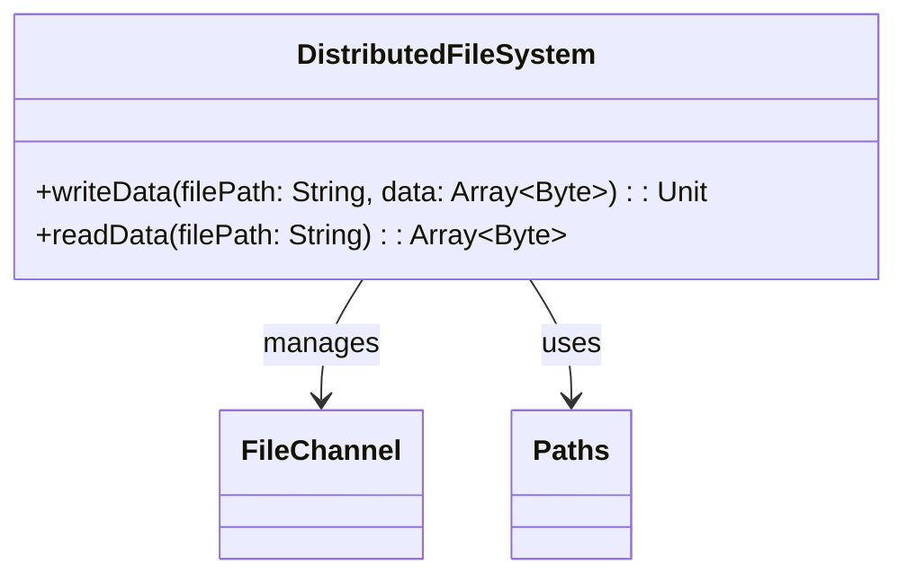

Distributed Filesystems are a pivotal design pattern in modern cloud computing environments. They offer a consistent, scalable, and reliable way to store, retrieve, and manage large datasets across distributed systems. This article delves into the mechanics of distributed filesystems and their role in cloud-based data management and analytics.

## Design Pattern Overview

### Definition

A Distributed Filesystem (DFS) is a file system that allows storage management and access across multiple servers in a network, presenting an abstraction of a single cohesive file system to the end-user. It abstracts the complexity inherent in managing a large pool of storage resources, enabling users and applications to interact with the system as if it were a single entity.

### Key Attributes
- **Scalability:** The ability to add storage resources seamlessly as demand grows across multiple servers or racks.
- **Fault Tolerance:** Robustness to component failures, ensuring data availability and integrity through redundancy and replication.
- **Performance:** High throughput and low latency access to large volumes of data, critical for real-time analytics and data processing pipelines.
- **Consistency Models:** Support for various data consistency models, from eventual to strong consistency, accommodating diverse application requirements.

## Architectural Approaches

### Architecture of Distributed Filesystems

1. **Master-Slave Architecture:** Commonly used, where a central master node maintains metadata and orchestrates the data storage across slave nodes. This approach simplifies coordination but can make the master a point of contention or failure.

2. **Peer-to-Peer (P2P):** Nodes in the system act as both clients and servers, contributing to both storage and retrieval tasks, ensuring robustness and availability without the necessity of a central control point.

3. **Federated Architecture**: Federations of different clusters or filesystems that cooperate to present a unified namespace, beneficial for large organizations spread over multiple geographic regions.

### Implementation Details

- **Data Replication:** Ensuring data availability through redundancy across different physical locations.
  
- **Data Striping:** Distributing data blocks across multiple nodes to boost read/write performance.
  
- **Load Balancing:** Efficiently distributing requests across the network to avoid hotspots and ensure optimal usage of distributed resources.

## Best Practices 

- **Data Sharding Based on Access Patterns:** Dividing datasets into shards to optimize read/write performance tailored to specific access patterns.
  
- **Consistent Hashing for Data Distribution:** Using consistent hashing to evenly distribute load among nodes without major redistributions when nodes join or leave.

- **Monitoring and Adaptive Resource Allocation:** Implementing comprehensive monitoring to track system health and dynamically adapt resource allocation to meet the demand.

## Example Code

```scala
import java.nio.file._
import java.nio.channels.FileChannel
import java.nio.ByteBuffer

object DistributedFileSystemExample {
  def writeData(filePath: String, data: Array[Byte]): Unit = {
    val path = Paths.get(filePath)
    val channel = FileChannel.open(path, StandardOpenOption.WRITE, StandardOpenOption.CREATE)
    try {
      val buffer = ByteBuffer.wrap(data)
      channel.write(buffer)
    } finally {
      channel.close()
    }
  }

  def readData(filePath: String): Array[Byte] = {
    val path = Paths.get(filePath)
    val channel = FileChannel.open(path, StandardOpenOption.READ)
    try {
      val buffer = ByteBuffer.allocate(channel.size().toInt)
      channel.read(buffer)
      buffer.array()
    } finally {
      channel.close()
    }
  }
}
```

## UML Diagram



## Related Patterns

- **Object Storage:** Often complementing distributed filesystems, object storage provides a different paradigm focusing on data scalability and metadata-rich storage.
  
- **Data Replication Patterns:** Techniques focused on data synchronization and availability across multiple nodes or clusters.
  
- **Data Partitioning:** Strategies for dividing data into distinct partitions suitable for parallel processing and distributed storage.

## Additional Resources

- [Hadoop Distributed File System (HDFS)](https://hadoop.apache.org/docs/r1.2.1/hdfs_design.html)
- [Ceph - A Highly Scalable Distributed File System](https://ceph.io/)
- [Amazon S3: Object Storage Service](https://aws.amazon.com/s3/)

## Summary

Distributed Filesystems are indispensable for cloud environments seeking scalability, performance, and resilience in data storage. By leveraging advanced storage architecture patterns, organizations can efficiently manage gigantic datasets and serve high-volume user requests, making them a backbone technology for big data analytics, cloud computing, and enterprise IT systems. Understanding and implementing distributed filesystems properly ensures data reliability, accessibility, and scalability in a distributed computing environment.
