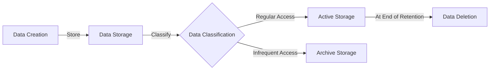

## Introduction

Data retention policies are strategic approaches in cloud computing that dictate how long data should be stored and managed. These policies ensure compliance with legal, business, and archiving requirements. They are integral to maintaining data integrity and optimizing storage resources while aligning with industry regulations and standards.

## Design Pattern Overview

### Goals of Data Retention Policies
Data retention policies aim to:

- Comply with legal and regulatory requirements.
- Reduce storage costs by purging obsolete data.
- Safeguard sensitive data and maintain privacy standards.
- Optimize data retrieval times by organizing archived data.
- Facilitate disaster recovery and business continuity through effective backup strategies.

### Key Components
1. **Retention Periods**: Timeframes during which data must be retained.
2. **Classification**: Categorizing data based on sensitivity, legal value, or business utility.
3. **Archiving**: Safe storage of data that is infrequently accessed but still necessary for compliance.
4. **Data Destruction**: Secure deletion of data post-retention period to prevent unauthorized access.

## Architectural Approaches

### Centralized Data Governance
Employing a centralized data governance framework allows organizations to uniformly enforce data retention policies across multiple cloud environments, ensuring consistent policy application and monitoring.

### Automated Policy Management
Using AI and ML for automating policy execution can significantly enhance efficiency. Tools integrated into cloud services, such as AWS IAM policies, Google Cloud's organization policies, or Azure Policy can help automate compliance.

### Tiered Storage Solutions
Implement tiered storage for cost-effective data management, using scalable options provided by cloud providers (e.g., AWS S3 Glacier, Azure Blob Storage Archive Tier) to economize on storage for infrequently accessed data.

## Best Practices

1. **Incorporate Compliance Regulations**: Tailor retention policies in accordance with local and international data protection laws, such as GDPR or CCPA.
2. **Regular Audits**: Conduct routine audits to assess the effectiveness of data retention schedules and update them as legal requirements evolve.
3. **Stakeholder Engagement**: Involve stakeholders from legal, IT, and business units to holistically understand data needs and compliance impacts.
4. **Documentation**: Maintain comprehensive documentation of data retention processes and decisions to aid transparency and accountability.

## Example Code

Here's a JSON example of an AWS IAM policy for managing data access in line with retention policies:

```json
{
  "Version": "2012-10-17",
  "Statement": [
    {
      "Effect": "Allow",
      "Action": "s3:PutObject",
      "Resource": "arn:aws:s3:::example-bucket/*",
      "Condition": {
        "DateLessThan": {
          "aws:CurrentTime": "2024-12-31T23:59:59Z"
        }
      }
    }
  ]
}
```

The policy above allows data to be written to an S3 bucket with an expiration deadline, enforcing retention by permitting actions only before a specified date.

## Diagrams

Here’s a simple visualization illustrating a data retention workflow:



## Related Patterns and Practices

- **Data Masking**: Protect sensitive data through obfuscation during retention.
- **Data Encryption**: Enhance data protection by encrypting data at rest and transit.
- **Backup and Recovery**: Design redundancy by implementing robust backup strategies forward disaster recovery solutions.

## Additional Resources

- [AWS Data Protection](https://aws.amazon.com/compliance/data-protection/)
- [Google Cloud Retention Policies](https://cloud.google.com/security/compliance)
- [Azure Data Governance](https://azure.microsoft.com/en-us/services/governance/)

## Summary

Data retention policies are a foundational element in cloud data management, combining regulatory compliance, cost management, and data protection. By leveraging automated tools and scalable cloud storage solutions, organizations can confidently enforce tailored retention policies, maximize resource efficiency, and adhere to legal requirements, creating a robust data management strategy.
