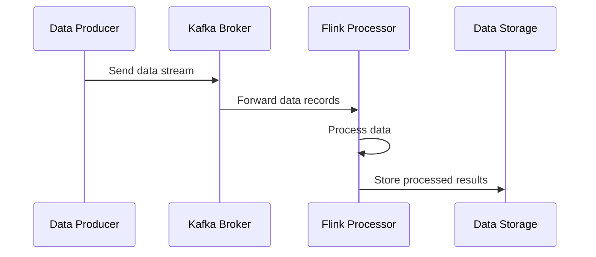

## Introduction to Stream Processing

Stream processing is a powerful design pattern utilized in cloud-based systems for processing data flows continuously and in real time. Unlike traditional batch processing that handles data in large, static chunks, stream processing focuses on processing data incrementally as it arrives, allowing systems to respond promptly to incoming data streams. This enables real-time analytics, monitoring, and decision-making, which are essential in applications ranging from monitoring financial transactions to processing social media feeds.

## Detailed Explanation

Stream processing involves processing data records individually, immediately upon arrival. The architecture typically consists of a few key components:

- **Data Producers/Collectors**: These components generate or aggregate streams of data. Examples include IoT devices, transaction systems, and user activity logs.
  
- **Data Ingestion Layer**: This layer ensures that data flows are efficiently and reliably streamed into the processing system. Popular solutions for this layer include Apache Kafka, AWS Kinesis, and Azure Event Hubs.

- **Stream Processing Layer**: This is where real-time analytics occur. Platforms such as Apache Flink, Apache Storm, and StreamSets provide the necessary tools for processing data in motion. These platforms support complex event processing, analytics, and transformations.

- **Data Storage/Output**: After processing, data can be stored in systems like time-series databases or NoSQL databases or passed to other services and systems for further action or storage.

## Example Code with Apache Kafka and Apache Flink

Here's a simple example of how you might set up a basic stream processing application using Apache Kafka for data ingestion and Apache Flink for processing:

### Kafka Producer Example (Java)

```java
import org.apache.kafka.clients.producer.KafkaProducer;
import org.apache.kafka.clients.producer.ProducerRecord;
import java.util.Properties;

public class KafkaDataProducer {
    public static void main(String[] args) {
        Properties props = new Properties();
        props.put("bootstrap.servers", "localhost:9092");
        props.put("key.serializer", "org.apache.kafka.common.serialization.StringSerializer");
        props.put("value.serializer", "org.apache.kafka.common.serialization.StringSerializer");

        KafkaProducer<String, String> producer = new KafkaProducer<>(props);
        for (int i = 0; i < 100; i++) {
            producer.send(new ProducerRecord<>("stream_topic", Integer.toString(i), "message " + i));
        }
        producer.close();
    }
}
```

### Flink Consumer Example (Java)

```java
import org.apache.flink.api.common.functions.FlatMapFunction;
import org.apache.flink.api.java.tuple.Tuple2;
import org.apache.flink.streaming.api.datastream.DataStream;
import org.apache.flink.streaming.api.environment.StreamExecutionEnvironment;
import org.apache.flink.streaming.connectors.kafka.FlinkKafkaConsumer;
import org.apache.flink.util.Collector;
import java.util.Properties;

public class FlinkStreamProcessor {
    public static void main(String[] args) throws Exception {
        StreamExecutionEnvironment env = StreamExecutionEnvironment.getExecutionEnvironment();
        
        Properties props = new Properties();
        props.setProperty("bootstrap.servers", "localhost:9092");
        props.setProperty("group.id", "flink_consumer");

        DataStream<String> stream = env
            .addSource(new FlinkKafkaConsumer<>("stream_topic", new SimpleStringSchema(), props));

        DataStream<Tuple2<String, Integer>> processed = stream
            .flatMap(new LineSplitter())
            .keyBy(value -> value.f0)
            .sum(1);

        processed.print();

        env.execute("Flink Streaming Job");
    }

    public static final class LineSplitter implements FlatMapFunction<String, Tuple2<String, Integer>> {
        @Override
        public void flatMap(String value, Collector<Tuple2<String, Integer>> out) {
            String[] words = value.split("\\s");
            for (String word : words) {
                out.collect(new Tuple2<>(word, 1));
            }
        }
    }
}
```

## Diagram: Stream Processing

Here is UML Sequence diagram showcasing the flow in a stream processing system:



## Related Patterns

- **Event Sourcing**: Capturing all changes to an application state as a sequence of events, which can be useful in conjunction with stream processing for building highly available systems.
- **CQRS (Command Query Responsibility Segregation)**: Helps in separating read and update workloads, which can often be paired with stream processing to maintain consistency.
- **Data Lake**: Handle large volumes of data storage that can integrate with stream processing systems to facilitate real-time analytics on big data.

## Additional Resources

- [Apache Kafka Documentation](https://kafka.apache.org/documentation/)
- [Apache Flink Documentation](https://flink.apache.org/documentation.html)
- [AWS Kinesis](https://aws.amazon.com/kinesis/)
- [Azure Stream Analytics](https://azure.microsoft.com/en-us/services/stream-analytics/)

## Summary

Stream processing is a key architectural pattern in the realm of big data and real-time analytics. It transforms how businesses respond to data, allowing for more dynamic and timely decision-making processes. By employing frameworks like Apache Kafka and Apache Flink, organizations can efficiently process and analyze streaming data at scale.

The stream processing pattern supports enhanced performance in data-driven applications, ensuring that systems are not only reactive but also predictive and intelligent, paving the way for innovative solutions across industries.
