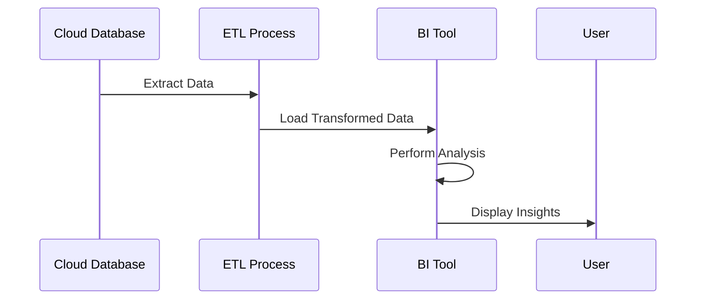

## Introduction

**Integration with BI Tools** is a critical design pattern in modern cloud architectures, aimed at providing seamless data flow and accessibility for Business Intelligence (BI) applications. Organizations utilize BI tools to analyze diverse data sources, derive actionable insights, and make data-driven decisions. This pattern describes how cloud data systems can be effectively integrated with BI tools to ensure real-time data availability, query performance, and enhanced reporting capabilities.

## Pattern Overview

The Integration with BI Tools pattern focuses on architectural strategies for connecting cloud data storage and processing platforms with BI applications such as Tableau, Power BI, Looker, and others. This integration can be achieved through direct database connections, ETL (Extract, Transform, Load) processes, or via APIs that enable data extraction and visualization.

### Key Components

1. **Data Source**: Cloud-based databases or data warehouses, such as Amazon Redshift, Google BigQuery, Azure Synapse, or Snowflake, serve as the primary sources for data.

2. **ETL/ELT Processes**: ETL pipelines preprocess data to ensure accuracy and reliability before loading it into BI tools. ELT processes optimize for performance by allowing BI tools to handle some transformations.

3. **Data Connectors**: Custom or OOTB (Out-Of-The-Box) connectors facilitate the extraction of data from sources to BI tools, supporting APIs, JDBC/ODBC connections, and other interfaces.

4. **BI Tools**: Software applications that perform data visualization, reporting, and analytics, leveraging the ingested data to provide insights and dashboards.

## Architectural Approaches

- **Direct Connection**: Connect BI tools directly to cloud databases using JDBC/ODBC drivers. This approach provides live access to data but may be constrained by network performance and data size.

- **Data Warehousing**: Centralize data in a data warehouse for better performance and optimized querying. Implement processes for regular data extraction and transformation.

- **Data Lake Integration**: Utilize data lakes for storing raw data, offering BI tools the flexibility to pick and transform data as needed.

- **APIs and Microservices**: Expose data through standardized APIs, allowing BI tools to query and retrieve data on-demand. This approach supports scalability and abstraction.

## Best Practices

- **Data Governance**: Establish robust data governance policies to ensure data quality, accuracy, and security.

- **Performance Optimization**: Implement query optimization strategies, such as indexing and partitioning, to enhance data retrieval speed.

- **Scalability**: Design for scalability to accommodate growing data volumes and concurrent user access.

- **Security**: Use encryption, authentication, and access controls to protect sensitive data.

## Example Code

Here is an example of a Python script using an API to fetch and prepare data for a BI tool:

```python
import requests
import pandas as pd

def fetch_data(api_url, headers):
    response = requests.get(api_url, headers=headers)
    response.raise_for_status()
    return pd.DataFrame(response.json()['data'])

def preprocess_data(df):
    # Example preprocessing: remove nulls, convert types, etc.
    df = df.dropna()
    df['date'] = pd.to_datetime(df['date'])
    return df

api_url = "https://api.example.com/data"
headers = {"Authorization": "Bearer YOUR_TOKEN"}

data = fetch_data(api_url, headers)
clean_data = preprocess_data(data)
clean_data.to_csv('prepared_data.csv', index=False)
```

## Diagrams

Below is a simplified sequence diagram depicting data flow from a cloud data source to a BI tool:



## Related Patterns

- **Data Lake Pattern**: For storing large volumes of raw data and allowing flexible processing and analytics.
  
- **Event-Driven Data Processing**: For real-time data ingestion and transformation using event streams.

## Additional Resources

- [Data Warehousing on Cloud Platforms](https://cloudprovider.com/data-warehousing)
- [BI Tool Integration Best Practices](https://bi-tool-provider.com/integration-guide)
- [API Strategies for Data Access](https://techblog.com/api-strategies)

## Summary

Integrating BI tools with cloud data services ensures dynamic data visualization and critical business insights are continuously available. This pattern suggests prioritizing performance, scalability, and security in connecting data sources to analytics applications. Leveraging cloud analytics capabilities, automated ETL processes, and robust connectors can provide business users with reliable and real-time data access, tailored for strategic decision-making.
