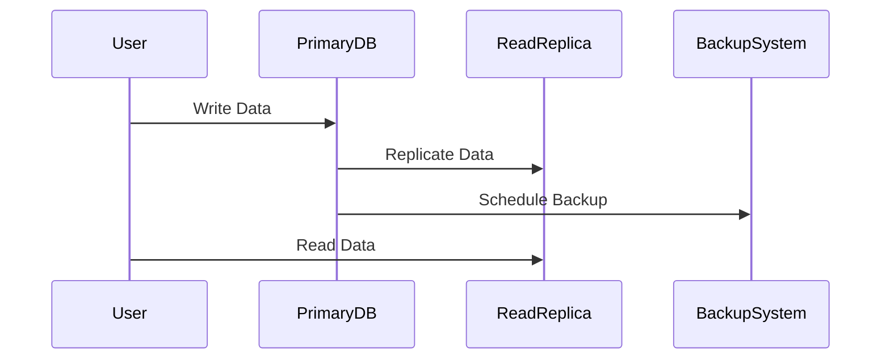

## Introduction

The Data Redundancy and Backup pattern is pivotal in cloud computing as it ensures data integrity and high availability across distributed systems. The core idea is to preserve digital information by duplicating it, creating copies that act as fail-safes. This pattern is essential for mitigating risks like system failures, data corruption, accidental deletions, and cyberattacks.

## Detailed Explanation

### Design Pattern Overview

Data redundancy involves storing multiple copies of data in diverse locations. Cloud environments leverage redundancy to enhance data reliability, using strategies such as mirroring, replication, and erasure coding. Backup solutions add an extra layer by periodically creating snapshots of data and storing them in secured, often geographically distant, locations.

### Architectural Approach

A comprehensive approach to implementing this pattern includes:

- **Replication:** Real-time copying of data across multiple cloud regions, often leveraging database replication techniques like master-slave or multi-master setups.
  
- **Backup Solutions:** Scheduled backups to different cloud storage services or object-based storages like Amazon S3, Google Cloud Storage, and Azure Blob.

- **Erasure Coding:** Distributing data across various nodes, breaking it into fragments, then encoding it with redundant data pieces.

- **Data Mirroring:** Maintaining exact copies of data on different physical drives or storage arrays to provide immediate failover options.

### Best Practices

- **Automate Backup Processes:** Utilize cloud-native tools to automate backup schedules, ensuring consistency and repeatability.
  
- **Geographical Distribution:** Store backups in multiple geographic locations to protect against regional disasters.

- **Regular Testing:** Periodically test backup and recovery processes to ensure data can be restored quickly and reliably.

- **Cost Management:** Optimize storage costs by choosing appropriate storage classes such as AWS S3 Glacier for infrequent access backup data.

### Example Code

Implementing replication using AWS RDS for a MySQL database:

```sql
-- Create a read replica for an AWS RDS MySQL instance
CALL mysql.rds_set_external_master (
    'source-db.endpoint.region.rds.amazonaws.com', 
    3306, 
    'replication_user', 
    'password', 
    'binary_log_file', 
    log_pos);
```

### Diagrams

#### UML Sequence Diagram



## Related Patterns

- **Data Sharding:** Splitting databases into smaller, more manageable pieces can be complemented by redundancy for added reliability.
  
- **Disaster Recovery Pattern:** A comprehensive strategy that considers both redundancy and backup to provide operational continuity.

## Additional Resources

- [Data Management in the Cloud: An Overview](https://cloud-provider-docs/data-management)
- [AWS Backup Documentation](https://docs.aws.amazon.com/backup/index.html)
- [Azure Site Recovery](https://azure.microsoft.com/en-us/services/site-recovery/)
- [Google Cloud Storage Classes](https://cloud.google.com/storage/docs/storage-classes)

## Summary

The Data Redundancy and Backup pattern is an indispensable paradigm for maintaining data integrity in cloud computing. By employing techniques such as replication, backup, and erasure coding, organizations can safeguard their data against a wide range of failures and risks. Implementing best practices around automation, testing, and cost management further enhances the robustness and cost-effectiveness of storage solutions.
