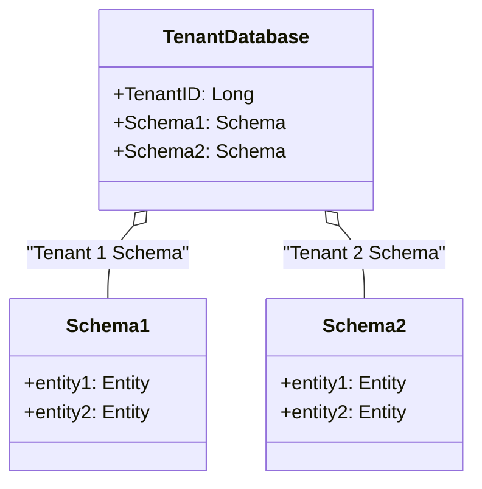

## Introduction

The Multi-Tenancy Data Solutions pattern enables cloud service providers to efficiently manage and share database and infrastructure resources among multiple tenants. This approach optimizes resource usage and reduces costs while maintaining necessary levels of isolation and security for each tenant's data.

## Detailed Explanation

### Design Goals

- **Resource Utilization**: Optimize the utilization of hardware and software resources by consolidating multiple tenants onto shared infrastructure.
- **Cost Efficiency**: Reduce operational costs through shared infrastructure while segregating tenant data logically.
- **Scalability**: Seamlessly scale to accommodate increasing user bases and data volumes without compromising performance.
- **Security and Isolation**: Ensure strong data isolation and security measures to protect each tenant's data from unauthorized access.

### Architectural Approaches

1. **Single Database, Shared Schema**:
   - A single database is used with shared tables and a column to identify the tenant.
   - Benefits: Simplicity in setup and management.
   - Drawbacks: Risk of accidental data leakage and complex query handing for isolation.

2. **Single Database, Separate Schema**:
   - Each tenant has a distinct schema within a single database.
   - Benefits: Better segregation of data and simpler logical separation.
   - Drawbacks: Increased complexity in database management and schema handling.

3. **Dedicated Database per Tenant**:
   - Each tenant has a completely separate database.
   - Benefits: Strong isolation and easy backup/restore processes.
   - Drawbacks: Higher resource consumption and management overhead.

### Best Practices

- **Use of Database Views and Access Controls**: Secure tenant-specific data access efficiently.
- **Automated Scaling**: Implement solutions such as Kubernetes or serverless technology to automate scaling based on tenant demand.
- **Monitoring and Analytics**: Use cloud-native monitoring tools to track performance and usage patterns across tenants.

### Example Code

Here's a simplified example in Java using Hibernate for a single database with separate schemas:

```java
// Entity class for tenant data with shared schema strategy
@Entity
@Table(name = "data", schema = "tenant1")
public class TenantData {
    
    @Id
    @GeneratedValue(strategy = GenerationType.IDENTITY)
    private Long id;
    
    @Column(name = "tenant_id")
    private Long tenantId;
    
    @Column(name = "data_value")
    private String dataValue;
    
    // Getters and setters...
}

// Hibernate Config for multi-tenant with schema
public class MultiTenantSchemaConfig {

    public DataSource dataSource() {
        // Config for data source...
    }

    public LocalContainerEntityManagerFactoryBean entityManagerFactory() {
        LocalContainerEntityManagerFactoryBean em = new LocalContainerEntityManagerFactoryBean();
        em.setDataSource(dataSource());
        em.setPackagesToScan(new String[] { "com.example.domain" });
        em.setJpaVendorAdapter(new HibernateJpaVendorAdapter());
        em.setJpaProperties(hibernateProperties());
        
        return em;
    }

    private Properties hibernateProperties() {
        Properties properties = new Properties();
        properties.put("hibernate.multiTenancy", "SCHEMA");
        properties.put("hibernate.tenant_identifier_resolver", "com.example.TenantIdentifierResolver");
        
        return properties;
    }
}
```

### Diagrams

Below is UML diagram illustrating a basic implementation of a single database with separate schemas for multi-tenancy:



### Related Patterns

- **Data Sharding**: Often combined with multi-tenancy to improve performance by distributing data across different database shards.
- **Event-Driven Architecture**: Facilitates scalable and decoupled systems that can react to tenant-specific events.

### Additional Resources

- [Multi-Tenancy with Hibernate](https://hibernate.org/orm/documentation/rationale/multitenancy/)
- [Kubernetes for Multi-Tenant SaaS Applications](https://kubernetes.io/docs/concepts/architecture/multi-tenancy/)

## Summary

The Multi-Tenancy Data Solutions pattern is essential for cloud providers aiming to offer scalable, efficient, and cost-effective services. By carefully selecting the appropriate approach and adhering to best practices, organizations can effectively manage multiple tenants while ensuring data isolation and security. As cloud technologies evolve, maintaining flexibility and scalability remains a priority, making this pattern crucial for modern application architecture.
