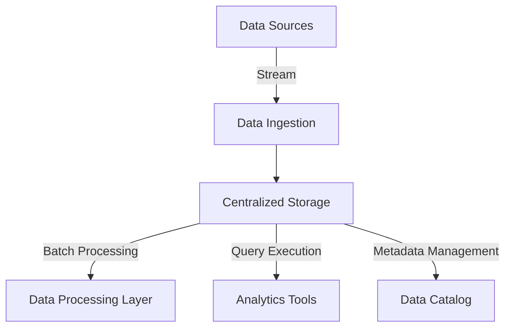

## Introduction

In the era of big data, organizations are continually seeking ways to store and process massive volumes of data efficiently. Traditional data warehouses often struggle with handling the unstructured data and scaling the resources as needed. The **Data Lake Formation** pattern emerges as a pivotal approach to overcome these challenges by providing a centralized repository capable of storing structured, semi-structured, and unstructured data. This pattern facilitates scalable, cost-effective storage while enabling diverse analytics, batch processing, and machine learning opportunities.

## Design Patterns and Architectural Approaches

### Core Concepts

- **Raw Data Storage**: Ingest data in its native format, eliminating the need for schema on write.
- **Centralized Repository**: A single source of truth for various data types, aiding in data democratization and avoiding siloed data storage.
- **Scalability**: Leverage the scalability of cloud resources to expand storage and computing capabilities as data grows.
- **Flexible Access**: Enable diverse processing frameworks to read the data without altering it, promoting analytical agility.

### Architectural Approach

1. **Ingress and Ingestion**
   - Use distributed ingestion frameworks like Apache Kafka or AWS Kinesis to collect and stream data into the data lake.
   - Implement ETL pipelines with tools such as Apache NiFi or AWS Glue for transformation processes when necessary.

2. **Storage System**
   - Choose scalable cloud storage solutions like AWS S3, Azure Blob Storage, or Google Cloud Storage.
   - Implement security policies and access controls to ensure data integrity and privacy.

3. **Processing and Query Execution**
   - Employ frameworks like Apache Spark, Presto, or Google BigQuery for data processing and running complex queries.

4. **Data Catalog and Governance**
   - Utilize metadata management tools like AWS Glue Data Catalog or Apache Atlas to maintain an organized view of the data stored.

5. **Optimization and Monitoring**
   - Deploy monitoring and optimization tools such as AWS CloudWatch or Prometheus for resource usage and performance tracking.

## Example Code

Below is an example of setting up a basic data lake storage solution using AWS S3 and Apache Spark for processing:

```scala
import org.apache.spark.sql.SparkSession

object DataLakeExample {
  def main(args: Array[String]): Unit = {
    val spark = SparkSession.builder
      .appName("Data Lake Example")
      .config("spark.hadoop.fs.s3a.access.key", "your-access-key")
      .config("spark.hadoop.fs.s3a.secret.key", "your-secret-key")
      .getOrCreate()

    // Read data from S3
    val df = spark.read.format("csv").option("header", "true")
      .load("s3a://your-bucket-name/input-data/")

    // Perform some data transformation
    val transformedDF = df.filter("column_name != 'unwanted_value'")
      .select("important_column1", "important_column2")

    // Write data back to S3
    transformedDF.write.format("parquet").save("s3a://your-bucket-name/processed-data/")
  }
}
```

## Diagrams

### Data Lake Architecture Diagram



## Related Patterns

- **Lambda Architecture**: Offers a robust architecture for handling massive quantities of data by combining batch and stream processing.
- **Data Warehouse**: Complements data lakes for structured data analytics, offering a different approach with schema-on-write processing.

## Additional Resources

- **Books**: 
  - "Data Lake Architecture" by Bill Inmon
  - "Designing Data-Intensive Applications" by Martin Kleppmann
- **Documentation and Whitepapers**:
  - [AWS Data Lake Documentation](https://aws.amazon.com/big-data/datalakes-and-analytics/what-is-a-data-lake/)
  - [Azure Data Lake Storage](https://azure.microsoft.com/en-us/services/storage/data-lake-storage/)

## Summary

Adopting the Data Lake Formation pattern is pivotal for organizations looking to leverage big data. By centralizing diverse data in its native form, data lakes provide a scalable, cost-efficient solution for storage and analytics across various domains. Emphasizing raw data storage, governed access, and flexible processing ensures enterprises are well-equipped to handle their evolving data landscapes and advance their analytics capabilities.
