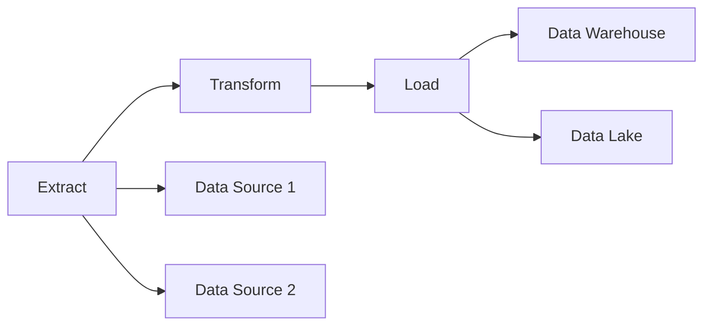

---

linkTitle: "ETL (Extract, Transform, Load) Pipelines"
title: "ETL (Extract, Transform, Load) Pipelines: Streamlining Data Integration"
category: "Data Management and Analytics in Cloud"
series: "Cloud Computing: Essential Patterns & Practices"
description: "Explore the ETL (Extract, Transform, Load) Pipelines pattern, a crucial design for streamlining data integration across different sources in cloud environments. This pattern focuses on extracting data, transforming it to fit operational needs, and loading it into a system for analysis and reporting."
categories:
- Data Integration
- Cloud Architecture
- Big Data
tags:
- ETL
- Data Pipelines
- Cloud Data Management
- Data Transformation
- Data Analytics
date: 2024-07-07
type: docs

canonical: "https://softwarepatternslexicon.com/18/6/5"
license: "© 2024 Tokenizer Inc. CC BY-NC-SA 4.0"
---

## Introduction

ETL (Extract, Transform, Load) pipelines are integral components of modern data architectures, particularly in cloud environments. These pipelines are designed to handle large volumes of data being moved from various sources into a centralized data repository, such as a data warehouse or data lake, for analysis and decision-making.

## Pattern Explanation

### Components of ETL Pipelines

1. **Extract**:
   - **Purpose**: Retrieve raw data from various sources such as databases, cloud services, APIs, and data streams.
   - **Challenges**: Handling diverse data formats and volumes without losing data integrity or performance.

2. **Transform**:
   - **Purpose**: Convert extracted data into a format that is more usable for analysis. This may involve cleaning, filtering, aggregating, and enriching the data.
   - **Techniques**: 
     - Data cleansing to correct errors or inconsistencies.
     - Data mapping to align data formats and schemas.
     - Data transformation functions include aggregations, joins, and format conversions.

3. **Load**:
   - **Purpose**: Store the transformed data into the desired storage system or analytical infrastructure.
   - **Options**: Load into data warehouses (like Snowflake or Amazon Redshift), data lakes (using Azure Data Lake or AWS S3), or real-time analytics platforms (such as Google BigQuery).

### Architectural Approaches

- **Batch Processing**: Suitable for handling large volumes of data at scheduled intervals. Often used when immediate data freshness is not required.
- **Real-Time Processing**: Utilizes streaming platforms like Apache Kafka, Spark Streaming, or AWS Kinesis to process data as it arrives, allowing for real-time insights and decision-making.

## Best Practices

- **Scalability**: Design ETL pipelines to handle increasing data volume efficiently. Utilize cloud-native services that offer automatic scaling.
- **Resilience and Fault Tolerance**: Implement retry mechanisms and idempotency to ensure data consistency and reliability in case of failures.
- **Monitoring and Logging**: Continuously monitor pipeline performance and maintain comprehensive logs for troubleshooting and optimization.
- **Security**: Ensure data is encrypted both in transit and at rest, and that access controls are enforced to protect sensitive information.

## Example Code

Here is an example of a simplified ETL pipeline implemented using Python and Apache Spark:

```python
from pyspark.sql import SparkSession

spark = SparkSession.builder.appName("ETL Pipeline").getOrCreate()

raw_data = spark.read.csv("s3a://example-bucket/raw-data.csv")

filtered_data = raw_data.filter(raw_data['age'] > 18)
transformed_data = filtered_data.groupBy('country').count()

transformed_data.write.mode("overwrite").parquet("s3a://example-bucket/processed-data/")

spark.stop()
```

## Diagram



## Related Patterns

- **Data Lake Pattern**: Storing raw data in its native format until it's needed.
- **Lambda Architecture**: Combines batch and real-time processing to provide comprehensive analytics.
- **Data Streaming Pattern**: Real-time data processing and analytics using streaming platforms.

## Additional Resources

- [The Modern Data Warehouse – Bento](https://docs.microsoft.com/en-us/azure/architecture/data-guide/modern-data-warehouse)
- [ETL in Big Data](https://aws.amazon.com/big-data/what-is-big-data/)

## Summary

ETL pipelines serve as the backbone for data integration in cloud environments, making it possible to convert large volumes of disparate data into actionable insights. Understanding and implementing these pipelines efficiently can significantly enhance data-driven decision-making capabilities. By leveraging cloud-native solutions and adhering to best practices, organizations can robustly and dynamically handle today's ever-expanding data landscape.
