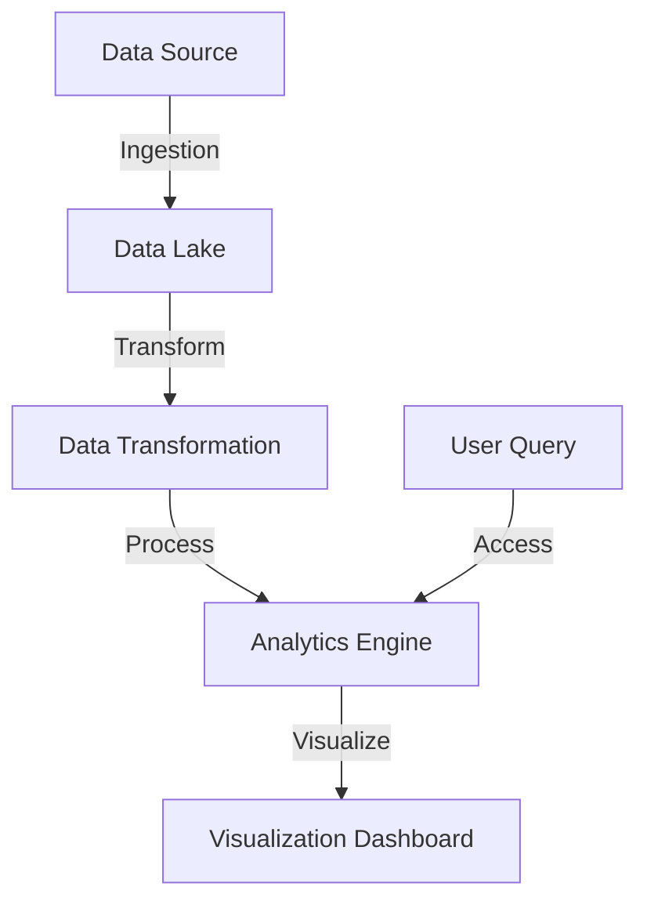

## Introduction

In the realm of data-driven enterprises, Managed Analytics Services have emerged as a pivotal pattern for leveraging cloud computing's scalability and flexibility. They provide a comprehensive framework to manage, analyze, and visualize large datasets, allowing organizations to derive insights without the burden of managing underlying infrastructure or software.

## Design Pattern Explanation

Managed Analytics Services (MAS) are cloud-based solutions designed to facilitate efficient data management and analytics processes. These services typically offer features such as data ingestion, transformation, storage, analytics, and visualization. Moreover, they allow organizations to avoid the complexities associated with on-premises data infrastructure management, such as hardware maintenance, data security, and scalability challenges.

### Key Components:
1. **Data Ingestion**: Capabilities for importing data from various sources, including databases, streaming services, IoT devices, etc.
2. **Data Storage**: Scalable storage solutions utilizing cloud-native technologies such as data lakes or warehouses.
3. **Data Transformation**: Tools for cleansing, enriching, and transforming raw data into structured information.
4. **Analytics Engines**: Integrations with machine learning and statistical analysis tools to derive insights from data.
5. **Data Visualization**: Dashboards and reporting tools to present data in an accessible and interpretable format.

### Architectural Approach

Managed Analytics Services follow a service-oriented architecture that encapsulates multiple functionalities into cohesive service offerings. They leverage cloud-native principles such as microservices and containerization to ensure ease of deployment, scalability, and flexibility. This architecture typically integrates serverless computing to optimize cost-effectiveness by scaling resources with demand.

### Example Code

Below is an example of a simple analytics workflow using an imaginary cloud provider SDK in Python:

```python
from cloudprovider.sdk import AnalyticsService

analytics_client = AnalyticsService()

data_source = 's3://bucket-name/data.csv'
ingestion = analytics_client.data_ingestion(data_source)

transformation_script = """
SELECT * FROM data WHERE value > 100
"""
transformed_data = analytics_client.data_transform(transformation_script)

analysis_query = """
SELECT AVG(value) as average_value FROM transformed_data
"""
results = analytics_client.run_query(analysis_query)

analytics_client.visualize_data(results, chart_type='bar')
```

### Diagrams

#### Managed Analytics Service Architecture



## Related Patterns

- **Data Lake Pattern**: Emphasizes the centralized repository for storing structured and unstructured data.
- **Serverless Architectures**: Focuses on building applications without managing infrastructure, offering scalability and cost optimization.
- **Microservices Architecture**: Breaks down applications into smaller, independent services for better maintainability and agility.

## Best Practices

- **Data Security**: Implement strong encryption and access controls to protect sensitive data within the analytics services.
- **Cost Management**: Utilize auto-scaling and pay-as-you-go models to optimize cloud resource costs.
- **Data Quality**: Invest in tools and processes for data cleansing and enrichment to ensure high-quality analytics.

## Additional Resources

- [AWS Big Data Analytics Services](https://aws.amazon.com/big-data/datalakes-and-analytics/)
- [Google Cloud’s Smart Analytics](https://cloud.google.com/solutions/smart-analytics/)
- [Azure Analytics Services](https://azure.microsoft.com/en-us/solutions/data-lake/)

## Summary

Managed Analytics Services streamline the process of gaining insights from data by leveraging cloud infrastructure. These services ease the burden on organizations by handling data management logistics, allowing them to focus on harnessing data for strategic decision-making. With built-in scalability and a pay-as-you-go model, MAS offer a cost-effective solution for modern businesses striving to stay ahead in a data-centric world.
