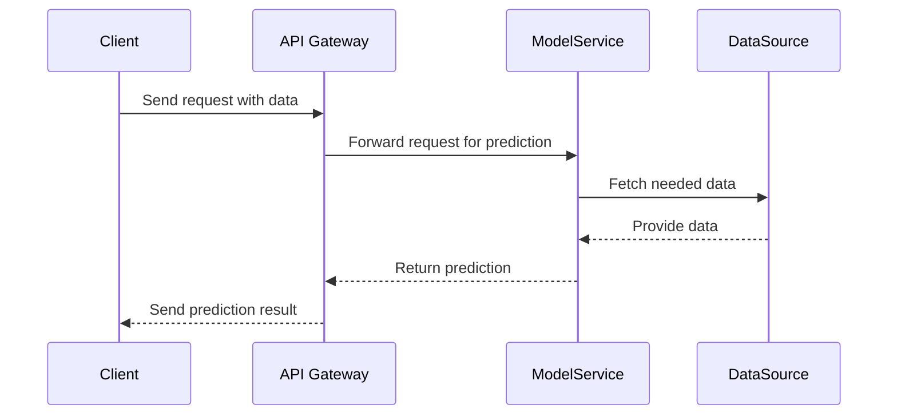

## Introduction

Machine Learning Integration in cloud environments represents a strategic pattern where machine learning models and their analytical capabilities are seamlessly embedded into cloud-based architectures. This pattern enhances the ability to derive valuable insights and automate intelligent decision-making processes within cloud systems.

## Detailed Explanation

Machine Learning (ML) integration in cloud architectures allows data-driven applications to leverage vast computing resources and scalability of cloud platforms efficiently. This integration includes the following key aspects:

1. **Model Deployment and Serving**: Models are trained using large datasets and deployed on cloud infrastructure, ensuring they can handle real-time queries and large-scale data processing. This often involves service-oriented architectures or microservices.

2. **Data Pipeline Integration**: ML models require continuous data flows. Building data pipelines that ingest, process, and deliver data to and from models is essential. This is typically achieved using tools like Apache Kafka, AWS Kinesis, or Google Cloud Dataflow.

3. **Scalability and Load Balancing**: Cloud solutions provide elasticity, enabling models to scale based on the load. Autoscaling features available in platforms like AWS Lambda or Google Cloud Functions are often leveraged to handle varying traffic.

4. **Security and Compliance**: Securing data and ensuring compliance with regulations like GDPR is crucial. Cloud providers offer tools and practices such as encryption, access controls, and audit logs to uphold these standards.

## Architectural Approaches

### Lambda Architecture

Lambda architecture is commonly used in ML integration. It combines batch processing with real-time stream processing, enabling comprehensive data insights.

- **Batch Layer**: Handles large amounts of historical data, providing recommendations and trends.
- **Speed Layer**: Deals with real-time data processing to offer immediate insights.
- **Serving Layer**: Merges outputs from both layers for comprehensive results.

### Microservices Architecture

ML models are deployed as independent services within a microservices architecture to ensure separation of concerns, ease of maintenance, and independent scaling. Each service can be deployed, updated, and scaled without impacting the whole system.

## Best Practices

- **Containerization**: Use Docker and Kubernetes to manage ML models as deployable containers, ensuring consistency and scalability.
- **Version Control for Models**: Use model registry solutions like MLflow or AWS SageMaker Model Registry for versioning and tracking models.
- **Monitoring and Logging**: Implement monitoring tools like Prometheus and Grafana for real-time metrics and insights into the model performance.
- **Feedback Loops**: Set up feedback mechanisms to collect data on predictions and outcomes to improve model accuracy continuously.

## Example Code

This example uses Python and Flask to deploy a simple machine learning model on AWS Lambda.

```python
import flask
from sklearn.externals import joblib
import json

app = flask.Flask(__name__)

MODEL = joblib.load('model.pkl')

@app.route('/predict', methods=['POST'])
def predict():
    data = flask.request.get_json(force=True)
    prediction = MODEL.predict(data)
    return json.dumps({'prediction': prediction.tolist()})

if __name__ == '__main__':
    app.run(host='0.0.0.0', port=8080)
```

In this snippet, a machine learning model is exposed as a RESTful service, allowing integration into cloud-based workflows.

## Diagrams

### UML Sequence Diagram



## Related Patterns

- **Service Mesh**: Facilitates secure, fast, reliable communication between microservices, essential in ML model integration.
- **Data Lake**: Serves as the centralized repository for storing raw data, essential for training machine learning models.

## Additional Resources

- [AWS Machine Learning Guide](https://aws.amazon.com/machine-learning/)
- [Google Cloud AI Platform Documentation](https://cloud.google.com/ai-platform)
- [Azure Machine Learning Workshop](https://azure.microsoft.com/en-us/services/machine-learning/)

## Summary

The Machine Learning Integration pattern provides a structured approach to incorporate ML capabilities within cloud ecosystems, focusing on scalability, security, and efficiency. By leveraging cloud-native architectures, enterprises can enhance their data-driven applications, enabling real-time insights and predictive analytics that drive smarter business decisions.
