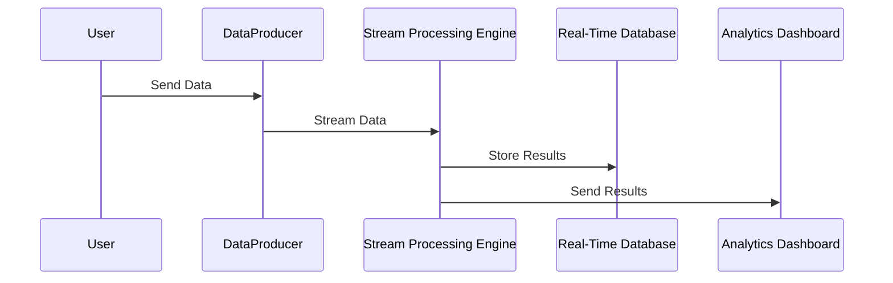

## Introduction

The `Real-Time Analytics` pattern involves processing data concurrently as it arrives into systems, enabling businesses to gain insights and respond to information quickly. This design pattern is essential for applications like fraud detection, anomaly detection, operational monitoring, and real-time personalization where time-sensitive data is processed promptly to enhance decision-making.

## Design Pattern Overview

Real-Time Analytics leverages the power of event-driven architectures and fast data processing frameworks to ensure that data is analyzed immediately upon receipt. This immediate data crunching is invaluable for use-cases where delaying insights could result in negative outcomes or missed opportunities.

### Key Components

- **Data Ingestion Pipeline**: Utilizes data streaming platforms such as Apache Kafka, Amazon Kinesis, or Azure Event Hubs for collecting and forwarding real-time data streams.
- **Stream Processing Engine**: Frameworks like Apache Flink, Apache Storm, or Google Dataflow are used for processing and analyzing data streams.
- **Storage**: Quick-access databases like Redis, Apache Cassandra, or Google Bigtable are employed to store interim results.
- **Analytics and Visualization**: Utilize platforms like Kibana or Grafana to visualize analytics in a user-friendly manner.

## Example Code

Here's an example of using Apache Flink for processing a real-time data stream:

```java
import org.apache.flink.api.common.functions.MapFunction;
import org.apache.flink.streaming.api.datastream.DataStream;
import org.apache.flink.streaming.api.environment.StreamExecutionEnvironment;

public class RealTimeAnalyticsExample {
    public static void main(String[] args) throws Exception {
        final StreamExecutionEnvironment env = StreamExecutionEnvironment.getExecutionEnvironment();
        
        DataStream<String> text = env.socketTextStream("localhost", 9999);

        DataStream<Integer> parsed = text.map(new MapFunction<String, Integer>() {
            @Override
            public Integer map(String value) throws Exception {
                return Integer.parseInt(value);
            }
        });

        parsed.print();
        env.execute("Socket Text Stream Example");
    }
}
```

## Diagram

Below is sequence diagram describing the flow in a real-time data processing system:



## Architectural Approaches

- **Event-Driven Architecture**: Real-time analytics heavily rely on event-driven models where each event triggers processing activities.
- **Scalable Stream Processing**: The architecture should support the scaling of resources in/out as per data load without affecting performance.

## Best Practices

- Design for easy scaling of data ingestion, computation, and storage components.
- Ensure real-time systems have fault tolerance to handle transient failures gracefully.
- Optimize for low-latency data processing by leveraging the right combination of tools and architectures.

## Related Patterns

- **Lambda Architecture**: Combines batch and real-time processing to deliver comprehensive analytical insights.
- **Event Sourcing Pattern**: Manages application state as a sequence of events, enabling real-time processing capabilities.

## Additional Resources

- [Apache Flink Documentation](https://flink.apache.org/documentation.html)
- [Streaming Data Solutions on AWS](https://aws.amazon.com/streaming-data/)
- [Google Cloud Stream Analytics](https://cloud.google.com/solutions/realtime)

## Summary

Real-Time Analytics is a pivotal design pattern that enables organizations to harness the real-time influx of data and extract insights instantaneously. By deploying an effective real-time analytics solution using cloud-based tools and best practices, businesses can stay ahead by optimizing operations, improving customer experience, and making informed decisions instantly.
