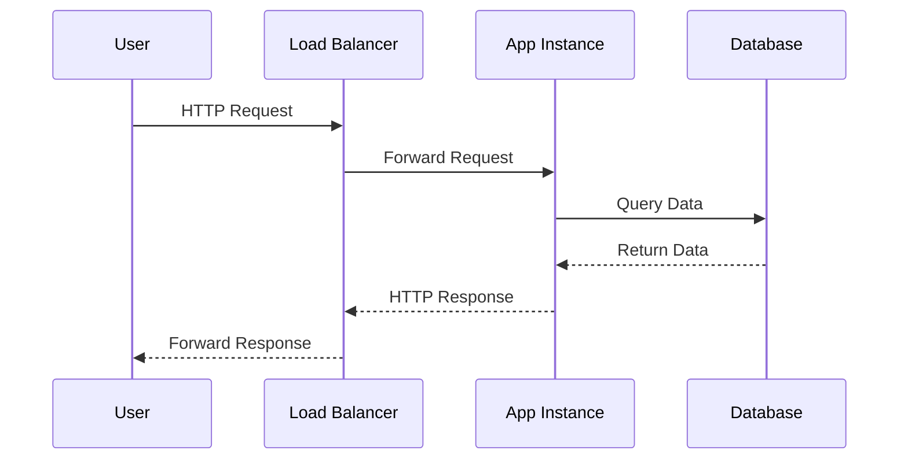

The **12-Factor App Methodology** provides guidelines for building cloud-native, scalable, and maintainable applications. Originally developed by Heroku, this methodology is widely adopted in modern software engineering to ensure that applications are suitable for deployment in cloud environments and embody the principles of continuous delivery.

## The Twelve Factors

1. **Codebase**: There should be a single codebase tracked in version control, which can have many deploys.

2. **Dependencies**: Explicitly declare and isolate dependencies. This ensures that all dependencies are defined explicitly and the application’s environment will not affect dependencies.

3. **Config**: Store configuration in the environment. Configuration should not be stored in code but rather in environment variables.

4. **Backing Services**: Treat backing services like attached resources. Services such as databases should be accessible through URLs or other configuration without code changes.

5. **Build, Release, Run**: Separate the build and run stages. This separation increases deployment reliability and recovery procedures.

6. **Processes**: Execute the app as one or more stateless processes. Statelessness ensures that each process can handle an independent incoming request without relying on previous state.

7. **Port Binding**: Export services via port binding. Applications must self-contain HTTP servers and serve for requests from designated ports.

8. **Concurrency**: Scale out via the process model. To accommodate load, create multiple instances of the app that shall be load-balanced.

9. **Disposability**: Maximize robustness with fast startup and graceful shutdown. Applications should handle sudden terminations gracefully and start quickly.

10. **Dev/Prod Parity**: Ensure that development, staging, and production environments are as similar as possible. Minimizing the differences avoids unexpected issues when transitioning code.

11. **Logs**: Treat logs as event streams. Logs are a critical element for monitoring and do not form part of app’s standard output but should be streamed to whatever service aggregates logs.

12. **Admin Processes**: Run admin/management tasks as one-off processes. These are separate from the application’s run-time environment and allow for non-disruptive administration activities.

## Architectural Approaches

- **Microservices Architecture**: The 12-Factor principles align well with microservices by encouraging independent service deployment and operations.
- **DevOps Practices**: Encouraging rapid, consistent deployment and environmental parity supports DevOps initiatives.
- **Continuous Integration/Continuous Deployment (CI/CD)**: Automating build and release stages ensures release consistency across environments.

## Best Practices

- Embrace containers (such as Docker) for consistency across development and production environments.
- Utilize cloud-native platforms such as Kubernetes for orchestration and maintaining scalability.
- Use configuration management tools (like HashiCorp Vault) to manage environment variables securely.

## Example Code

The example below demonstrates creating a simple 12-Factor compliant Node.js application with environment variables for configuration:

```javascript
const express = require('express');
const app = express();
const port = process.env.PORT || 3000;

app.get('/', (req, res) => {
  res.send('Hello World!');
});

app.listen(port, () => {
  console.log(`App running on port ${port}`);
});
```
Environment-specific details such as the port number are provided through environment variables, keeping the application configuration flexible and environment-independent.

## Diagrams

### Sequence Diagram of a 12-Factor Application Request Flow



## Related Patterns

- **Service-Oriented Architecture (SOA)**: Provides a similar modular structure, but the 12-Factor App provides a more cloud-native approach.
- **Infrastructure as Code (IaC)**: Facilitates parity and consistency by automated infrastructure setup.
- **Event-Driven Architecture**: Complements the stateless process principle with environments allowing reactive scalability.

## Additional Resources

- [12-Factor App Website](https://12factor.net)
- [Cloud Foundry and the 12-Factor App](https://www.cloudfoundry.org/why/cloud-native/)

## Summary

The 12-Factor App Methodology offers a framework for developing applications designed to scale, adapt, and maintain high availability within cloud environments. Adhering to these principles ensures that applications integrate seamlessly with DevOps practices and modern cloud platforms, promoting agility and reducing the time to market.
