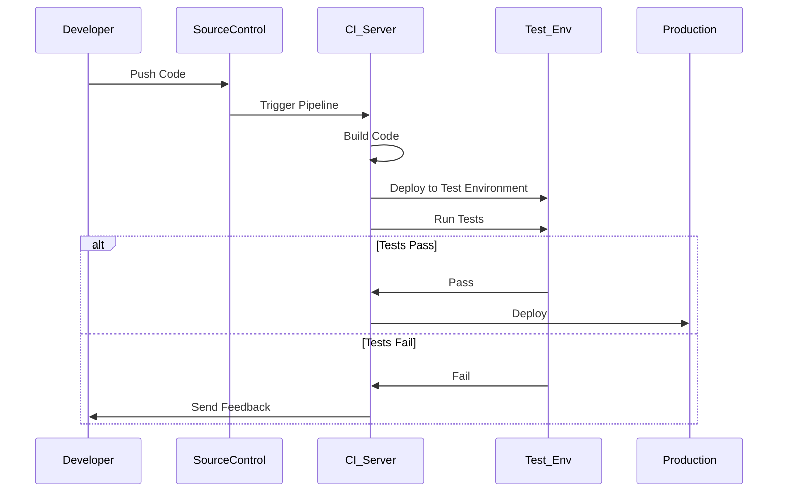

## Introduction

In the realm of cloud application development and deployment, maintaining the integrity and reliability of the software is paramount. Automated Testing in Pipelines is a crucial design pattern that integrates various testing methodologies into the Continuous Integration/Continuous Deployment (CI/CD) pipelines. This ensures that every change in the codebase is automatically vetted against a suite of tests, catching potential issues early and reducing the risk of defects in production environments.

## Design Pattern Explanation

### Core Concepts

- **Continuous Integration (CI):** The practice of automatically building and testing code changes as they are integrated into the main branch, ensuring alignment with the latest codebase.
- **Continuous Deployment (CD):** The automation of releasing the build artifact to production environments once it passes the necessary tests, enhancing speed and reliability of deployments.
- **Automated Testing:** Involves running suites of tests automatically, including unit tests, integration tests, and end-to-end tests, as part of the CI/CD pipeline.

### Benefits

1. **Increased Efficiency:** Automated tests run faster than manual tests, enabling quicker feedback on code changes.
2. **Early Bug Detection:** Helps in identifying defects before they reach production, reducing the cost and effort required for troubleshooting.
3. **Improved Code Quality:** Encourages cleaner, better-structured code through consistent testing and refactoring.

## Architectural Approaches

### Test Strategies

1. **Unit Testing:** Validates the smallest parts of an application in isolation. Typically, developers write these tests to ensure that individual functions or methods work as expected.
   
2. **Integration Testing:** Ensures that different modules or services used by your application interact correctly. These are crucial for detecting issues with external systems or APIs.
   
3. **End-to-End Testing:** Simulates real user scenarios to verify the complete workflow of the application. It is executed against the entire application environment.

### Workflow in Pipelines

1. **Source Control Integration:** Automatically triggers test runs when changes are pushed to the repository.
   
2. **Build Phase:** Compiles the code and packages it for testing.
   
3. **Test Phase:** Executes the suite of automated tests. CI platforms like Jenkins, GitLab CI, or CircleCI often manage this.
   
4. **Deployment Phase:** If tests pass, the code is deployed to production or a staging environment. In case of failures, deployment is halted, and feedback is provided.

### Example Code Snippet

Here's a basic example in a `Jenkinsfile` that showcases how automated testing fits into a CI/CD pipeline using Jenkins:

```groovy
pipeline {
    agent any

    stages {
        stage('Build') {
            steps {
                echo 'Building...'
                sh './gradlew build'
            }
        }
        
        stage('Test') {
            steps {
                echo 'Testing...'
                sh './gradlew test'
            }
        }
        
        stage('Deploy') {
            when {
                branch 'master'
            }
            steps {
                echo 'Deploying to production...'
                sh './gradlew deploy'
            }
        }
    }
    
    post {
        always {
            echo 'Cleaning up...'
            sh './gradlew clean'
        }
    }
}
```

## Diagrams

Below is a simple sequence diagram illustrating a CI/CD workflow with automated testing:



## Related Patterns

- **Canary Deployment:** Gradually deploys the new version of the application to a small subset of users before fully rolling out.
- **Blue-Green Deployment:** Maintains two identical environments to enhance reliability during changes or updates.
- **Feature Toggles:** Allows for releasing code under feature flags to toggle new features on/off dynamically.

## Best Practices

- Ensure that the tests cover both functional and nonfunctional requirements.
- Regularly update and maintain the test suite to cover new features and updates.
- Utilize load and stress testing within the pipeline for resilience validation.
- Incorporate security testing to identify potential vulnerabilities early.

## Additional Resources

- [Martin Fowler's Continuous Integration](https://martinfowler.com/articles/continuousIntegration.html)
- [CI/CD Pipeline Guide by Atlassian](https://www.atlassian.com/continuous-delivery/ci-vs-ci-vs-cd)
- [Effective Testing Strategies in DevOps](https://devops.com/effective-testing-strategies-in-devops/)

## Summary

Automated Testing in Pipelines is a vital pattern in modern software development that enhances the quality and reliability of applications. By embedding tests into the CI/CD lifecycle, organizations can ensure that every change to the code is safe, efficient, and deployable. Through strategic testing approaches and the adoption of best practices, automated pipelines can significantly reduce the risk of introducing defects into production, thereby maintaining high software standards.
