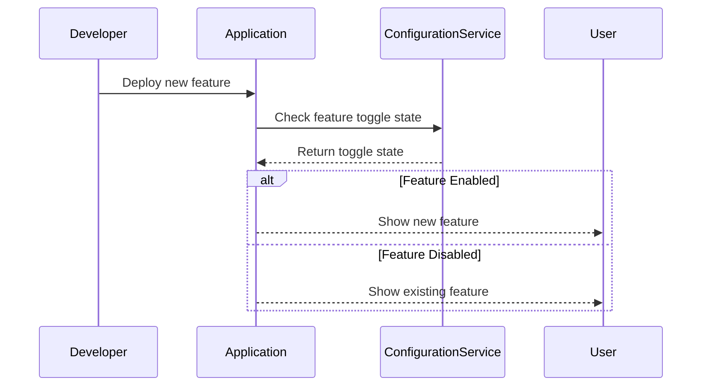

## Overview

Feature Toggles, also known as Feature Flags, are a design pattern in software engineering that enables developers to activate or deactivate certain functionalities in an application without deploying new code. This practice facilitates continuous integration and delivery by allowing incomplete features to be merged into the production environment in a controlled manner, providing opportunities for testing, experimentation, and feedback.

## Detailed Explanation

### Key Concepts

- **Toggle Point**: A decision point in the code where the state of a feature toggle is evaluated to determine which code path to execute.

- **Toggle Configuration**: The externalized configuration that controls the state of feature toggles, often stored in databases or configuration files.

- **Types of Toggles**: 
  - **Release Toggles**: Used to manage release strategies, allowing features to be enabled after deployment.
  - **Experiment Toggles**: Facilitate A/B testing and experimentation with features.
  - **Ops Toggles**: Allow operational control over features, typically used in response to urgent business needs.
  - **Permission Toggles**: Limit access to features based on user roles.

### Architectural Approach

Feature Toggles can be implemented by adding conditional logic around code segments representing new features. The state of each toggle is typically managed in a configuration system, which can be updated dynamically to change the application behavior without redeployment.

### Example Code

Here's a basic example using Java to demonstrate a feature flag concept:

```java
public class FeatureToggleExample {

    private static final boolean NEW_FEATURE_ENABLED = true;

    public static void main(String[] args) {
        if (isNewFeatureEnabled()) {
            System.out.println("New Feature is Enabled!");
            // Execute new feature
        } else {
            System.out.println("New Feature is Disabled.");
            // Execute fallback
        }
    }

    public static boolean isNewFeatureEnabled() {
        return NEW_FEATURE_ENABLED;
    }
}
```

In this example, the `NEW_FEATURE_ENABLED` flag controls the execution of a new feature.

### Diagrams

Here is a simple UML Sequence diagram illustrating the flow with a feature toggle:



## Related Patterns

- **Canary Releases**: Allows minor releases to a subset of users to test changes in production.
- **Blue-Green Deployment**: Maintains two separate environments to minimize downtime during releases.

## Additional Resources

- **Feature Toggles: An In-Depth View** by Martin Fowler: [Link](https://martinfowler.com/articles/feature-toggles.html)
- **Feature Flagging Best Practices** by LaunchDarkly: [Link](https://launchdarkly.com)

## Summary

Feature Toggles offer a strategic advantage in modern software development by decoupling feature release from deployment. This design pattern supports incremental releases, lowers deployment risk, and offers flexibility for testing and feedback. By leveraging Feature Toggles, organizations can accelerate their continuous integration and continuous delivery pipelines, ultimately enhancing responsiveness to market changes and user needs.
