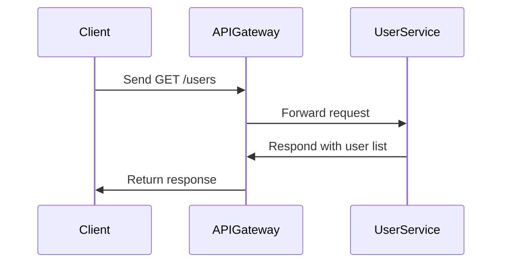

## Introduction to API-First Development

The API-First Development pattern is a modern software design approach that prioritizes the design and development of APIs before implementing any business logic or underlying architecture. This method ensures that all services are interoperable, consistent, and designed with the end consumer in mind. It is particularly effective in microservices architecture, where APIs define the communication fabric between independently deployable components.

## Core Principles

### Design APIs with the Consumer in Mind
- **Consumer-Centric Approach**: Leverage consumer stories and use cases to formulate API design.
- **Behavior Driven Design (BDD)**: Use BDD tools to validate API behavior from a consumer’s perspective.

### Contract-First Approach
- **API Contracts**: Define API contracts upfront using standards like OpenAPI or RAML, ensuring that all stakeholders agree on the payloads and endpoints prior to development.
- **Mock API Endpoints**: Provide mock endpoints early in the development cycle for testing and feedback.

### Comprehensive Documentation
- **Automated API Documentation**: Use tools that auto-generate documentation as part of the build process from the API specifications.
- **Versioning and Deprecation Policies**: Implement systematic versioning strategies and deprecation policies to manage API evolution.

## Architectural Approaches

### API Gateway
- Utilize an API Gateway as an entry point to manage request routing, composition, and protocol translation.
- Enhance security through authentication and authorization layers in the gateway.

### Microservices Compatibility
- Design services as microservices that communicate through well-defined RESTful or GraphQL APIs, ensuring loose coupling and high cohesion.

## Best Practices

1. **Prototyping and Feedback**: Develop API prototypes early and solicit feedback from end users and frontend developers.
2. **Continuous Testing**: Integrate automated testing for APIs using testing tools like Postman or JUnit to run regression tests continuously.
3. **Scalability and Performance**: Design APIs with scalability in mind, ensuring they can handle increased loads and performance requirements.

## Example Code

Here's a simple example using OpenAPI to define an API contract for a hypothetical user service.

```yaml
openapi: 3.0.0
info:
  title: User Service API
  version: 1.0.0
paths:
  /users:
    get:
      summary: Returns a list of users.
      responses:
        '200':
          description: A JSON array of user names
          content:
            application/json:
              schema: 
                type: array
                items: 
                  type: string
  /users/{userId}:
    get:
      summary: Retrieve a user by ID
      parameters:
        - name: userId
          in: path
          required: true
          description: ID of the user
          schema:
            type: string
      responses:
        '200':
          description: A single user
          content:
            application/json:
              schema:
                type: object
                properties:
                  id:
                    type: string
                  name:
                    type: string
```

## Diagram

Here's UML Sequence Diagram illustrating the API-First approach in a microservices environment:



## Related Patterns

- **Service Mesh**: Enhances API-First with observability, security, and network services optimizations.
- **Backend for Frontend (BFF)**: Tailors APIs to specific frontend needs, complementing API-First architecture.
- **Continuous Integration/Continuous Deployment (CI/CD)**: Automate deployment and testing of APIs, ensuring constant availability of the latest API version.

## Additional Resources

- [OpenAPI Specification](https://swagger.io/specification/)
- [RESTful API Design Principles](https://www.martinfowler.com/articles/richardsonMaturityModel.html)
- [API Gateway in Microservices](https://microservices.io/patterns/apigateway.html)

## Summary

The API-First Development pattern is foundational in contemporary cloud-native and microservice architectures. By prioritizing API design and embracing a consumer-first mindset, organizations can ensure flexibility, scalability, and maintainability across their distributed systems. Enhanced by robust documentation and continuous integration processes, API-First paves the way for efficient communication between services and seamless user experiences.
