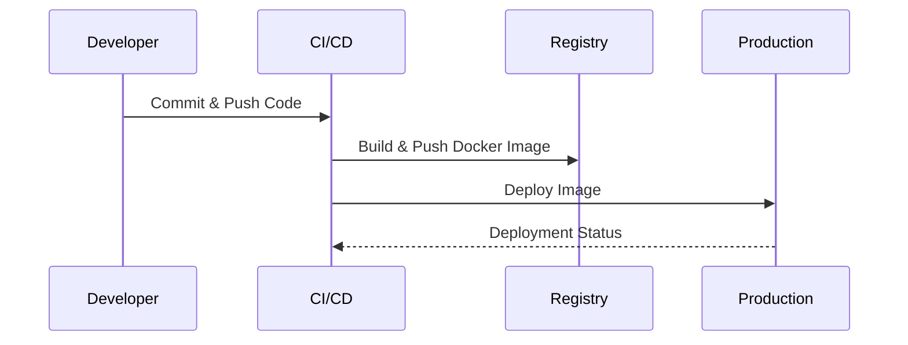

Immutable deployments provide a robust strategy for deploying applications in cloud environments. By treating each deployment as an immutable artifact—one that cannot be altered after its creation—we can achieve a more predictable and stable deployment process. This approach simplifies configuration management, reduces the chances of mistakes, and improves the rollback procedure by enabling seamless transitioning between deployment phases.

## Design Pattern Overview

Immutable deployments draw from the immutable infrastructure principle, stating that once a system component such as a server or an application instance is instantiated, it should not change. Any updates or deployments should instead involve replacing the old system component with a new one.

### Key Characteristics of Immutable Deployments

- **Immutability**: Ensures that instances are not modified after creation, maintaining the integrity of the deployment.
- **Consistency**: Every environment runs an identical version, minimizing discrepancies caused by configuration drift.
- **Reliability**: Easier rollback processes, as previous versions exist alongside new ones until stable.
- **Simplified Configuration Management**: Configuration is part of the deployment artifact, minimizing runtime changes.

## Architectural Approach

### Application Building Process

1. **Build Once, Deploy Everywhere**: Once an application artifact (e.g., Docker image) is built, the same artifact is deployed across all environments (development, staging, production).
2. **Versioned Artifacts**: Each deployment is versioned, leveraging image registries or artifact repositories.

### Deployment Process

- **Blue-Green Deployment**: Maintain two environments (blue and green) to ensure smooth transition and rollback.
- **Canary Releases**: Gradually introduce changes to a subset of users before full deployment.
- **Feature Flagging**: Use feature flags to toggle features on and off without deploying new code.

### Tools and Technologies

- **Docker & Containerization**: Promotes the creation of immutable application layers.
- **Kubernetes**: Facilitates the deployment of immutable application containers.
- **CI/CD Pipelines**: Tools like Jenkins, GitLab CI/CD, and AWS CodePipeline automate the build and deployment process.
- **Infrastructure as Code (IaC)**: Tools like Terraform or AWS CloudFormation ensure environment specifications are consistent across deployments.

## Example Code

Here's an example Dockerfile used to create an immutable application container:

```dockerfile
FROM openjdk:11-jre-slim

COPY target/myapp.jar /app/myapp.jar

ENTRYPOINT ["java", "-jar", "/app/myapp.jar"]
```

In this example, once the image is built, it is never modified. Any change to the application requires creating a new image version.

## Diagrams

### UML Sequence Diagram: Example Deployment Process



This diagram illustrates how a developer's code changes are eventually deployed to production using an immutable deployment approach.

## Related Patterns

- **Blue-Green Deployment**: A strategy that complements immutable deployments by toggling between two environments for smoother update processes.
- **Canary Release**: Further enhance deployment risk minimization by initially deploying changes to a limited audience.

## Additional Resources

- [The Twelve-Factor App: Introduction](https://12factor.net/)
- [Docker Documentation](https://docs.docker.com/)
- [Kubernetes: Best Practices](https://kubernetes.io/docs/concepts/cluster-administration/manage-deployment/)

## Summary

Immutable deployments revolutionize the deployment process by ensuring environmental consistency and minimizing configuration drift. By using build tools and orchestration platforms like Docker and Kubernetes, applications are packaged into immutable artifacts that streamline deployments, enable easy rollback, and provide enhanced stability. Combined with deployment strategies like blue-green and canary releases, they offer a comprehensive solution for reliable cloud application deployment.
