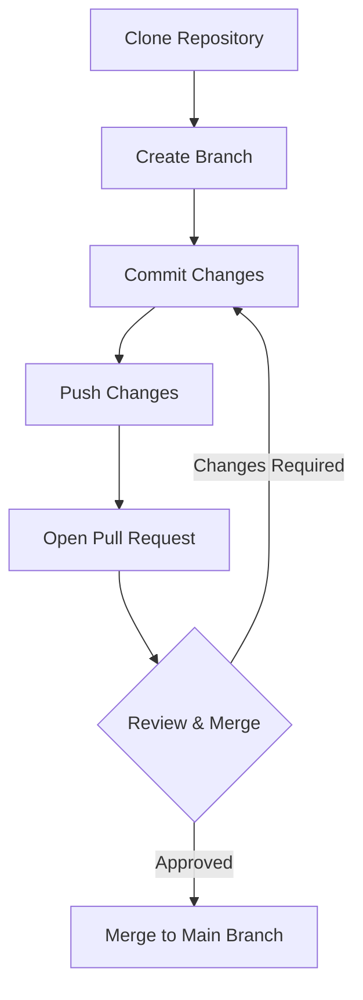

### Introduction to Code Repositories and Version Control

In the era of cloud computing, effective code management is foundational to successful application development and deployment. Code repositories and version control systems form the backbone of modern development practices, enabling teams to collaborate efficiently, manage changes, and maintain the integrity of their codebases.

### Importance in Cloud Application Development

- **Collaboration**: Facilitates teamwork, allowing multiple developers to work on different parts of a project simultaneously without conflicts.
- **Change Management**: Tracks changes over time, allowing developers to understand what changes were made, when, and by whom.
- **Rollback Capabilities**: Effortlessly revert to previous states of the codebase, crucial for quick recovery from defects or experiments.
- **Integration with CI/CD**: Seamlessly integrate with Continuous Integration and Continuous Deployment pipelines to automate testing and deployment processes, ensuring rapid iteration and delivery.

### Architectural Approaches

1. **Centralized Version Control Systems (CVCS)**: These include systems like Subversion (SVN) that use a central server to hold the codebase. Ideal for smaller teams where central oversight is preferred.

2. **Distributed Version Control Systems (DVCS)**: Tools like Git and Mercurial decentralize the source code repository, allowing developers to work fully independently and merge changes. This has become the de facto standard in cloud development.

### Best Practices

- **Consistent Branching Strategy**: Adopt a branching model like Git Flow or GitHub Flow to manage feature development, releases, and bug fixes.
- **Regular Commits**: Make frequent, small commits to keep a trackable history of changes, ensuring that individual units are manageable and can be easily rolled back if necessary.
- **Meaningful Commit Messages**: Write clear, concise commit messages to convey the purpose of changes.
- **Access Control and Security**: Implement strict access controls, use SSH keys for secure access, and maintain a robust audit trail to track code changes.

### Example Code

```bash
git init

git clone [repository-url]

git checkout -b feature/new-feature

git add newfile.txt

git commit -m "Add new feature"

git push origin feature/new-feature
```

### Diagrams

#### Repository Workflow Diagram



### Related Patterns

- **Continuous Integration/Continuous Deployment (CI/CD)**: Automates the integration and deployment of code changes, reducing manual errors and speeding up the delivery process.
- **Infrastructure as Code (IaC)**: Enables automated provisioning and management of cloud infrastructure, aligning with version-controlled workflows for consistent environment setup.

### Additional Resources

- [Pro Git Book](https://git-scm.com/book/en/v2)
- [Atlassian Git Tutorials](https://www.atlassian.com/git/tutorials)
- [Git Flow Workflow](https://www.atlassian.com/git/tutorials/comparing-workflows/gitflow-workflow)

### Summary

Leveraging code repositories and version control is indispensable in cloud application development and deployment. By incorporating these practices, teams can enhance collaboration efficiency, ensure code stability, and accelerate their delivery pipeline, ultimately leading to more reliable and agile software solutions. This pattern, aligned with contemporary development paradigms, empowers teams to manage complex codebases with increased confidence and precision.
