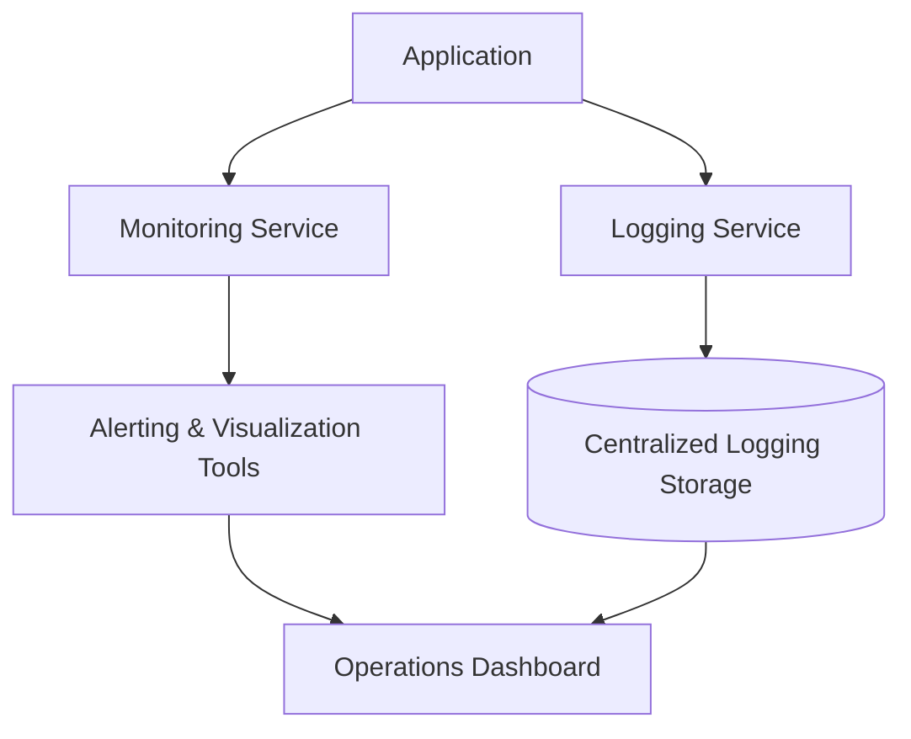

## Overview

The **Monitoring and Logging Integration** design pattern is a critical aspect of modern cloud computing systems. It focuses on enhancing system observability by seamlessly integrating monitoring and logging mechanisms into your application's architecture. This is essential for diagnosing issues, optimizing performance, maintaining the reliability of complex systems, and ensuring that operations comply with regulatory standards.

### Objective

The main goal of this pattern is to ensure that all aspects of an application and its hosting environment are transparent and easily interpretable. This allows for proactive identification of potential issues and swift remedial actions.

## Detailed Explanation

### Key Concepts

- **Monitoring** captures real-time data on application performance and infrastructure status, providing insight through metrics, alerts, and dashboards.
- **Logging** involves recording a comprehensive trail of system and application events, which can be analyzed for insights and troubleshooting.

### Best Practices

1. **Establish Clear Metrics**: Define key performance indicators (KPIs) that reflect system health and operational success.
2. **Centralized Logging Systems**: Use tools like ELK Stack (Elasticsearch, Logstash, Kibana) or managed services such as AWS CloudWatch and Azure Monitor to centralize log collection and analysis.
3. **Alerting Mechanisms**: Set up alerts for critical conditions that require immediate attention, ensuring they are specific and actionable to reduce alert fatigue.
4. **Immutable Logs**: Ensure that logs are immutable and securely stored for compliance and auditing.
5. **Automated Checks and Balances**: Implement automated health checks to ensure continuous monitoring.

### Architectural Approaches

- **Microservices and Distributed Systems**: Employ distributed tracing to track requests as they travel through microservices. Tools like OpenTelemetry and Jaeger can facilitate this by providing context-rich telemetry data.
- **Containerized Applications**: Use container-specific solutions like Prometheus and Grafana for container monitoring, linking performance insights specific to dynamic environments like Kubernetes.

### Example Code

Here's a simple example snippet demonstrating how to use Python's `logging` library to integrate logging at the application level:

```python
import logging

logging.basicConfig(level=logging.INFO,
                    format='%(asctime)s %(levelname)s %(message)s',
                    handlers=[logging.FileHandler("app.log"),
                              logging.StreamHandler()])

def process_data(data):
    try:
        logging.info("Starting data processing")
        # Processing logic...
        logging.info("Data processing completed successfully")
    except Exception as e:
        logging.error("Error processing data: %s", e)

process_data("sample data")
```

### Diagrams

Below is UML diagram illustrating the integration of monitoring and logging in a cloud-native application architecture:



### Related Patterns

- **Circuit Breaker Pattern**: Prevent system failures by detecting faults and halting operations that may trigger cascading failures, complementing monitoring with proactive interruption.
- **Health Check Pattern**: Regularly assess the heartbeats of system components to ensure continuous operation within acceptable parameters.
- **Retry Pattern**: Automatically retry failed operations that might be transient, using monitoring to trigger retries responsibly.

### Additional Resources

- [The Twelve-Factor App](https://12factor.net/logs)
- [AWS Well-Architected Framework: Operational Excellence](https://docs.aws.amazon.com/wellarchitected/latest/framework/operational-excellence.html)
- [Google SRE Book](https://landing.google.com/sre/sre-book/toc/)

## Summary

The **Monitoring and Logging Integration** design pattern is indispensable for maintaining optimal performance, reliability, and security in cloud environments. By leveraging powerful logging and monitoring tools, architects can ensure system faults are quickly identified and resolved, contributing to a seamless and trustworthy user experience. Integrating this pattern into your cloud strategy ensures proactive problem-solving, compliance, and a holistic view of the system’s health.
