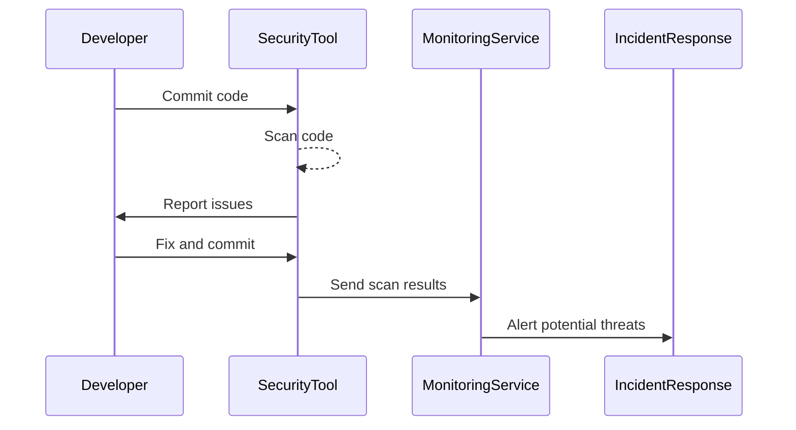

---

linkTitle: "Security Best Practices in Development"
title: "Security Best Practices in Development: Ensuring Robust Cloud Applications"
category: "Application Development and Deployment in Cloud"
series: "Cloud Computing: Essential Patterns & Practices"
description: "Explore essential security best practices for developing cloud applications, focusing on safeguarding data, applications, and infrastructure against potential threats through proven strategies and technologies."
categories:
- application-development
- cloud-security
- best-practices
tags:
- security
- cloud-computing
- development
- best-practices
- application-security
date: 2024-07-07
type: docs

canonical: "https://softwarepatternslexicon.com/18/7/19"
license: "© 2024 Tokenizer Inc. CC BY-NC-SA 4.0"
---

## Introduction to Security Best Practices in Development

In the rapidly evolving landscape of cloud computing, ensuring the security of applications and data is vital. The stakes are high, and organizations must adopt robust security practices during the development phase to counter potential vulnerabilities and threats. This article delves into several security best practices essential for cloud application development, offering guidance on building secure, resilient, and compliant solutions.

## Key Security Best Practices

### 1. Secure Software Development Lifecycle (SDLC)

A Secure SDLC integrates security practices within each phase of the software development lifecycle—from requirements gathering to maintenance. Incorporating security early helps identify vulnerabilities before they are exploited. Key activities include:

- **Threat Modeling:** Understand potential attack vectors.
- **Code Review:** Regularly audit code to ensure adherence to security standards.
- **Static and Dynamic Analysis:** Employ tools for automated vulnerability scanning.
- **Continuous Integration:** Integrate automated security checks within the CI pipeline.

### 2. Encryption and Data Protection

Securing data in transit and at rest is fundamental:

- **TLS/SSL:** Ensure encrypted connections for data in transit.
- **Encryption Algorithms:** Use strong, modern cryptographic algorithms for data storage.
- **Key Management:** Implement secure practices for managing encryption keys, possibly leveraging cloud provider managed services.

### 3. Access Controls

Controlling access to applications and sensitive data is critical:

- **Least Privilege Principle:** Grant minimum necessary permissions.
- **Role-Based Access Control (RBAC):** Define roles and access policies based on job functions.
- **Multi-factor Authentication (MFA):** Implement MFA to add an additional layer of security.

### 4. Vulnerability Management

Regularly identify and remediate security vulnerabilities:

- **Patching:** Stay updated with security patches for all software components.
- **Vulnerability Scanning:** Use tools to regularly scan applications and infrastructure.
- **Dependency Checking:** Monitor third-party libraries for security issues.

### 5. Security Monitoring and Logging

Effective monitoring helps detect and respond to incidents:

- **Centralized Logging:** Aggregate logs from all systems for consistent analysis.
- **Security Information and Event Management (SIEM):** Adopt SIEM solutions for real-time monitoring and automated alerts.
- **Anomalies Detection:** Utilize machine learning for anomaly detection and proactive incident identification.

## Example Code

Here is an example illustrating a simple implementation of an access policy using AWS IAM:

```json
{
  "Version": "2012-10-17",
  "Statement": [
    {
      "Effect": "Allow",
      "Action": "s3:GetObject",
      "Resource": "arn:aws:s3:::example-bucket/*",
      "Condition": {
        "IpAddress": {
          "aws:SourceIp": "192.0.2.0/24"
        }
      }
    }
  ]
}
```

## Diagrams

### Security Monitoring Workflow



## Related Patterns

- **Zero Trust Architecture:** An approach that requires strict identity verification for every user and device attempting to access resources.
- **Network Segmentation:** Dividing a network into multiple segments to improve security and performance.
- **Container Security:** Practices specifically devised to secure containerized applications.

## Additional Resources

- [OWASP Top Ten](https://owasp.org/www-project-top-ten/): A resource detailing the most critical security risks for web applications.
- [NIST Cybersecurity Framework](https://www.nist.gov/cyberframework): Guidelines and best practices for managing cybersecurity-related risk.

## Summary

Security is a cornerstone of successful cloud application development. By integrating security best practices into the development lifecycle, organizations can ensure their applications are safeguarded against potential threats. Adopting a secure SDLC, ensuring robust access control measures, continuously managing vulnerabilities, and monitoring for potential incidents are fundamental steps toward achieving robust security posture. Embracing these practices not only protects data and applications but also fosters trust with users and stakeholders in an increasingly interconnected digital ecosystem.
