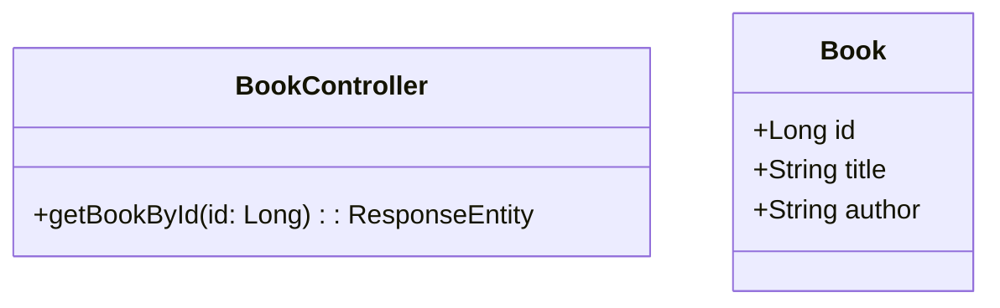

Microservices architecture is an architectural style that structures an application as a collection of loosely coupled services. This architecture enables the rapid, frequent, and reliable delivery of large, complex applications. This pattern is highly beneficial for cloud-based applications due to its scalability and flexibility. 

### Detailed Explanation of Microservices Architecture

Microservices architecture involves breaking down a large monolithic application into smaller, independent “microservices.” Each service focuses on a single business capability and communicates with others through well-defined APIs, often via HTTP/HTTPS, messaging queues, or asynchronous events. This modular approach facilitates continuous delivery/deployment, enabling development teams to improve parts of an application without impacting others.

#### Core Characteristics:
- **Decentralization**: Each microservice manages its own data and business logic. There is no single, central database.
- **Technology Diversity**: Teams can use different technologies and languages for different microservices, as long as they comply with inter-service communication protocols.
- **Autonomy**: Services are developed, deployed, and scaled independently.
- **Domain-Driven Design**: Microservices are typically aligned with business functionalities, emphasizing domain boundaries.

### Architectural Approaches

1. **API Gateway**: Acts as an entry point, handling requests by invoking multiple backend services and aggregating results.
2. **Service Mesh**: Provides service-to-service communication, security, and observability.
3. **Event Sourcing and CQRS**: Capture all changes as a sequence of events, supporting highly scalable and maintainable applications.
4. **Service Registry and Discovery**: Keeps track of service instances and their locations.

### Best Practices

- **Design for Failure**: Implement retries, timeouts, and circuit breakers to handle service failures gracefully.
- **Monitoring and Logging**: Use centralized logging and monitoring solutions to gain visibility over the ecosystem.
- **Automated Deployment**: Continuous Integration/Continuous Deployment (CI/CD) pipelines streamline releasing code changes.
- **Security**: Implement authentication and authorization using OAuth/OpenID and secure communication channels like TLS/SSL.

### Example Code

Let's look into a simple REST-based microservice example using Spring Boot:

```java
@RestController
@RequestMapping("/api/books")
public class BookController {
    
    @GetMapping("/{id}")
    public ResponseEntity<Book> getBookById(@PathVariable Long id) {
        // Simulate service logic
        Book book = new Book(id, "Cloud Computing Patterns", "John Doe");
        return ResponseEntity.ok(book);
    }
}
```

### Diagram



### Related Patterns with Descriptions

- **Service Mesh**: Enhances inter-service communication by providing features like load balancing and failover.
- **Sidecar Pattern**: Deploy ancillary operations like logging and proxy as separate processes or containers running alongside application services.
- **API Gateway Pattern**: Directs requests to the appropriate service endpoints, supporting concerns like authentication and request routing.

### Additional Resources

- "Building Microservices" by Sam Newman
- Official documentation on [Spring Cloud](https://spring.io/projects/spring-cloud)
- Online course: "Microservices with Node JS and React" on Udemy

### Summary

Microservices architecture optimizes application development for the cloud by enabling independent service deployment and scalability. By decomposing applications into small, independently functioning units, organizations can enhance adaptability, resilience, and deployment velocity—a must for modern software engineering. This pattern leverages various tools and practices (e.g., Docker, Kubernetes) to ensure robustness and reliability. Understanding and implementing microservices architectures can lead to significant improvements in both the development and operational phases of software lifecycle management.
