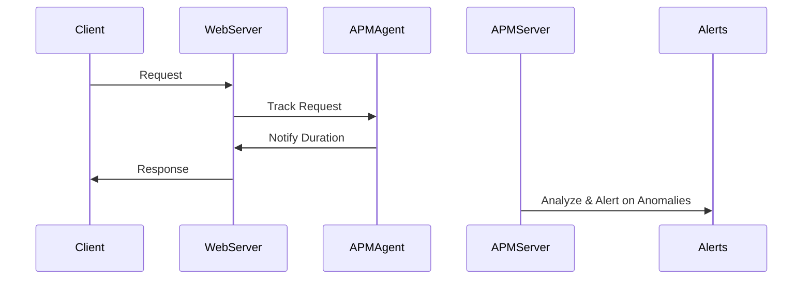

## Introduction

Application Performance Management (APM) is an essential design pattern in the realm of cloud computing to ensure that applications perform efficiently and reliably. As applications move to the cloud, the complexity inherently increases due to distributed architectures, third-party services, microservices, and mixed execution environments.

APM is a practice and a suite of technologies that help manage and monitor the application’s performance and behavior, ensuring efficient resource usage and a smooth user experience.

## Detailed Explanation

### Architectural Approaches

APM solutions in cloud environments often adopt a multi-level approach. The architecture typically includes:

- **Instrumenting Applications**: Injecting code or using agents to collect data from application components such as response times, throughput, and resource usage.
- **Collecting Metrics**: Gathering detailed metrics from different layers, including infrastructure, application, and user experience.
- **Analyzing Data**: Utilizing AI and ML techniques to analyze and interpret collected data to detect anomalies and forecast trends.
- **Alerting and Visualization**: Providing real-time alerts for performance deviations and visual dashboards for stakeholders to understand the state of applications.

### Paradigms and Best Practices

- **End-User Experience Monitoring**: Track the end-user experience to assess how performance issues affect users.
- **Runtime Application Architecture Discovery**: Dynamically understand and map the architecture of the application for effective monitoring.
- **Dynamic Baseline Setting**: Establish performance benchmarks that adapt to infrastructural changes and promote proactive rather than reactive performance management.
- **Distributed Tracing**: Enable visibility into the lifecycle of requests through distributed systems to troubleshoot latency issues.
- **Automate with Machine Learning**: Implement ML algorithms to automatically identify and classify performance patterns, helping streamline problem resolution.

### Example Code

Here’s a simplified example to demonstrate how one might integrate performance monitoring into an application using Node.js:

```javascript
const express = require('express');
const app = express();
const performance = require('perf_hooks').performance;

// Middleware to monitor request duration
app.use((req, res, next) => {
  const start = performance.now();
  res.on('finish', () => {
    const duration = performance.now() - start;
    console.log(`Request to ${req.url} took ${duration} milliseconds`);
  });
  next();
});

app.get('/', (req, res) => {
  res.send('Hello World!');
});

app.listen(3000, () => {
  console.log('Server is running on port 3000');
});
```

### Diagrams

#### Sequence Diagram: APM Process



## Related Patterns

- **Autoscaling**: Automatically adjusting resources allocated to the application based on current demand.
- **Circuit Breaker**: A pattern to handle and prevent cascading failures in complex systems which complements APM by providing fail-safe mechanisms.

## Additional Resources

- [Monitoring Distributed Systems](https://linktodocumentation.com)
- [Best Practices for Cloud Application Monitoring](https://anotherlink.com)
- [Understanding APM](https://thirdlink.com)

## Summary

Application Performance Management (APM) is paramount for maintaining robust and performant cloud applications. By enabling real-time insights and feedback mechanisms, APM allows teams to quickly identify and rectify performance bottlenecks. With continual innovations such as AI-driven analytics and cloud-native tools, APM remains an ever-evolving and dynamic field crucially supporting the integrity and efficiency of applications.
