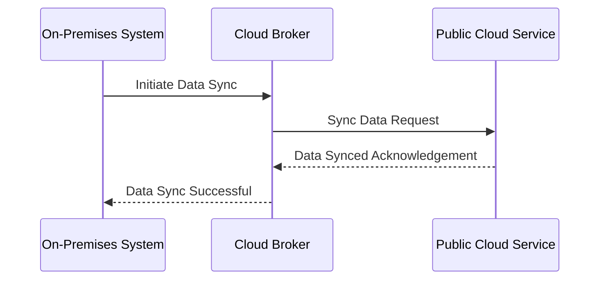

## Introduction

The Hybrid Cloud Applications design pattern represents a sophisticated architectural approach that combines on-premises environments with public and private cloud resources. This approach aims to leverage the advantages of each deployment model, such as cost efficiency, scalability, security, and compliance. By adopting a hybrid cloud strategy, organizations can dynamically allocate resources and optimize their workload distribution to meet specific business demands.

## Detailed Explanation

Hybrid Cloud Applications enable organizations to integrate multiple cloud services and on-premises systems seamlessly. This pattern often involves the following elements:

- **Cloud Broker:** A middleware solution that manages and orchestrates resources across different cloud environments.
- **Unified Management Interface:** A centralized management console to monitor and manage cloud resources and applications.
- **Data Integration and Synchronization:** Efficient synchronization and integration mechanisms to ensure data consistency across distributed systems.
- **Security and Compliance Framework:** A robust framework to enforce corporate security policies and ensure compliance with regulatory requirements.

### Architectural Approaches

1. **Workload Distribution:** Deciding which parts of an application run in the public cloud and which run on-premises or in a private cloud, often based on latency, cost, and regulatory requirements.

2. **Data Residency and Compliance:** Ensuring sensitive data resides in appropriate jurisdictions, aligning storage locations with compliance requirements.

3. **Cloud Bursting:** Running baseline workloads on-premises and dynamically scaling applications to the public cloud during peak demand to leverage additional resources.

4. **Disaster Recovery and Backup:** Using hybrid clouds for creating redundancy and data resiliency plans, thereby ensuring business continuity during outages.

### Best Practices

- **Identify Workload Characteristics:** Understand application components' dependencies and resource requirements before deployment.
- **Network Configuration:** Establish robust VPNs and dedicated private connections to ensure secure communication between cloud and on-premises infrastructures.
- **Automation:** Use automation tools for configuration management and deployment to reduce operational complexity.
- **Monitoring and Optimization:** Continuously monitor resource usage and application performance to optimize costs and improve efficiency.

### Example Code

Below is a pseudocode sample demonstrating a basic mechanism for a hybrid cloud application with on-premises and cloud interactions:

```javascript
// Sample pseudocode demonstrating hybrid cloud data synchronization

// Function to synchronize data between on-premises and cloud databases
function syncData(onPremDataSource, cloudDataSource) {
    const onPremData = fetchDataFrom(onPremDataSource);
    const cloudData = fetchDataFrom(cloudDataSource);

    // Compare data and sync changes
    const changes = diff(onPremData, cloudData);
    applyChanges(cloudDataSource, changes);

    // Log synchronization status
    console.log("Data synchronization completed successfully.");
}

function fetchDataFrom(dataSource) {
    // Simulate fetching data from a source
    return dataSource.getData();
}

function diff(data1, data2) {
    // Simulate finding differences between two data sets
    return data1.filter(item => !data2.includes(item));
}

function applyChanges(dataSource, changes) {
    // Simulate applying changes to a data source
    dataSource.updateData(changes);
}
```

### Diagrams

Here is a basic representation of a hybrid cloud architecture using UML sequence diagram:



### Related Patterns

- **Cloud Broker Pattern:** Facilitates the management and integration of multiple cloud services.
- **Multi-Cloud Pattern:** Focuses on leveraging multiple public cloud providers for redundant service and optimized cost-efficiency.

### Additional Resources

- [Cloud Computing Patterns by Christoph Fehling et al.](https://www.cloudcomputingpatterns.org)
- [NIST Cloud Computing Reference Architecture](https://www.nist.gov/publications/cloud-computing-reference-architecture)

## Summary

The Hybrid Cloud Applications design pattern is a versatile solution for organizations looking to enhance resource optimization, operational agility, and cost efficiency by integrating on-premises infrastructure with cloud resources. By understanding the architectural approaches, best practices, and leveraging related patterns, enterprises can build resilient and adaptable cloud applications that meet current and future requirements.
