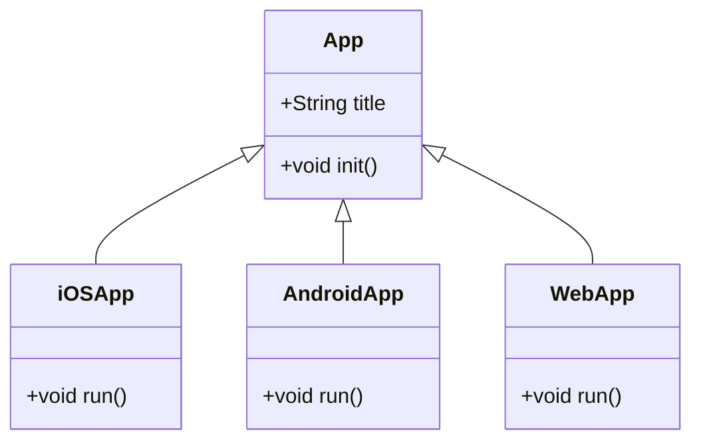

## Overview

Cross-Platform Development is a design pattern employed to build applications that can operate across different operating systems and computing environments seamlessly. This architectural approach allows developers to write code once and deploy it on multiple platforms, alleviating the need for excessive platform-specific coding. This pattern is crucial in cloud computing as it ensures that applications can leverage various cloud providers' environments, enhancing the application's reach and flexibility.

### Key Characteristics

- **Portability**: The ability to use the same codebase across different operating systems such as Windows, macOS, and Linux.
- **Code Reusability**: Writing code once and reusing it across multiple platforms reduces development time and maintenance effort.
- **Efficiency**: Streamlined deployment process and reduced time-to-market.
- **Cost Reduction**: Lower costs by minimizing the resources needed to maintain separate codebases for different platforms.

## Design Pattern Structure

Utilizing frameworks and tools that facilitate cross-platform development is essential. Popular tools include:

- **React Native**: For building mobile applications that run on both iOS and Android platforms.
- **Flutter**: A UI toolkit from Google for creating natively compiled applications for mobile, web, and desktop from a single codebase.
- **Electron**: For developing cross-platform desktop applications with web technologies like JavaScript, HTML, and CSS.
- **Xamarin**: A Microsoft framework for building mobile apps with C# and .NET that run on both Android and iOS.

## Best Practices

- **Abstract Platform-Specific Features**: Use abstraction layers to handle platform-specific features which are inevitable in development.
- **Unified Testing Strategy**: Implement a robust testing strategy covering all targeted platforms to ensure consistent behavior.
- **Modular Architecture**: Employ modular or service-based architecture to separate concerns and facilitate independent development and testing.
- **Code Quality Tools**: Utilize linting, static code analysis, and continuous integration tools to maintain code quality and consistency across platforms.
- **Performance Optimization**: Continuously benchmark and optimize performance for each platform, paying attention to the unique characteristics of each.

## Example Code

### Using Flutter for Cross-Platform Mobile Apps

```dart
import 'package:flutter/material.dart';

void main() {
    runApp(MyApp());
}

class MyApp extends StatelessWidget {
    @override
    Widget build(BuildContext context) {
        return MaterialApp(
            title: 'Cross-Platform App',
            theme: ThemeData(
                primarySwatch: Colors.blue,
            ),
            home: Scaffold(
                appBar: AppBar(
                    title: Text('Hello, World!'),
                ),
                body: Center(
                    child: Text('Cross-Platform Application Running!'),
                ),
            ),
        );
    }
}
```

## Diagram



## Related Patterns

- **Microservices Architecture**: This pattern can be combined with cross-platform development to deliver componentized services across platforms.
- **Containerization**: Employing containers aids in deploying a consistent environment, enhancing cross-platform deployment.
- **Continuous Integration and Continuous Deployment (CI/CD)**: This pattern supports automated deployment across multiple platforms.

## Additional Resources

- [Flutter Documentation](https://flutter.dev/docs)
- [React Native Documentation](https://reactnative.dev/docs/getting-started)
- [Electron Documentation](https://www.electronjs.org/docs)
- [Xamarin Documentation](https://docs.microsoft.com/en-us/xamarin/)

## Summary

Cross-Platform Development is an invaluable design pattern in the cloud computing landscape. By enabling applications to run on various platforms seamlessly, organizations can optimize their reach and streamline their development processes. By following best practices and leveraging the right frameworks and tools, developers can deliver efficient, maintainable, and scalable applications across diverse computing environments.
