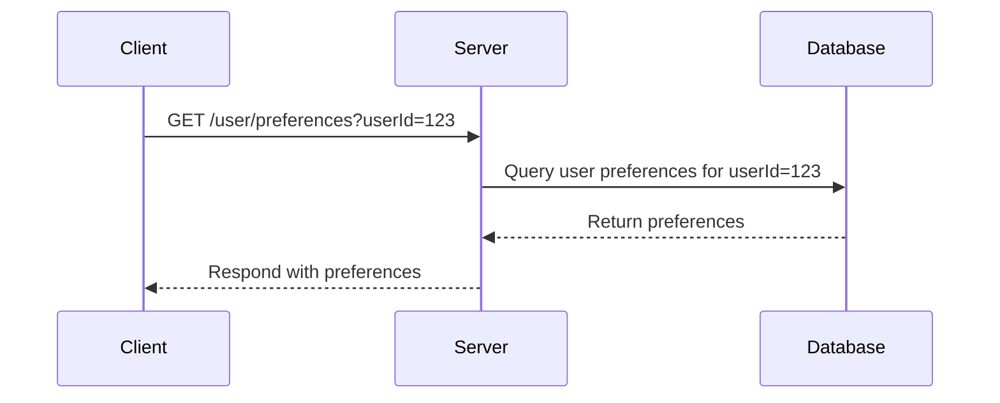

---

linkTitle: "Stateless Application Design"
title: "Stateless Application Design: Optimizing Scalability and Reliability"
category: "Application Development and Deployment in Cloud"
series: "Cloud Computing: Essential Patterns & Practices"
description: "Explore how to design stateless applications to enhance scalability, fault tolerance, and reliability in cloud environments."
categories:
- Application Design
- Cloud Architecture
- Scalability
tags:
- stateless
- cloud
- scalability
- reliability
- best practices
date: 2024-07-07
type: docs

canonical: "https://softwarepatternslexicon.com/18/7/27"
license: "© 2024 Tokenizer Inc. CC BY-NC-SA 4.0"
---


## Introduction

In cloud computing, stateless application design is a crucial pattern that maximizes an application's scalability and resilience across distributed systems. By decoupling application logic from session data storage, stateless design enables dynamic scaling, load balancing, and seamless failover.

## Design Pattern Overview

Stateless applications do not store any client session information on the server side between requests. Each request from a client must contain all the information the server needs to process it, or the server must be able to retrieve this information from another shared resource, such as a database or external cache.

### Key Advantages:
- **Scalability**: Seamlessly add or remove instances without impacting the user's experience.
- **Fault Tolerance**: Failed instances can be replaced without worrying about session loss.
- **Simplified Deployment**: Stateless components can be more easily replicated across different environments.

## Architectural Approaches

### 1. Client-Side State Management:
Store session data in the client, utilizing mechanisms like cookies or local storage. This approach ensures that every client request carries its context, which can then be validated and processed by the server.

### 2. Externalize State:
Leverage external services (e.g., Redis, Memcached, databases) to store session information. This prevents server dependencies for session state, promoting a truly stateless server infrastructure.

### 3. Idempotency:
Design operations in a way that repeated execution of the same request leads to the same state. This is crucial for reliable stateless interactions, especially in environments with retries, like in cloud services.

## Example Code

Here’s a simple example using an HTTP API in Node.js, illustrating stateless design by querying user preferences stored in a database on each request:

```javascript
const express = require('express');
const app = express();
const db = require('./database'); // Simulated database module

app.get('/user/preferences', async (req, res) => {
    const userId = req.query.userId;
    
    try {
        const preferences = await db.getUserPreferences(userId);
        res.json({ userId, preferences });
    } catch (error) {
        res.status(500).json({ error: 'Error retrieving user preferences' });
    }
});

app.listen(3000, () => console.log('Stateless API running on port 3000'));
```

## Diagrams

### Sequence Diagram Using Mermaid



## Related Patterns

- **Circuit Breaker**: Aids in handling service failures by detecting fault conditions and preventing requests until recovery.
- **Retry Pattern**: Complements stateless designs by retrying transient failures without maintaining state.

## Additional Resources

- **Books**: "Designing Data-Intensive Applications" by Martin Kleppmann
- **Websites**: Martin Fowler's Microservices Resource Guide

## Summary

Stateless application design is integral to modern cloud-native architectures, promoting scalable, efficient, and fault-tolerant applications. By externalizing state management and ensuring idempotent operations, developers can build robust systems that meet the dynamic demands of cloud environments. As you explore further, consider how stateless principles can enhance your application's architecture by aligning with cloud best practices.
