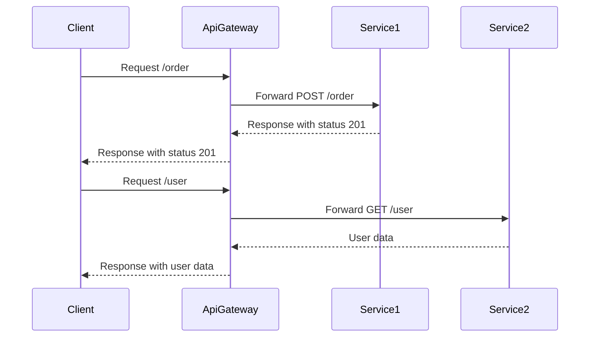

## Introduction to API Gateways

API Gateways play a crucial role in modern cloud architectures, particularly in microservices-based applications. They act as a single entry point through which all client requests pass, enabling centralized management, security, routing, and monitoring of APIs. By handling concerns such as authentication, authorization, rate limiting, and logging, API Gateways simplify the development process and help to isolate microservices from direct client interactions.

## Architectural Approach

### Key Features

1. **Routing and Composition:**  
   API Gateways route incoming HTTP requests to the appropriate service endpoints. They can also compose multiple microservice responses to fulfill complex client requests, hiding the actual service structure from the external world.

2. **Centralized Security and Policy Enforcement:**  
   They secure APIs using standard mechanisms such as OAuth, JWT authentication, and can enforce policies on incoming requests, such as IP whitelisting or blacklisting.

3. **Load Balancing:**  
   Integrated load balancing features distribute incoming requests across multiple instances of services, enhancing application availability and reliability.

4. **Rate Limiting and Throttling:**  
   Protect APIs from abuse by implementing rate limiting and throttling policies that control the number of requests a client can make within a given time frame.

5. **Monitoring and Analytics:**  
   API Gateways often include built-in monitoring and analytics capabilities, allowing developers to gain insights into API usage patterns, latency, and traffic statistics.

## Best Practices

- **Security First:**  
  Always prioritize implementing strong authentication and authorization mechanisms. Protect sensitive data in transit using HTTPS/TLS.

- **Maintain Scalability:**  
  Design gateways to handle varying loads efficiently, leveraging cloud-native auto-scaling features to adapt to traffic demands.

- **Consistency in Error Handling:**  
  Ensure consistent error handling and response structures to simplify error management for client applications.

- **Versioning Support:**  
  Implement versioning in APIs to allow backward compatibility and smooth transitions when introducing new features.

## Example Code

Below is an example of a simplified API Gateway setup using AWS API Gateway with Lambda functions as backend services:

```python
import json

def lambda_handler(event, context):
    path = event.get('path')
    method = event.get('httpMethod')

    if path == '/order' and method == 'POST':
        return create_order(event)
    elif path == '/user' and method == 'GET':
        return get_user_info(event)
    else:
        return {
            "statusCode": 404,
            "body": json.dumps({"message": "Resource not found."})
        }

def create_order(event):
    # Logic to create an order
    return {
        "statusCode": 201,
        "body": json.dumps({"message": "Order created successfully."})
    }

def get_user_info(event):
    # Logic to retrieve user info
    return {
        "statusCode": 200,
        "body": json.dumps({"user": {"id": "123", "name": "John Doe"}})
    }
```

## Diagram



## Related Patterns

- **Service Mesh:** Complements the API Gateway by providing features such as service-to-service authentication, traffic management, and observability.
- **Backend for Frontend (BFF):** A specialized gateway pattern designed to address varying needs for different client types, such as mobile and web clients.

## Additional Resources

- [AWS API Gateway Documentation](https://docs.aws.amazon.com/apigateway/index.html)
- [Google Cloud Endpoints Documentation](https://cloud.google.com/endpoints)
- [Azure API Management](https://azure.microsoft.com/en-us/services/api-management/)

## Summary

API Gateways act as the facade to microservices architectures, providing centralized management of API traffic. They enhance security, enforce policies, and manage traffic at scale while allowing microservice teams to focus on business-specific logic without concerns about external interface complexities. Implementing API Gateways is vital for scalable, resilient, and maintainable cloud-native applications.
